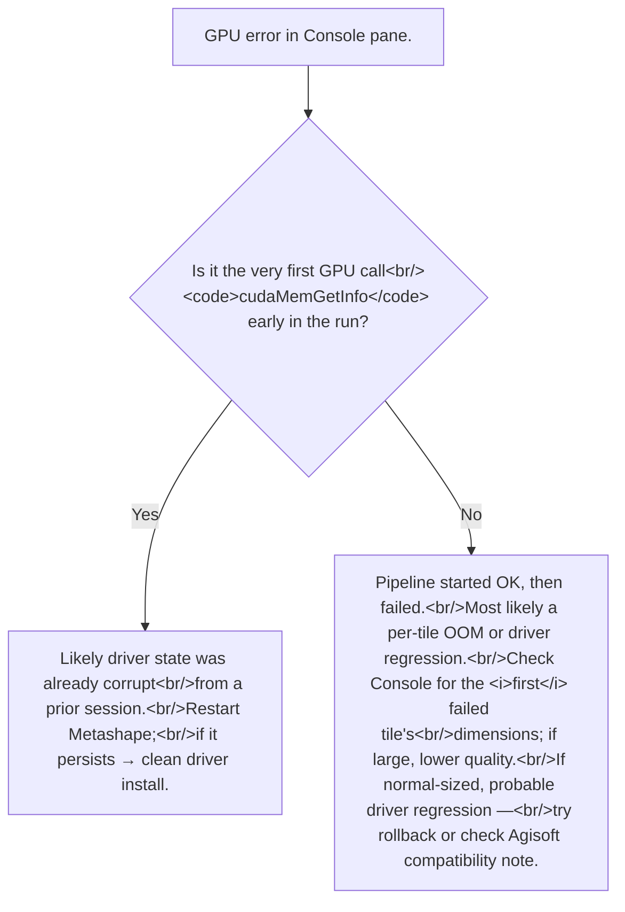

# Diagnosing CUDA / OpenCL errors: timeouts, OOM, kernel failures
> **Confidence:** *medium.* All four error-family / first-action
> mappings are forum-attested or directly cited from the source
> threads. The *specific known-bad NVIDIA driver versions* are
> historical (340.52 in 2014, others over time); the pattern
> recurs but the current bad versions are Tier 3 empirical.

> **Terminology note:** *Build Dense Cloud* was renamed *Build
> Point Cloud* in Metashape 2.0. The two terms refer to the
> same processing stage; verbatim quotations preserve the
> original wording.

Metashape's GPU pipeline produces a few characteristic error
messages when something goes wrong. Most can be triaged from
the message text alone — but the right *first action* differs
substantially across error families. This article is the
diagnostic cross-reference.

## The four error families

| Error message | Root cause family | First action |
|---------------|-------------------|--------------|
| `cudaMemGetInfo: the launch timed out and was terminated` | Driver-state corruption (kernel hung; driver auto-killed; subsequent runs fail because state didn't recover) | **Clean NVIDIA driver re-install.** Restart Metashape after. |
| `cudaMemGetInfo: an illegal memory access was encountered` | Same family — driver memory state corrupt from a prior failure | Same — clean driver re-install |
| `Kernel failed: an illegal memory access` (per-tile) | Per-kernel failure during tile processing; Metashape auto-falls-back to CPU for the failed tile | If sporadic: tolerate (run continues at reduced speed). If many tiles fail: treat as the family above. |
| `clEnqueueWriteBuffer failed, CL_OUT_OF_RESOURCES` | OpenCL ran out of GPU resources for this operation, **or** the installed driver has an OpenCL regression | (1) Reduce dense-cloud quality (Lowest / Low). (2) Check Agisoft's compatibility note for known-bad driver versions; rollback if applicable. |

The graceful fallback message — `"GPU processing failed,
switching to CPU mode"` — is **not** a fatal error. Metashape
falls back per-tile; the session continues. Repeated across
many tiles, however, the run will be many times slower than
expected and the GPU pipeline is broken.

## The driver-failure family (cudaMemGetInfo timeout)

The most common GPU pipeline failure. The documented diagnostic:

> "Looks like the driver failure. After the first time out it
> has not recovered, so all the next tries fails immediately.
> I suggest to make a clean driver install [...]" — Alexey
> Pasumansky, 2020-01-25, Metashape 1.5
> ([permalink](https://www.agisoft.com/forum/index.php?topic=11771.msg52680#msg52680))

What's happening:

1. Build Dense Cloud (or Build Depth Maps) launches a CUDA
   kernel.
2. The kernel takes longer than the OS's *Timeout Detection
   and Recovery* (TDR) limit — typically 2 seconds on Windows.
3. Windows decides the GPU is hung; kills the kernel; resets
   the driver state.
4. From here, *all* subsequent CUDA calls fail because the
   driver's internal state is corrupt — even calls as simple
   as `cudaMemGetInfo`.

The fix:

- **First**: clean NVIDIA driver re-install (the documented
  recommendation).
- **If that doesn't help**: increase Windows TDR timeout via
  registry (developer-mode setting; typical: set
  `HKLM\System\CurrentControlSet\Control\GraphicsDrivers\TdrDelay`
  to 60 seconds). On Linux, no TDR equivalent — the kernel
  runs to completion regardless.
- **If still failing**: known-bad driver version. Roll back to
  a previous version; check Agisoft's compatibility note.

## The OOM / resource family (CL_OUT_OF_RESOURCES)

`clEnqueueWriteBuffer failed, CL_OUT_OF_RESOURCES` is OpenCL's
way of saying "I tried to allocate something on the GPU and
couldn't." Two distinct root causes:

### Genuine GPU memory exhaustion

A high-resolution dense-cloud step on a high-megapixel image
set really did exceed the GPU's VRAM. Mitigations:

- **Lower the dense-cloud quality** (Lowest / Low / Medium /
  High / Ultra High). Each step down reduces VRAM consumption
  significantly. See [RAM and quality settings](ram-and-quality-settings.md)
  for the relationship.
- **Restrict the chunk's bounding box** to the area of
  interest. Large empty regions inflate dense-cloud memory
  unnecessarily.
- **Process in chunks** (`split_in_blocks` for export; chunks
  for processing — see [chunks workflow articles](../../workflow/chunks/index.md)).
  Each block fits
  in VRAM individually.

### Driver-version regression

Documented verbatim:

> "Actually, the latest Nvidia drivers 340.52 causes the
> mentioned OpenCL processing problem, so we recommend to
> rollback to the previous version of drivers, while we are
> trying to find out if it could be fixed on our side." —
> Alexey Pasumansky, 2014-08-27, PhotoScan 1.0
> ([permalink](https://www.agisoft.com/forum/index.php?topic=2587.msg14663#msg14663))

The pattern recurs over time: a recently-released NVIDIA
driver introduces an OpenCL regression that causes
`CL_OUT_OF_RESOURCES` on memory operations the GPU has
plenty of room for. The diagnostic: the same project worked
before a recent driver update and now fails. Roll back the
driver; check Agisoft's compatibility note.

A third-party diagnostic recommended in the source thread:

> "We can suggest to use some tests for OpenCL, for example,
> GPU Caps should have such functionality." — Alexey
> Pasumansky, 2014-08-04, PhotoScan 1.0
> ([permalink](https://www.agisoft.com/forum/index.php?topic=2587.msg14130#msg14130))

[GPU Caps Viewer](https://www.geeks3d.com/dlcomputing/) tests
OpenCL functionality independently of Metashape. If GPU Caps
fails the same way, the problem is in the driver, not in
Metashape.

## The per-tile-fallback family (Kernel failed)

```text
[GPU] estimating 213x476x96 disparity using 213x476x8u tiles, offset 0
ocl_engine.cpp line 231: clEnqueueWriteBuffer failed, CL_OUT_OF_RESOURCES
GPU processing failed, switching to CPU mode
[CPU] estimating 213x476x96 disparity using 213x476x8u tiles, offset 0
```

Metashape's depth-maps pipeline tries each tile on the GPU
first; if a tile fails for any reason, it falls back to CPU
processing for that tile and continues. The session does not
abort.

Triage:

- **A handful of failed tiles** (< 5% of total): tolerate. The
  CPU fallback handles them. Total runtime is a bit longer but
  the result is correct.
- **Most tiles failing** (> 50%): the GPU pipeline is
  effectively broken. Stop the run; investigate per the
  driver-failure family above.
- **Failed tiles concentrated at start of run**: probable
  cudaMemGetInfo timeout on first kernel launch; subsequent
  launches inherit the broken state.
- **Failed tiles concentrated at high-resolution depth maps**:
  probable VRAM exhaustion on those specific tiles. Lower the
  dense-cloud quality or restrict the bounding box.

## Diagnostic order



## Caveats

- **TDR limit on Windows is 2 seconds by default.** Long-
  running CUDA kernels on a slow GPU or large project can
  exceed this. Increasing TDR via registry is a developer-
  mode setting; do not change on a production system without
  understanding the tradeoff (a genuine driver hang takes
  longer to be killed).
- **Linux has no TDR.** Kernels run to completion. Different
  failure modes apply (segfault on illegal memory; no
  timeout-and-recover behaviour).
- **The 2014 NVIDIA 340.52 reference is historical.** Other
  driver versions have introduced regressions over time;
  consult the Agisoft compatibility note in the latest
  release for current known-bad drivers. **2025 example
  (Metashape 2.3.0):** an issue with NVIDIA driver `591.44`
  was diagnosed by Agisoft staff and a workaround shipped in
  the latest 2.3.0 update; driver `581.42` worked fine.
  Attested verbatim:

  > "We have faced similar problem with NVIDIA 591.44 driver
  > version (581.42 worked fine) and implemented the
  > workaround in the latest 2.3.0 update."
  > — Alexey Pasumansky, 2025-12-23, Metashape 2.3.0
  > pre-release ([permalink](https://www.agisoft.com/forum/index.php?topic=17361.msg74630#msg74630))

  The pattern (specific NVIDIA driver versions trigger
  regressions; subsequent Metashape updates ship workarounds)
  recurs across the project's history; the *specific*
  bad-driver list drifts.
- **macOS GPU pipeline** is different — Metal-based on
  recent versions of Metashape; the CUDA / OpenCL
  troubleshooting in this article is Linux/Windows-specific.
- **GPU Caps Viewer is third-party; verify the source.**
  The documented diagnostic remains useful but
  Agisoft does not vouch for the tool.
- **The *Console* pane is the primary diagnostic surface.**
  Always enable it (*View → Console*) before launching a
  potentially-failing run; the per-tile log is what tells you
  whether the GPU is healthy.
- ***Preferences → Advanced → Write log to file*** persists the
  same lines to disk — essential for post-mortem analysis of
  long runs that complete with degraded results.

## Runnable demonstration

This article is a diagnostic cross-reference rather than a
recipe; the demo is *negative* (we trigger an error and watch
the fallback) rather than *positive* (we run a successful
operation). The reproducible test:

> **Demo verified:** ✗ — pending Tier 3 reproduction. Triggers
> a synthetic GPU error to verify the per-tile fallback and
> the log-marker behaviour.

```python
"""Trigger a GPU OOM by setting an unrealistic dense-cloud
quality; verify the per-tile fallback message appears in the
Console pane.

Pre-condition: a chunk with images aligned. Aerial-with-GCPs
or any small dataset works.
"""
import Metashape

chunk = Metashape.app.document.chunk

# Build a depth-map step at unrealistic settings to force GPU
# OOM on the smallest GPUs. Works only if the GPU has < ~6 GB
# VRAM; on larger GPUs, dial up further or skip this test.
chunk.buildDepthMaps(
    downscale=1,        # Highest quality — most VRAM
    filter_mode=Metashape.FilterMode.MildFiltering,
)
# In the Console pane, watch for either:
#   [GPU] estimating ... — GPU is being used
#   GPU processing failed, switching to CPU mode — fallback
#   cudaMemGetInfo: ... — driver-state error (run aborted)
```

**Expected output:** if the GPU has enough VRAM, the run
succeeds with `[GPU]` log markers. If VRAM is exceeded,
`GPU processing failed, switching to CPU mode` appears on
the failed tiles and the run continues at reduced speed. If
`cudaMemGetInfo: the launch timed out` appears, the driver
has been killed and the run aborts — restart Metashape.

## References

- [Forum thread, *cudaMemGetInfo time out error*, 2020](https://www.agisoft.com/forum/index.php?topic=11771.0)
  — primary source; the "driver failure" diagnosis
  and clean-driver-install recommendation (msg 52680, 2020-01-25).
- [Forum thread, *GPU processing during the modeling and
  settings*, 2014](https://www.agisoft.com/forum/index.php?topic=2587.0)
  — the bad NVIDIA 340.52 driver (msg 14253) and
  GPU Caps Viewer recommendation (msg 14130). Also the source-thread user
  log excerpt showing the per-tile `GPU processing failed,
  switching to CPU mode` fallback in action (msg 13769).
- [Forum thread, *GPU CUDA_ERROR_OUT_OF_MEMORY*, 2018](https://www.agisoft.com/forum/index.php?topic=9565.0)
  — companion thread on the genuine OOM family.
- [Forum thread, *Crash at dense cloud processing — CUDA
  error*, 2018](https://www.agisoft.com/forum/index.php?topic=8946.0)
  — the responses on OOM-vs-driver-state diagnosis.
- [Microsoft TDR documentation](https://learn.microsoft.com/en-us/windows-hardware/drivers/display/timeout-detection-and-recovery)
  — the Windows kernel-timeout mechanism.
- [*GPU error messages - possible solutions* (Agisoft KB)](https://agisoft.freshdesk.com/support/solutions/articles/31000160027)
  and [*GPU-related crashes in Metashape* (Agisoft KB)](https://agisoft.freshdesk.com/support/solutions/articles/31000160098)
  — Agisoft's own triage of the CUDA/OpenCL error families and
  per-vendor (Intel / NVIDIA / AMD) GPU crashes covered here.
- [*Photo and Ortho view is not responding, toolbar disappears* (Agisoft KB)](https://agisoft.freshdesk.com/support/solutions/articles/31000145376)
  — a separate, display-side GPU issue (OpenGL rendering, fixed
  via a driver update or `--opengl angle`), distinct from the
  compute errors here; check it if the symptom is an unresponsive
  viewport rather than a processing failure.
- [GPU Caps Viewer (Geeks3D)](https://www.geeks3d.com/dlcomputing/)
  — third-party OpenCL diagnostic tool.
- [When does Metashape use the GPU?](gpu-usage-by-stage.md) — the companion explanation article. The log
  markers documented there are what surfaces these errors.
- [RAM and quality settings: what determines peak memory](ram-and-quality-settings.md) — the quality-reduction lever for genuine OOM.
