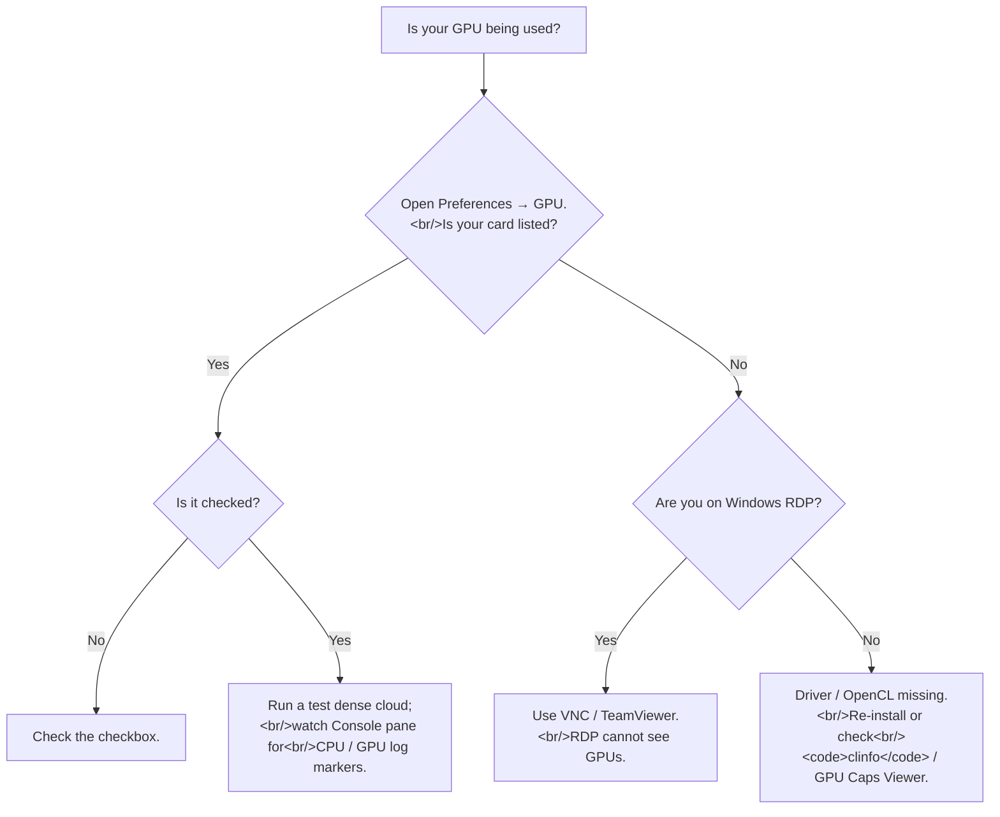

# When does Metashape use the GPU? (and how to verify)
> **Confidence:** *medium.* Forum-attested facts (OpenCL
> device discovery; Remote Desktop limitation; second-phase-of-
> dense-cloud is CPU only) are high-confidence. The
> stage-by-stage GPU-usage table reflects forum-attested
> behaviour from 2014 (general enumeration) and 2017
> (dense-cloud-phase split); the table is operationally accurate
> through Metashape 2.2.2 but should be verified on your
> installed version via the empirical log markers documented
> below.

> **Terminology note:** *Build Dense Cloud* was renamed *Build
> Point Cloud* in Metashape 2.0. This article uses both terms
> — verbatim quotations preserve the original
> wording; author prose in this article uses the historical
> "Build Dense Cloud" term throughout for symmetry with the
> source quotations. The two terms refer to the same
> processing stage; readers on Metashape 2.x should see
> "Build Point Cloud" in the GUI.

The recurring "is the GPU being used?" question has a precise
answer: yes for some stages, no for others, and you can verify
the actual behaviour via the Console pane's `[CPU]` / `[GPU]`
log markers.

## What controls GPU usage

> "PhotoScan uses every OpenCL supported device that is checked
> on in the corresponding tab of PhotoScan Preferences window." —
> Alexey Pasumansky, 2014-07-31, PhotoScan 1.0
> ([permalink](https://www.agisoft.com/forum/index.php?topic=2587.msg14153#msg14153))

The mechanism is simple:

- *Preferences → GPU* lists every OpenCL device the OS reports.
- Each device has an enable/disable checkbox. Enabled devices
  participate; disabled ones are ignored.
- When multiple devices are enabled, work is distributed across
  them in parallel.

Two common reasons the GPU device list is *empty* or shorter
than expected:

- **Windows Remote Desktop** sessions have a known limitation —
  the GPU is owned by the local console session, not the RDP
  session, and Metashape (via OpenCL) cannot see it. From the same
  forum thread: *"if you are using Windows Remote
  Desktop to connect to another machine the list of OpenCL
  devices will be likely empty and PhotoScan would not be able
  to use GPUs installed on remote computer."* Workaround: VNC,
  TeamViewer, or a non-RDP remote-access method that shares
  the local session.
- **Driver / OpenCL-runtime missing.** A correctly-installed
  GPU should produce an entry; absence means either the driver
  is broken (clean reinstall) or the OpenCL runtime is missing
  (CUDA toolkit / OpenCL ICD loader on Linux).

## Stage-by-stage GPU usage

| Stage | GPU usage | Notes |
|-------|-----------|-------|
| Align Photos (Match Photos + Align Cameras) | **CPU only** | Feature detection / matching / bundle adjustment are CPU-bound. |
| Build Depth Maps / Reconstructing Depth | **Heavy GPU usage** | The most GPU-intensive stage. Multi-GPU benefits here. |
| Build Point Cloud (depth-maps phase) | **Heavy GPU usage** | Same kernels as Build Depth Maps. (Was *Build Dense Cloud* in 1.x.) |
| Build Point Cloud (second / consolidation phase) | **CPU only** | "The second phase of the dense cloud generation stage is performed on CPU only" (forum-attested). |
| Build Mesh | **CPU only** *(early-version enumeration; verify on 2.x)* | Per the 2014 stage-by-stage enumeration; not contradicted by later forum statements. |
| Build Texture | **CPU only** *(early-version enumeration; verify on 2.x)* | Same source. |
| Build Tiled Model | (varies by version) | Recent versions may use GPU for some sub-steps; verify via log markers. |
| Build Orthomosaic | **CPU only** *(2014 enumeration; verify on 2.x)* | |
| Build DEM | **CPU only** *(2014 enumeration; verify on 2.x)* | |

The 2014 enumeration:

> "GPU is not used during Align Photos. GPU is used heavily
> during Reconstructing depth portion of Build Dense Cloud.
> GPU is not used during Build Mesh. GPU is not used during
> Build Texture." — David Cockey, 2014-07-08, PhotoScan 1.0
> ([permalink](https://www.agisoft.com/forum/index.php?topic=2587.msg13713#msg13713))

This was the canonical community statement at the time;
the subsequent 2017 statement on the second-dense-
cloud-phase being CPU-only is consistent with it. The table
should be treated as a starting point for current versions and
verified empirically — see *How to verify* below.

## The 100 %-GPU-utilisation expectation is wrong

A common diagnostic confusion: monitoring shows GPU utilisation
at 20–30 % during dense-cloud generation and the user concludes
"my GPU is broken / underused." Two design-level reasons it's
expected to be partial:

> "Also it would be better, if you provide the timing for the
> depth maps reconstruction step only, as the second phase of
> the dense cloud generation stage is performed on CPU only." —
> Alexey Pasumansky, 2017-05-04, PhotoScan 1.3
> ([permalink](https://www.agisoft.com/forum/index.php?topic=6992.msg33751#msg33751))

- **Build Dense Cloud is split.** Phase 1 (depth maps)
  saturates the GPU; phase 2 (consolidation) is CPU-only.
  Averaged over the whole step, GPU utilisation is typically
  20–60 %, not 100 %.
- **Multi-GPU on Windows.** OS-level GPU scheduling for
  non-display cards is restricted unless TCC mode is enabled
  on Windows. On a dual-GPU rig where the second GPU is
  display-attached, expect under-utilisation; switching the
  second GPU to TCC mode (compute-only, non-display) often
  helps. On Linux, the equivalent is `nvidia-smi -c 3`
  (compute-exclusive).

## How to verify (the `[CPU]` / `[GPU]` log markers)

The canonical method to observe GPU activity at runtime:

> "Could you please also check the console output in PhotoScan?
> If the GPU is used you'll see lines starting from `[CPU]` and
> `[GPU]` during depth maps estimation process." — Alexey
> Pasumansky, 2014-07-31, PhotoScan 1.0
> ([permalink](https://www.agisoft.com/forum/index.php?topic=2587.msg13735#msg13735))

During Build Depth Maps / Build Dense Cloud, the *Console* pane
shows per-tile lines:

```text
[GPU] estimating 213x476x96 disparity using 213x476x8u tiles, offset 0
timings: rectify: 0.016 disparity: 0.593 borders: 0.015 filter: 0.156 fill: 0
[GPU] estimating 296x587x96 disparity using 296x587x8u tiles, offset -33
timings: rectify: 0.031 disparity: 0.593 borders: 0.078 filter: 0.047 fill: 0
[CPU] estimating 375x567x96 disparity using 375x567x8u tiles, offset -15
...
```

Each tile is processed by either CPU or GPU. The tag indicates
which. A run with a healthy GPU pipeline shows `[GPU]` for most
tiles; a run with a broken GPU pipeline shows `GPU processing
failed, switching to CPU mode` followed by `[CPU]` for the
fallback tile. See [Diagnosing CUDA / OpenCL errors](diagnosing-cuda-opencl-errors.md)
for the failure-mode triage.

Enable the Console pane in *View → Console*. To capture a
log file for later analysis, *Preferences → Advanced → Write
log to file* writes the same lines to disk.

## Caveats

- **The table reflects 2014–2017 statements.** The
  *direction* (which stages use the GPU) has been
  architecturally stable; specific stages — particularly
  Build Tiled Model, recent dense-cloud variants — may use
  GPU acceleration that wasn't present in 2014. Verify on
  your version via the log markers.
- **Remote-Desktop GPU detection is platform-specific.** The
  forum-attested behaviour above applies to Windows RDP. macOS
  Screen Sharing and Linux X11 forwarding may behave
  differently — verify on your specific configuration.
- **TCC mode requires NVIDIA Tesla / Quadro grade cards** on
  Windows; consumer GeForce cards typically can't be set to
  TCC. The compute-exclusive equivalent on Linux works on any
  NVIDIA card.
- **OpenCL is the GPU API Metashape uses.** A driver that
  installs CUDA but not the OpenCL ICD loader produces an
  empty GPU list. Verify with `clinfo` (Linux) or *GPU Caps
  Viewer* (Windows) before assuming the GPU is incompatible.
- **Vulkan checkbox in 2.2.0+ is a forward-looking
  placeholder.** *Preferences → GPU* in Metashape 2.2.0 and
  later shows a Vulkan checkbox alongside the OpenCL device
  list. The checkbox has no effect in current versions; it is
  reserved for future GPU-based texturing and vertex
  colorization. Attested verbatim:
  > "you can check it on, but in the current version it does
  > not have any effect. Later it would have meaning for
  > GPU-based texturing and vertex colorization procedure."
  > — Alexey Pasumansky, 2024-12-02, Metashape 2.2.0
  > pre-release ([permalink](https://www.agisoft.com/forum/index.php?topic=16745.0))

## Decision picker



## Runnable demonstration

The script below dumps the OpenCL device list as Metashape sees
it and runs a small dense-cloud test on Aerial-with-GCPs to
exercise the depth-maps stage; then the user inspects the
Console pane for `[CPU]` / `[GPU]` markers.

> **Demo verified:** ✗ — pending Tier 3 reproduction on
> Metashape Pro 2.2 / 2.3. The OpenCL-device-list check is API-
> introspectable; the log-marker observation requires the
> Console pane.

```python
"""Verify GPU usage on the current Metashape installation."""
import Metashape

# The OpenCL device list as Metashape sees it.
print("=== OpenCL device list (Preferences → GPU equivalent) ===")
for i, dev in enumerate(Metashape.app.enumGPUDevices()):
    enabled = "✓" if Metashape.app.gpu_mask & (1 << i) else " "
    print(f"  {enabled} [{i}] {dev}")

print()
print("=== gpu_mask = bitmask of enabled GPUs ===")
print(f"  Metashape.app.gpu_mask = {Metashape.app.gpu_mask}")
# Bit i == 1 → device i is enabled.

# To enable / disable a specific device, set gpu_mask:
# Metashape.app.gpu_mask = 0b011   # enable devices 0 and 1
# Metashape.app.cpu_enable = True   # CPU also participates

print()
print("=== Console-marker test ===")
print("  Run a dense-cloud step on a small chunk and watch the")
print("  Console pane for [CPU]/[GPU] markers per tile.")
print("  Lines like '[GPU] estimating ...' confirm GPU usage;")
print("  '[CPU]' alone means GPU is not being used (or fallback).")
```

**Expected output:** the OpenCL device list shows your GPU(s)
with their enable state; `gpu_mask` bitmask matches the enabled
checkboxes. After running a dense-cloud test, the Console pane
has `[GPU]` lines if the pipeline is healthy, `[CPU]` lines if
it's CPU-only (or fallback after a GPU failure).

## References

- [Forum thread, *GPU processing during the modeling and
  settings*, 2014](https://www.agisoft.com/forum/index.php?topic=2587.0)
  — discussion of OpenCL device discovery (msg 13721),
  the `[CPU]` / `[GPU]` log markers (msg 13735), and the bad-
  driver workaround (msg 14253). the 2014
  stage-by-stage enumeration (msg 12839).
- [Forum thread, *Photoscan 1.3.1, GPU load reaching 20 to 30 %
  max*, 2017](https://www.agisoft.com/forum/index.php?topic=6992.0)
  — discussion of multi-GPU TCC mode and the
  second-phase-CPU-only behaviour (msg 34036).
- [Forum thread, *Blending Textures not using GPU*, 2022](https://www.agisoft.com/forum/index.php?topic=14503.0)
  — companion thread on texture-blending GPU questions.
- *Metashape Python Reference* (2.3.1), `Metashape.app.gpu_mask`,
  `Metashape.app.enumGPUDevices()`, `Metashape.app.cpu_enable`.
- [*General information related to GPU processing* (Agisoft KB)](https://agisoft.freshdesk.com/support/solutions/articles/31000150614)
  — supported GPUs, configuring the GPU preferences tab, and which
  stages are GPU-accelerated (including Vulkan texture blending in
  2.x); and [*NVIDIA graphic card is not recognized on macOS in GPU preferences tab* (Agisoft KB)](https://agisoft.freshdesk.com/support/solutions/articles/31000133910)
  — the macOS empty-GPU-list case (CUDA driver pack on older
  macOS; automatic OpenCL fallback on 10.14+).
- [Diagnosing CUDA / OpenCL errors: timeouts, OOM, kernel
  failures](diagnosing-cuda-opencl-errors.md) —
  what to do when the `[GPU]` markers turn into `GPU processing
  failed` messages.
