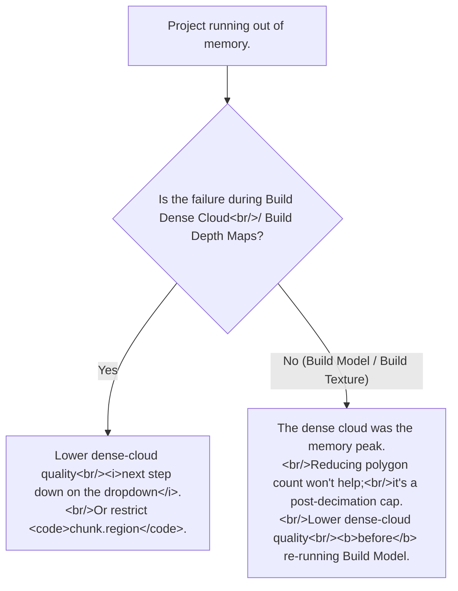

# RAM and quality settings: what determines peak memory
> **Confidence:** *medium.* The forum-attested statements about
> Build Model (arbitrary-then-decimate) and dense-cloud quality
> as the primary memory driver remain operationally valid through
> Metashape 2.2.2. Specific numerical thresholds (GB-per-million-
> points, etc.) are version-dependent — consult the Memory
> Requirements PDF for current absolute numbers.

> **Terminology note:** *Build Dense Cloud* was renamed *Build
> Point Cloud* in Metashape 2.0; the underlying behaviour is
> unchanged. The two terms refer to the same processing stage;
> verbatim quotations preserve the original
> "Dense Cloud" wording.

The recurring "how much RAM do I need?" / "should I lower
polygon count?" questions have a precise answer that's
counterintuitive at first reading: **dense-cloud quality drives
peak memory, not polygon count**. This article documents the
underlying behaviour and its three operational implications.

## The three memory-sizing rules

### Rule 1 — Dense-cloud QUALITY drives peak memory

Documented verbatim:

> "Please refer to the approximate memory consumption peaks
> mentioned in the following document depending on the
> number/resolution of images and processing settings used:
> [http://www.agisoft.com/pdf/tips_and_tricks/PhotoScan_Memory_Requirements.pdf](http://www.agisoft.com/pdf/tips_and_tricks/PhotoScan_Memory_Requirements.pdf)
>
> So actually, the quality of the dense cloud is important and
> not the number of polygons specified in the Build Model
> dialog." — Alexey Pasumansky, 2014-11-12, PhotoScan 1.0
> ([permalink](https://www.agisoft.com/forum/index.php?topic=3071.msg16225#msg16225))

The dense-cloud quality dropdown — *Lowest / Low / Medium /
High / Ultra High* — controls the per-image **downscale factor**
applied during depth-maps reconstruction:

| Quality | Downscale factor | Effective image size | Memory scaling |
|---------|-----------------|----------------------|----------------|
| Highest (Ultra High) | 1 (no downscale) | Full image | 1× baseline |
| High | 2 | Half each axis | ~0.25× |
| Medium | 4 | Quarter each axis | ~0.0625× |
| Low | 8 | Eighth | ~0.016× |
| Lowest | 16 | Sixteenth | ~0.004× |

Each step down the quality ladder reduces the effective image
area by 4× (linear-2× squared), and depth-maps memory scales
roughly with effective image area. Stepping from Ultra High to
High typically gives a 4× memory reduction; from High to
Medium another 4×.

In Python: `chunk.buildDepthMaps(downscale=N, ...)` where `N` is
the literal downscale factor (`1`, `2`, `4`, `8`, `16`).

### Rule 2 — Polygon count does NOT drive memory

The counterintuitive result:

> "[...] PhotoScan generates as much polygons as possible (in
> Arbitrary mode) and then decimates the model. [...]" —
> Alexey Pasumansky, 2014-11-12, PhotoScan 1.0
> ([permalink](https://www.agisoft.com/forum/index.php?topic=3071.msg14975#msg14975))

The Build Model dialog's *Face count* parameter (or
`chunk.buildModel(face_count=…)`) is **a post-decimation
target, not a memory bound**. The actual algorithm:

1. Generate as many polygons as the dense cloud supports
   (Arbitrary mode internally).
2. Decimate to the target face count.

Step 1 is the memory-intensive step; step 2 reduces the result
but doesn't reduce peak memory. So setting *Face count =
1,000,000* on a project that would normally produce 5,000,000
polygons does NOT save memory — only output size.

The lever for reducing Build Model memory: reduce the dense
cloud (lower quality at Build Dense Cloud time, or restrict the
bounding box) so step 1 has less to chew on.

### Rule 3 — Bounding box restricts everything

`chunk.region` — the bounding box — is the universal memory
reducer. Tighten it to cover only the area of interest and
dense-cloud / mesh / orthomosaic memory drops linearly with
the volume reduction.

The same-thread rule of thumb:

> "Also please check that the bounding box is shrink [sic] up to the
> monumnet [sic] and doesn't cover unwanted background." — Alexey
> Pasumansky, 2014-11-12, PhotoScan 1.0
> ([permalink](https://www.agisoft.com/forum/index.php?topic=3071.msg14934#msg14934))

A common pattern: an aerial survey covers a wide area but the
user is only interested in a 100 × 100 m feature. Without
bounding-box restriction, dense-cloud memory is sized for the
whole survey. With a tight bounding box, memory drops
proportionally to the area ratio. See [Setting `chunk.region`
to bound the tie-point cloud](../../workflow/project-setup/setting-the-chunk-region.md) for the API surface.

## Why it matters

Three operational decisions the rules unlock:

- **"My run is OOM. Should I lower polygon count or dense-cloud
  quality?"** → Dense-cloud quality. Polygon count
  doesn't help.
- **"Should I add RAM or restrict the bounding box?"** →
  Bounding box first. It's free and often gives 2–3× memory
  reduction in production aerial surveys.
- **"How much RAM is enough?"** → The Memory Requirements PDF
  is the authoritative reference. As an order-of-magnitude
  heuristic for current Metashape 2.x:
  - Build Depth Maps / Dense Cloud: ~1–2 GB per 100 megapixels
    of input at Ultra High quality (scales ~0.25× per quality
    step).
  - Build Model: ~2–4 GB per 10 million dense-cloud points.
  - Build Texture: ~1 GB per 4096-px texture page.
  These are illustrative; the PDF has the current authoritative
  numbers.

## The Agisoft Memory Requirements PDF

The cited reference:

> "Please refer to the approximate memory consumption peaks
> mentioned in the following document [...]:
> [http://www.agisoft.com/pdf/tips_and_tricks/PhotoScan_Memory_Requirements.pdf](http://www.agisoft.com/pdf/tips_and_tricks/PhotoScan_Memory_Requirements.pdf)"

The URL still resolves; the document is updated periodically
(it still says "PhotoScan" in the title for historical reasons).
For current absolute numbers, this is the authoritative
reference.

## Caveats

- **The 4× memory-reduction-per-quality-step is approximate.**
  Different stages scale differently; some are linear in
  pixel-count, some logarithmic. The 4×-per-step is a good
  rule of thumb for depth-maps but the PDF has stage-specific
  detail.
- **Build Model decimation does NOT reduce input memory.**
  This is the key counterintuitive claim. The decimation runs
  on the already-built mesh; the peak memory was reached
  before decimation.
- **Adaptive face count (face count = 0)** in Build Model lets
  Metashape pick the polygon count. This is a post-decimation
  *minimum*; same memory as a larger target.
- **OS / Python overhead.** The PDF documents Metashape's
  consumption; OS + the Python interpreter add a few hundred
  MB on top.
- **Memory commit vs working set on Windows.** Task Manager
  shows "Commit" (virtual address space reserved) and
  "Working Set" (resident in RAM) separately. Metashape's
  large pre-allocations show up in Commit but may not be
  resident; the OS pages them in/out as needed.

## Decision picker



## Runnable demonstration

The script below queries the chunk's current dense-cloud
quality settings and predicts approximate memory consumption
based on the Memory Requirements PDF's published heuristics.

> **Demo verified:** ✗ — pending Tier 3 reproduction. The
> introspection is API-confirmed; the predicted-memory numbers
> are illustrative and version-dependent.

```python
"""Query dense-cloud quality and predict approximate memory.

Pre-condition: any chunk with images added. The build_depthmaps
arguments capture the current settings (or last-used settings).
"""
import Metashape

chunk = Metashape.app.document.chunk
n_images = sum(1 for c in chunk.cameras)
if not chunk.cameras:
    raise SystemExit("Chunk has no cameras")

avg_w = sum(c.sensor.width for c in chunk.cameras) / n_images
avg_h = sum(c.sensor.height for c in chunk.cameras) / n_images
mp = (avg_w * avg_h) / 1e6

print(f"Chunk: {n_images} images at {avg_w:.0f} × {avg_h:.0f}")
print(f"Average resolution: {mp:.1f} megapixels")
print()

QUALITY_DOWNSCALE = {
    "Ultra High": 1, "High": 2, "Medium": 4, "Low": 8, "Lowest": 16,
}
print("Approximate Build Dense Cloud memory by quality:")
print(f"  {'quality':>12}  {'downscale':>9}  {'effective_mp':>12}  {'~RAM (GB)':>10}")
for label, downscale in QUALITY_DOWNSCALE.items():
    effective_mp = mp / (downscale ** 2)
    # Heuristic: ~1 GB per 100 effective megapixels at Ultra High;
    # version- and stage-dependent. Consult the official PDF for
    # current numbers.
    ram_gb = (effective_mp * n_images) / 100.0
    print(f"  {label:>12}  {downscale:>9}  {effective_mp:>12.2f}  {ram_gb:>10.1f}")

print()
print("Refer to the official Memory Requirements PDF for")
print("authoritative current numbers:")
print("  https://www.agisoft.com/pdf/tips_and_tricks/PhotoScan_Memory_Requirements.pdf")
```

**Expected output:** a table showing predicted memory by
quality setting, with the user able to identify the highest
quality that fits in their available RAM. The actual numbers
in production should be cross-checked against the PDF.

## References

- [Forum thread, *Crash — how much Ram is recommended? I have
  20 gigs*, 2014](https://www.agisoft.com/forum/index.php?topic=3071.0)
  — primary source; discussion of quality-vs-polygon-count
  (msg 14934) and Build Model arbitrary-then-decimate (msg 14975).
- [Forum thread, *Out of Memory*, 2010](https://www.agisoft.com/forum/index.php?topic=141.0)
  — early-era OOM diagnostic thread.
- [Forum thread, *Building new Machine any Suggestions?*, 2017](https://www.agisoft.com/forum/index.php?topic=7644.0)
  — hardware-sizing discussion with multiple posts in the source thread.
- *PhotoScan Memory Requirements* PDF — the canonical Agisoft
  document referenced by the source:
  [agisoft.com/pdf/tips_and_tricks/PhotoScan_Memory_Requirements.pdf](https://www.agisoft.com/pdf/tips_and_tricks/PhotoScan_Memory_Requirements.pdf)
- [*Memory requirements for processing operations* (Agisoft KB)](https://agisoft.freshdesk.com/support/solutions/articles/31000157329)
  — benchmark tables of processing time and peak RAM per stage
  for reference aerial and close-range datasets.
- *Metashape Python Reference* (2.3.1),
  `Chunk.buildDepthMaps(downscale=…)`,
  `Chunk.buildPointCloud(...)`, `Chunk.buildModel(face_count=…)`,
  `Chunk.region`.
- [Setting `chunk.region` to bound the tie-point cloud](../../workflow/project-setup/setting-the-chunk-region.md) — the bounding-box API surface.
- [When does Metashape use the GPU?](gpu-usage-by-stage.md) — companion article. Different stages have
  different memory patterns; GPU stages typically use VRAM,
  CPU stages use system RAM.
- [Diagnosing CUDA / OpenCL errors](diagnosing-cuda-opencl-errors.md) — distinguishes genuine VRAM exhaustion from
  driver-state errors.
