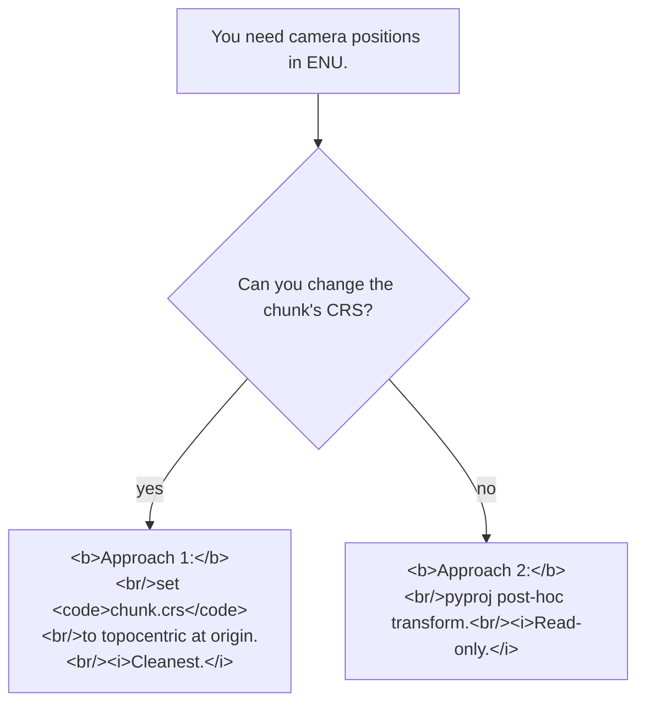

# Converting `camera.transform` to ENU (or any local Cartesian)
> **Confidence:** *medium.* The forward path (chunk-local →
> ECEF → CRS-target) is API-introspectable and unambiguous. The
> ENU-via-`+proj=topocentric` recipe is standard PROJ syntax
> but its acceptance by `Metashape.CoordinateSystem(...)` is the
> empirically-testable claim of this article.

The single most-confused topic in Metashape's coordinate
handling: how to get camera poses in ENU (East-North-Up) for
external use — Cesium viewers, mission-planning tools,
GNSS/IMU comparisons, etc.

`camera.transform` lives in the **chunk-local** frame whose axes
are *arbitrary* (alignment-determined). Converting requires
walking through three frames in order: chunk-local → world
(ECEF for georeferenced projects) → CRS-target. ENU is one
specific CRS-target.

## The three frames

| Frame | Origin | Axes | Where it lives in the API |
|-------|--------|------|---------------------------|
| **Chunk-local** | Arbitrary | Arbitrary | `camera.transform` (4×4 matrix) |
| **World (ECEF)** | Earth-centred | ECEF axes | `chunk.transform.matrix * camera.transform` |
| **CRS-target** | Whatever `chunk.crs` defines | CRS-determined | `chunk.crs.project(world_xyz)` |

For a non-georeferenced chunk, all three frames coincide
(`chunk.transform.matrix` is identity; `chunk.crs` is the
default local CRS). For a georeferenced chunk:

- `chunk.transform.matrix` is the chunk-local → ECEF rotation
  + translation + scale fitted by the alignment.
- `chunk.crs` is typically a geographic CRS (EPSG:4326 / WGS-84
  geographic) or a projected CRS (UTM zone, etc.). The `project`
  method maps ECEF → that CRS.

ENU at a chosen origin is a specific local Cartesian CRS.

## Approach 1 — Set the chunk's CRS to a topocentric (ENU) frame

The cleanest approach: set the chunk's CRS to an ENU-at-origin
frame *before* exporting. Subsequent
`chunk.transform.matrix * camera.transform` produces ENU camera
poses directly.

```python
import Metashape

chunk = Metashape.app.document.chunk

# Choose an origin: lat / lon / altitude (WGS-84).
origin_lat = 37.40
origin_lon = -79.15
origin_alt = 208.0

chunk.crs = Metashape.CoordinateSystem(
    f"+proj=topocentric "
    f"+lat_0={origin_lat} +lon_0={origin_lon} +h_0={origin_alt} "
    f"+datum=WGS84 +ellps=WGS84 +units=m +no_defs"
)
chunk.updateTransform()    # required: re-fits the similarity transform to the new CRS

# Now world-frame coordinates from chunk.transform are ENU at the chosen origin.
T = chunk.transform.matrix    # chunk-local → ENU
for camera in chunk.cameras:
    if camera.transform is None:
        continue
    enu = T * camera.transform
    east, north, up = enu.translation()
    print(f"{camera.label}  E={east:>10.3f}  N={north:>10.3f}  U={up:>8.3f}")
```

After setting the topocentric CRS, the chunk's
`updateTransform()` re-fits its similarity transform to align
chunk-local with ENU. Camera positions then read as ENU offsets
from the origin.

## Approach 2 — Post-hoc projection via `pyproj`

For a project whose CRS shouldn't be changed (e.g., already-
exported orthomosaics in UTM), do the conversion outside
Metashape:

```python
import pyproj
import Metashape

chunk = Metashape.app.document.chunk

# CRS the chunk lives in (typically WGS-84 geographic or a UTM zone).
src_crs = chunk.crs.wkt   # WKT representation

# ENU at chosen origin.
origin_lat, origin_lon, origin_alt = 37.40, -79.15, 208.0
ecef_to_enu = pyproj.Transformer.from_crs(
    "EPSG:4978",   # ECEF (geocentric WGS-84)
    f"+proj=topocentric +lat_0={origin_lat} +lon_0={origin_lon} "
    f"+h_0={origin_alt} +datum=WGS84 +ellps=WGS84 +units=m +no_defs",
    always_xy=True,
)

T = chunk.transform.matrix    # chunk-local → ECEF (since chunk is georeferenced)

for camera in chunk.cameras:
    if camera.transform is None:
        continue
    ecef_pos = T.mulp(camera.transform.translation())
    east, north, up = ecef_to_enu.transform(ecef_pos.x, ecef_pos.y, ecef_pos.z)
    print(f"{camera.label}  E={east:>10.3f}  N={north:>10.3f}  U={up:>8.3f}")
```

Use this when:

- The project's CRS must remain unchanged (downstream tools
  consume WGS-84 / UTM).
- You want ENU output without touching the project file.
- You need the conversion to run outside Metashape (e.g., in a
  separate post-processing pipeline).

The `pyproj` library is the recommended dependency; the
relevant transform is "EPSG:4978 (ECEF) → topocentric at
origin."

## Approach 3 — Read-only manual extraction

For occasional lookups without setting up `pyproj`:

```python
import Metashape

chunk = Metashape.app.document.chunk
T = chunk.transform.matrix
crs = chunk.crs

for camera in chunk.cameras:
    if camera.transform is None:
        continue
    ecef_pos = T.mulp(camera.transform.translation())     # ECEF
    crs_pos = crs.project(ecef_pos)                       # chunk's CRS
    print(f"{camera.label}  CRS coords: {crs_pos}")
```

`crs_pos` is in whatever the chunk's CRS happens to be. If
that CRS is geographic (WGS-84), `crs_pos` is `(lon, lat,
alt)`. If it's UTM, `crs_pos` is `(easting, northing, alt)`.
For ENU, use Approach 1 or 2.

## Decision picker



## Caveats

- **`+proj=topocentric` requires PROJ 8.0+.** Metashape's bundled
  PROJ version determines whether this PROJ syntax is accepted.
  Verify by running the Approach 1 code; if
  `Metashape.CoordinateSystem(...)` raises, fall back to
  Approach 2.
- **Setting `chunk.crs` triggers re-projection of all
  reference data.** If the chunk has imported GCPs in
  WGS-84 / UTM, switching the CRS to topocentric reprojects
  them. Confirm with `print(chunk.markers[0].reference.location)`
  before and after.
- **Non-georeferenced chunks have no meaningful ENU.** The
  chunk-local frame's axes are alignment-determined; without
  a georeference, "north" and "up" have no physical meaning.
  ENU conversion only makes sense when `chunk.crs` is a real
  earth-frame CRS.
- **`chunk.transform.matrix` includes scale.** For a chunk with
  a metric CRS the scale is unity; for a chunk in unfortunate
  units (e.g., feet) the scale captures the conversion.
  Verify with `chunk.transform.scale` (should be 1.0 for
  metric ENU output).
- **Camera-orientation matrix** (the rotation portion of
  `enu = T * camera.transform`) is the camera's rotation in
  ENU — useful for orienting per-camera ENU footprints. The
  full 4×4 result `T * camera.transform` is an ENU pose; its
  `.rotation()` and `.translation()` accessors expose the
  components.

## Runnable demonstration on the Aerial-with-GCPs sample dataset

The script below tries Approach 1 first; on failure, falls back
to Approach 2 (assumes `pyproj` is installed). Output: ENU
camera positions for the first 10 aligned cameras.

> **Demo verified:** ✗ — pending Tier 3 reproduction on Metashape
> Pro 2.2 / 2.3 with the *Aerial-with-GCPs* sample dataset. The
> Approach 1 PROJ-syntax acceptance is the empirically-testable
> claim; the underlying transformation math is standard.

```python
"""Convert camera positions to ENU.

Pre-condition: chunk fully aligned, with a georeferenced CRS
(WGS-84 or projected). Aerial-with-GCPs satisfies this.
"""
import Metashape

chunk = Metashape.app.document.chunk

# Pick origin from the first camera's reference location.
origin = chunk.cameras[0].reference.location
origin_lon, origin_lat, origin_alt = origin.x, origin.y, origin.z

original_crs = chunk.crs

try:
    # Approach 1: set the chunk's CRS to topocentric.
    chunk.crs = Metashape.CoordinateSystem(
        f"+proj=topocentric "
        f"+lat_0={origin_lat} +lon_0={origin_lon} +h_0={origin_alt} "
        f"+datum=WGS84 +ellps=WGS84 +units=m +no_defs"
    )
    chunk.updateTransform()
    print("Using Approach 1: chunk.crs = topocentric")
    method = "approach-1"
except Exception as e:
    print(f"Approach 1 failed ({e}); falling back to Approach 2 (pyproj)")
    method = "approach-2"

T = chunk.transform.matrix

for camera in chunk.cameras[:10]:
    if camera.transform is None:
        continue
    if method == "approach-1":
        enu = T * camera.transform
        east, north, up = enu.translation()
    else:
        # Approach 2 fallback (requires pyproj).
        import pyproj
        transformer = pyproj.Transformer.from_crs(
            "EPSG:4978",
            f"+proj=topocentric +lat_0={origin_lat} +lon_0={origin_lon} "
            f"+h_0={origin_alt} +datum=WGS84 +ellps=WGS84 +units=m +no_defs",
            always_xy=True,
        )
        ecef = T.mulp(camera.transform.translation())
        east, north, up = transformer.transform(ecef.x, ecef.y, ecef.z)
    print(f"{camera.label:>30}  E={east:>10.3f}  N={north:>10.3f}  U={up:>8.3f}")

# Restore original CRS if Approach 1 changed it.
if method == "approach-1":
    chunk.crs = original_crs
    chunk.updateTransform()
```

**Expected output:** the first camera's ENU position is near
`(0, 0, 0)` (it was the origin); subsequent cameras' positions
are East/North/Up offsets in metres from the first camera. If
ENU positions are nonsensical (e.g., values in the millions),
the chunk's CRS isn't georeferenced or `chunk.transform.matrix`
hasn't been computed yet — run `chunk.alignCameras()` first.

## See also

- [Computing camera direction vectors and look-at points](camera-direction-vectors.md)
  — for the optical-axis direction extraction (chunk-local or world frame).
- [`camera.project` and `camera.unproject`: 2D ↔ 3D in Python](camera-project-unproject.md)
  — the projective half of camera-coordinate scripting (image
  pixels ↔ 3D points).
- [`chunk.transform.matrix` is local→world; `camera.transform` is local](../crs/chunk-frame-vs-camera-frame.md)
  — the conceptual model for the three-frame conversion that
  this article walks through.
- [YPR rotation conventions: `ypr2mat` vs `camera.reference.rotation`](ypr-rotation-conventions.md)
  — for converting the ENU-projected pose to yaw/pitch/roll
  (or omega/phi/kappa) for downstream tools.
- [Camera reference error: per-camera location and orientation in Python](../repeatability-qa/camera-reference-error-python.md)
  — uses similar three-frame manipulation for residual
  computation.

## References

- [Forum thread, *How do I convert a camera to ENU?*, 2018](https://www.agisoft.com/forum/index.php?topic=9689.0)
  — primary source; the pointer to the freshdesk
  article and the photoscan-scripts GitHub repo (msg 47147,
  2018-09-18).
- [agisoft-llc/metashape-scripts on GitHub](https://github.com/agisoft-llc/metashape-scripts/blob/master/src/footprints_to_shapes.py)
  — `footprints_to_shapes.py` script that uses the same
  ECEF / CRS pipeline.
- [*How to calculate estimated Exterior Orientation parameters for the cameras using Python* (Agisoft KB)](https://agisoft.freshdesk.com/support/solutions/articles/31000145016)
  — official documentation on the camera-pose math.
- *Metashape Python Reference* (2.3.1), `Chunk.transform`,
  `Chunk.crs`, `CoordinateSystem.project` / `unproject`.
- [`chunk.transform.matrix` is local→world; `camera.transform`
  is local](../crs/chunk-frame-vs-camera-frame.md)
  — the foundational coordinate-frame distinction.
- [Computing per-camera coverage area](computing-camera-coverage-area.md) — companion article whose footprint
  coordinates can be ENU-converted via this article's recipe.
- Related: [Mapping orthomosaic pixels back to source images](orthomosaic-pixel-to-source-image.md) — uses the same `chunk.transform.matrix.inv()` /
  `Camera.project` machinery in the *reverse* direction (world
  → pixel, vs. this article's pixel → world).
