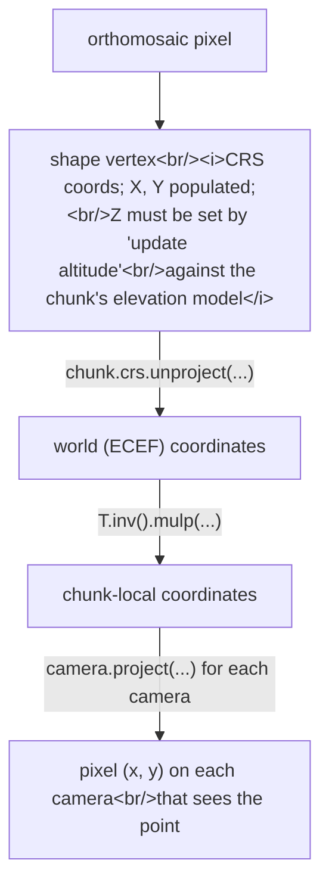

# Mapping orthomosaic pixels back to source images

> **Confidence:** *high.* The four-step pipeline (CRS unproject
> → chunk-local → camera.project) follows the canonical
> PhotoScan-era recipe; all API references are
> introspection-confirmed and stable through Metashape 2.x.

A common downstream-of-orthomosaic question: given a feature
detected on the orthomosaic (an object, a defect, a survey
target), where does that feature appear on the source images?
The answer is a back-projection through the chunk's CRS, world
frame, and camera projection — a four-step pipeline that has
remained API-stable through Metashape 2.x.

## The pipeline



The script (ported from a PhotoScan-era forum sample to
Metashape 2.x):

```python
"""Project a CRS-coordinate point onto every aligned camera that sees it.

Pre-condition: a Point shape exists in chunk.shapes[0] with X, Y, Z
all populated. To populate Z from the elevation model, run the
'update altitude' command from the shape's context menu in the
Ortho view, or call chunk.updateAltitude([shape]) in Python.
"""
import Metashape

chunk = Metashape.app.document.chunk

# 1. Get the shape vertex in CRS coordinates.
shape = chunk.shapes[0]
crs_point = shape.geometry.coordinates[0][0]   # Vector(X, Y, Z) in chunk.crs

# 2. CRS → world (ECEF for georeferenced chunks).
world_point = chunk.crs.unproject(crs_point)

# 3. World → chunk-local.
T_inv = chunk.transform.matrix.inv()
local_point = T_inv.mulp(world_point)

# 4. For each aligned camera, project and check in-bounds.
print(f"{'camera':>30}  {'x_pixel':>10}  {'y_pixel':>10}")
for camera in chunk.cameras:
    if not camera.transform:
        continue   # unaligned

    pixel = camera.project(local_point)
    if pixel is None:
        continue

    if (0 <= pixel.x < camera.sensor.width
            and 0 <= pixel.y < camera.sensor.height):
        print(f"{camera.label:>30}  {pixel.x:>10.1f}  {pixel.y:>10.1f}")
```

The output: for every aligned camera that sees the point, its
pixel coordinates in that camera's image.

## The "update altitude" prerequisite

Critical step that's easy to miss:

> "If you have drawn the point shape on the orthomosaic and want
> to get it's [sic] coordinates on the source images you should
> at first use 'update altitude' command from teh [sic] shape
> context menu in the Ortho view mode to ensure that shape vertex
> has all three coordinates [...]" — Alexey Pasumansky,
> 2018-09-19, PhotoScan 1.4
> ([permalink](https://www.agisoft.com/forum/index.php?topic=9404.msg44623#msg44623))

Why: orthomosaics are 2D. Drawing a Point shape on the
orthomosaic creates a vertex with X / Y in CRS coordinates but
**Z initialised to a default** (often 0 in the CRS frame, which
is far from any real elevation in WGS-84 or UTM). Without
correct Z, `chunk.crs.unproject` places the point at the wrong
altitude and `camera.project` returns plausible-looking but
geometrically-wrong pixels.

The fix is to query the chunk's elevation source (DEM, point
cloud, or mesh) for the Z at the X/Y location:

- **GUI:** in *Ortho view*, right-click the shape → *Update
  altitude*. Verify that the shape's Z has changed from `0`
  (or default) to a realistic elevation.
- **Python:**

  ```python
  chunk.updateAltitude([shape])
  ```

  Verify with `print(shape.geometry.coordinates[0][0])` before and after — the
  Z should change.

If the shape was created programmatically with all three
coordinates (e.g., from a `(lat, lon, alt)` source), the
update-altitude step is unnecessary; the X / Y / Z are already
correct.

## Why it matters

Three operational scenarios:

- **Object detection back-projection.** Run a CNN on the
  orthomosaic; for each detected object, back-project its
  centroid to all source images. Useful for higher-resolution
  inspection, cross-view consistency checking, and training-
  data annotation.
- **Quality control of stitching.** A pixel that back-projects
  to multiple source images and shows different content is a
  stitching artefact. Iterate over a grid of orthomosaic
  pixels; flag those whose source-image projections show
  significant photometric variance.
- **Photo-stamping workflows.** Annotate a feature once on the
  orthomosaic; render the annotation onto every source image
  that sees the feature.

## Caveats

- **`Camera.project(...)` returns `None` for points behind the
  camera or in degenerate configurations.** The
  `if pixel is None` check is defensive but easy to forget.
- **The in-bounds check is necessary.** A point geometrically
  in the camera's frustum may project to coordinates outside
  the image (e.g., when the lens distortion model maps the
  point off the sensor). The
  `0 <= pixel.x < camera.sensor.width` check filters those.
- **No occlusion check.** The script reports any camera whose
  projection lands in-bounds, *including* cameras where the
  point is occluded by mesh geometry behind a hill. To filter
  by visibility, raycast `local_point` from each camera centre
  against `chunk.model.faces` and exclude cameras whose ray hits
  another face before reaching `local_point` (analogous logic
  to [Computing per-camera coverage area](computing-camera-coverage-area.md)).
- **The 2018 script's namespace was `PhotoScan`.** This article's
  port renames to `Metashape`; all function signatures are
  unchanged. If you find an older copy of the script online,
  the rename is the only change needed.
- **Non-georeferenced chunks** have `chunk.crs` set to a
  default local CRS; `chunk.crs.unproject` then becomes a
  near-identity operation. The pipeline still works but the
  shape vertex must be in chunk-local coordinates from the
  start (no real CRS conversion happens).

## Related: pixel coordinates without a point cloud

A companion question (forum
[topic=17352](https://www.agisoft.com/forum/index.php?topic=17352.0)):
how to convert image pixels to real-world coordinates *without*
a point cloud or mesh available. The recipe is the **inverse**
of the one above:

```python
# Camera-pixel → world coordinate, given depth assumption.
pixel = Metashape.Vector([1024, 768])
direction = camera.calibration.unproject(pixel)
direction_world = chunk.transform.matrix.mulv(
    camera.transform.mulv(direction)
)
camera_centre_world = chunk.transform.mulp(camera.center)

# Without a model, you need a depth: how far along the ray to
# project. Common choices:
#   - Use camera.reference.location's altitude as a flat-ground
#     approximation.
#   - Intersect the ray with a horizontal plane at known elevation.
#   - Intersect with a triangulated mesh / DEM if available
#     (which is the with-mesh case the rest of this article handles).
```

When a mesh / DEM is available, use the with-mesh form; when
not, the flat-plane assumption is tolerable for nadir aerial
photography but breaks down for oblique views.

## Runnable demonstration on the Aerial-with-GCPs sample dataset

The script below requires a Point shape on the orthomosaic,
which the user must place manually before running.

> **Demo verified:** ✗ — pending Tier 3 reproduction on Metashape
> Pro 2.2 / 2.3 with the *Aerial-with-GCPs* sample dataset.
> The original PhotoScan-era script is direct; the port is
> mechanical (`PhotoScan` → `Metashape`); end-to-end run with
> a real orthomosaic and shape is the missing step.

```python
"""Project an orthomosaic point shape onto source images.

Pre-condition: chunk has an orthomosaic and at least one Point
shape with all three coordinates populated (run
chunk.updateAltitude([shape]) or use the GUI 'update altitude'
context menu first).
"""
import Metashape

chunk = Metashape.app.document.chunk
if not chunk.shapes:
    raise SystemExit("No shapes in chunk; create a Point shape first")

shape = chunk.shapes[0]

# Defensive: warn if the shape's Z looks suspicious.
crs_point = shape.geometry.coordinates[0][0]
if abs(crs_point.z) < 0.01:
    print("WARNING: shape vertex Z is ~0; did you run 'update altitude'?")

world_point = chunk.crs.unproject(crs_point)
T_inv = chunk.transform.matrix.inv()
local_point = T_inv.mulp(world_point)

print(f"Source point in CRS    : {crs_point}")
print(f"Source point in chunk  : {local_point}")
print()
print(f"{'camera':>30}  {'x_pixel':>10}  {'y_pixel':>10}")

count = 0
for camera in chunk.cameras:
    if not camera.transform:
        continue
    pixel = camera.project(local_point)
    if pixel is None:
        continue
    if (0 <= pixel.x < camera.sensor.width
            and 0 <= pixel.y < camera.sensor.height):
        print(f"{camera.label:>30}  {pixel.x:>10.1f}  {pixel.y:>10.1f}")
        count += 1

print(f"\nPoint visible in {count} aligned camera(s)")
```

**Expected output:** for a typical aerial-survey shape,
several cameras will see the point (typically 5–20 in
overlapping aerial datasets). Each camera's projected pixel
position should be plausible — the same physical feature on the
orthomosaic should appear at consistent visual content in every
source image it back-projects to.

## References

- [Forum thread, *How to map a pixel in a orthophoto to the
  original images*, 2018](https://www.agisoft.com/forum/index.php?topic=9404.0)
  — primary source; the complete sample script (msg
  47266, 2018-09-19).
- [Forum thread, *Convert pixel coordinates to real world without
  dense cloud*, 2024](https://www.agisoft.com/forum/index.php?topic=17352.0)
  — companion thread on the inverse direction (image pixel →
  world).
- *Metashape Python Reference* (2.3.1), `Camera.project`,
  `Chunk.crs.unproject`, `Matrix.inv`, `Matrix.mulp`,
  `Chunk.shapes`, `Shape.vertices`.
- [Computing per-camera coverage area](computing-camera-coverage-area.md) — companion article using the *forward*
  direction (camera-pixel → world); the two articles share the
  same projection machinery.
- [`chunk.transform.matrix` is local→world; `camera.transform`
  is local](../crs/chunk-frame-vs-camera-frame.md)
  — the foundational `T.inv().mulp(...)` step documented here.
- Related: [Orthomosaic export — the 4GB / BigTIFF limit and
  shift-during-export](../../workflow/orthomosaic/orthomosaic-export-pitfalls.md) — the export-side companion. The pixel-back-
  projection in this article assumes the orthomosaic is
  geometrically correct; if the exported orthomosaic is shifted
  relative to the in-Metashape preview, see O.1's diagnostic
  checklist.
