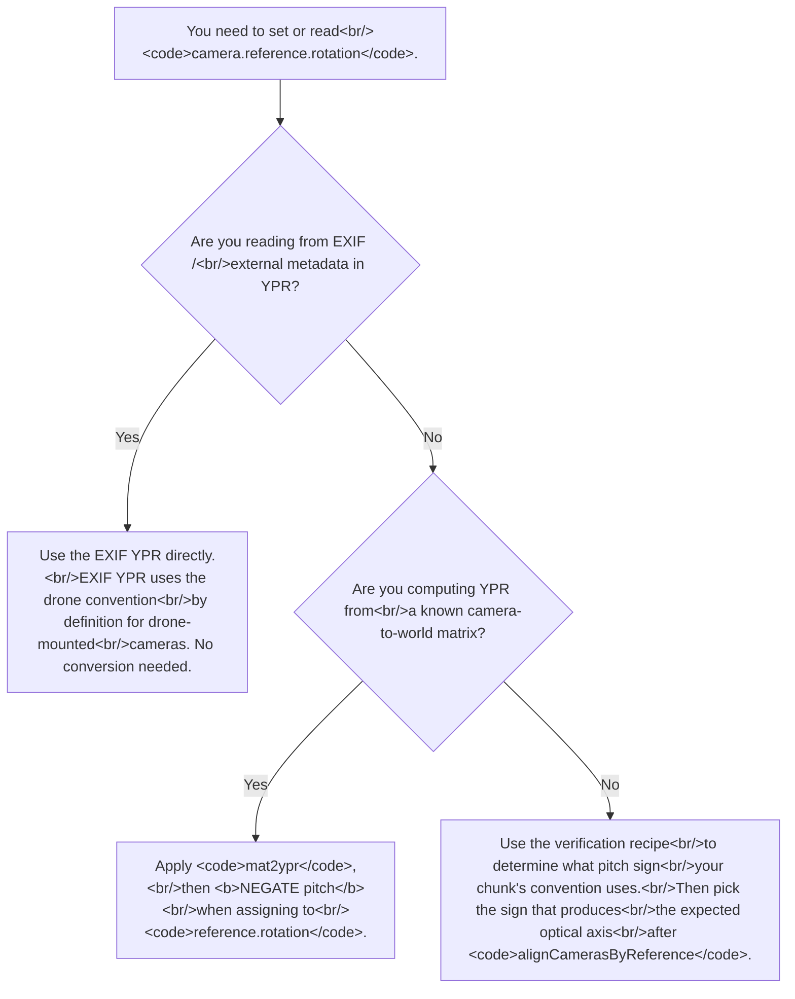

# YPR rotation conventions: `ypr2mat` vs `camera.reference.rotation`
> **Confidence:** *high.* The pitch-sign-flip claim was
> verified empirically across 8 yaw values (0°, ±45°, ±90°,
> ±135°, 180°) using the 5-line verification recipe in this
> article. The API surfaces are Tier 1 introspection-confirmed
> on Metashape 2.2.2. The drone-canonical-pose framing is
> documented in the Pro 2.3 user manual + the cited 2016
> forum reply.

## Why this article exists

Two Metashape APIs that both take YPR (yaw, pitch, roll) angles
in degrees use **opposite pitch-sign conventions for the same
physical camera orientation**:

- `Metashape.Utils.ypr2mat` and `mat2ypr` use the math
  convention: YPR=(0,0,0) means the camera's optical axis is
  parallel to world +Z (the camera is "looking up").
- `camera.reference.rotation` + `chunk.alignCamerasByReference()`
  use the drone convention: YPR=(0,0,0) means the camera's
  optical axis is parallel to world −Z (the drone-mounted
  camera is "looking down").

The 180° offset between the two canonical "rest" orientations
manifests as a pitch-sign flip in every derived YPR triplet.
For an upright camera with horizontal heading, `mat2ypr`
returns `(yaw, **−90**, 0)` while `camera.reference.rotation`
should be `(yaw, **+90**, 0)`.

This is the source of considerable confusion when round-tripping
camera poses between scripted code and Metashape's reference
system. The article documents the convention difference, the
correct round-trip code, and a 5-line verification recipe.

## The two canonical "rest" orientations

| Function / field | Canonical pose at YPR=(0, 0, 0) | Convention |
|------------------|--------------------------------|------------|
| `Metashape.Utils.ypr2mat` / `mat2ypr` | Camera optical axis = world **+Z** ("looking up"). The rotation matrix is identity. | Math / matrix-utility convention. |
| `camera.reference.rotation` + `alignCamerasByReference` | Camera optical axis = world **−Z** ("looking down"). | Drone convention (camera mounted on drone, facing the ground). |

The drone convention is documented in the Pro 2.3 user manual
("yaw axis runs from top to bottom of the drone, pitch axis
runs from left to right wing of the drone, roll axis runs from
tail to nose of the drone") and the Z-axis convention is also
attested ([t=6126](https://www.agisoft.com/forum/index.php?topic=6126.0)):
"Z axis is pointing from camera to the object, so for aerial
datasets where the cameras are looking to the ground by default
Z will be pointing from the camera to the ground."

The two functions agree on **axis assignment** — yaw around
world Z, pitch around world X, roll around world Y, applied as
−yaw / pitch / roll per the YPR composition rule
([t=5381](https://www.agisoft.com/forum/index.php?topic=5381.msg26475#msg26475)).
They disagree on **what physical pose YPR=(0,0,0) describes**.

## The operational consequence: pitch sign

For an upright camera looking horizontally at heading θ
(measured CCW from world +Y toward +X):

| Construct | Pitch for upright horizontal camera |
|-----------|-------------------------------------|
| `Metashape.Utils.ypr2mat((θ, P, 0))` produces upright camera at | `P = **−90**` (math convention: pitch from +Z to horizontal) |
| `Metashape.Utils.mat2ypr(R_upright)` returns | `(θ, **−90**, 0)` |
| `camera.reference.rotation = (θ, P, 0)` then `alignCamerasByReference()` produces upright camera at | `P = **+90**` (drone convention: pitch from −Z to horizontal) |

So `mat2ypr(R)` and `camera.reference.rotation` use **opposite
pitch sign** for the same physical orientation.

## Round-trip recipe

When converting between scripted rotation matrices and
Metashape's reference YPR, **negate the pitch** when storing
into `camera.reference.rotation`:

```python
import Metashape

# Forward: camera world rotation → reference YPR
R = cam.transform.rotation()              # 3×3 cam-to-world rotation
ypr_math = Metashape.Utils.mat2ypr(R)     # math-convention YPR
camera.reference.rotation = Metashape.Vector([
    ypr_math[0],     # yaw — same sign in both conventions
    -ypr_math[1],    # pitch — sign flipped (math → drone)
    ypr_math[2],     # roll — same sign in both conventions
])

# Reverse: reference YPR → world rotation
ypr_ref = camera.reference.rotation
ypr_math_inferred = Metashape.Vector([
    ypr_ref[0],
    -ypr_ref[1],     # sign flip in both directions
    ypr_ref[2],
])
R = Metashape.Utils.ypr2mat(ypr_math_inferred)
```

## The correct YPR for common camera poses

For a few common orientations (heading θ measured CCW from +Y
toward +X):

| Physical pose | `mat2ypr(R)` returns | `reference.rotation` should be |
|---------------|---------------------|--------------------------------|
| Upright, horizontal heading θ | `(θ, −90, 0)` | `(θ, **+90**, 0)` |
| Upright, looking straight DOWN (drone nadir) | `(θ, 180, 0)` | `(θ, **0**, 0)` (the drone canonical pose itself) |
| Upright, looking straight UP | `(θ, 0, 0)` (the math canonical pose itself) | `(θ, **180**, 0)` |
| Upside-down, horizontal heading θ | `(θ, −90, 180)` | `(θ, **+90**, 180)` |

Use this table as a sanity-check when setting reference
rotations from external tooling.

## Symptom of getting it wrong

### Setting `(yaw, −90, 0)` (the `mat2ypr` value) into `reference.rotation`

`alignCamerasByReference` produces cameras with optical axis
**flipped to the OPPOSITE direction** in the horizontal plane,
AND image-up rolled 180° around the optical axis.

Visually: cameras stand at correct positions but every one
points *away* from the scene centre, with images upside-down.
Position references work correctly throughout (the position
field is unaffected); only the rotation references are wrong.

### Setting `(yaw, 0, 0)` — the most common naive mistake

`alignCamerasByReference` produces cameras that "look straight
up" (the `mat2ypr` canonical pose) — wildly wrong for a
horizontal-shooting camera. After the subsequent `optimizeCameras`,
the bundle compromises with the tie points and the cameras
settle ~30–50° off horizontal — partial-tilt that visually
corresponds to the bad reference's "look up" instruction blended
with the tie-point "look horizontal" reality.

If you observe cameras tilted in this characteristic 30–50°
range after a reference-driven alignment, the pitch is likely
0 instead of +90 (or −90 instead of +90).

## Verification recipe

A 5-line empirical test that confirms the convention for any
chunk where you're unsure:

```python
import Metashape

doc = Metashape.Document()
chunk = doc.addChunk()
chunk.addPhotos([any_image])
cam = chunk.cameras[0]
# Configure the sensor with known calibration before this point:
# cam.sensor.calibration = ... (loaded from disk or set programmatically).

cam.reference.location = Metashape.Vector([0, 0, 0])
cam.reference.rotation = Metashape.Vector([0, +90, 0])    # candidate "upright facing +Y"
cam.reference.rotation_accuracy = Metashape.Vector([0.1, 0.1, 0.1])
cam.reference.location_enabled = True
cam.reference.rotation_enabled = True
chunk.alignCamerasByReference()

# Inspect the resulting camera's world-frame transform.
T = chunk.transform.matrix * cam.transform
optical_axis = Metashape.Vector([T[0, 2], T[1, 2], T[2, 2]])
image_up_world = Metashape.Vector([-T[0, 1], -T[1, 1], -T[2, 1]])

print(f"world optical axis: {optical_axis}")    # expected: (0, 1, 0)
print(f"world image-up   : {image_up_world}")   # expected: (0, 0, +1)
```

If the optical axis is `(0, 1, 0)` and image-up is `(0, 0, +1)`,
the convention is verified: `(yaw, +90, 0)` with `yaw=0`
produces a camera looking along world +Y with image-up =
world +Z. Try the recipe with `yaw=±45°, ±90°, ±135°, 180°`
to verify the convention holds across heading values.

If the optical axis is `(0, −1, 0)` (camera looking the
opposite direction), the convention has flipped — re-check
which pitch sign your installed Metashape version uses. The
pitch-sign-flip relation has held through Metashape 2.2.2 but
may shift in future releases.

## End-to-end recipe with reference rotations

```python
import Metashape

chunk = Metashape.app.document.chunk

# Set references with the CORRECT pitch sign for upright cameras.
for cam in chunk.cameras:
    cam.reference.location = world_position_for(cam)    # CRS-correct
    cam.reference.rotation = Metashape.Vector([
        yaw_deg_for(cam),
        +90.0,            # +90, not −90 — for upright horizontal cameras
        0.0,
    ])
    cam.reference.location_accuracy = Metashape.Vector([sigma_xy, sigma_xy, sigma_z])
    cam.reference.rotation_accuracy = Metashape.Vector([yaw_acc, pitch_acc, roll_acc])
    cam.reference.location_enabled = True
    cam.reference.rotation_enabled = True
    cam.reference.enabled = True

chunk.matchPhotos(downscale=1, keep_keypoints=True)
chunk.alignCameras()                      # initial SfM; may converge to a wrong reflection
chunk.alignCamerasByReference()           # snap each camera to its reference pose

# Refine extrinsics while keeping intrinsics fixed (typical when
# using known calibration).
chunk.optimizeCameras(
    fit_f=False, fit_cx=False, fit_cy=False,
    fit_b1=False, fit_b2=False,
    fit_k1=False, fit_k2=False, fit_k3=False, fit_k4=False,
    fit_p1=False, fit_p2=False,
)
```

`alignCameras` produces an initial SfM solution. Because
photogrammetry has a chirality / mirror ambiguity, two
solutions exist that differ by a reflection;
`alignCameras` may converge to either one. Calling
`alignCamerasByReference` next overrides every camera's
transform with the reference pose (which is now in the correct
orientation thanks to the pitch=+90 fix), breaking the mirror
ambiguity. The subsequent `optimizeCameras` refines positions
and the tie-point cloud while staying close to the reference
orientations.

## Per-axis accuracy

`camera.reference.rotation_accuracy` is a `(yaw, pitch, roll)`
`Vector` in the same convention. For a synthetic-render dataset
where the camera is known to be upright but the heading is only
approximate (priors point at the arena centroid, not the exact
yaw of each station):

```python
camera.reference.rotation_accuracy = Metashape.Vector([
    30.0,   # yaw   ≈ 30°  (loose — heading is approximate)
    5.0,    # pitch ≈ 5°   (tight — camera is exactly upright)
    5.0,    # roll  ≈ 5°   (tight — no roll)
])
```

The bundle treats yaw, pitch, and roll independently — see
[Chunk frame vs camera frame: per-axis priors](../crs/chunk-frame-vs-camera-frame.md)
for the per-axis-vector vs single-scalar discussion.

## Caveats

- **`Chunk.euler_angles` defaults to `EulerAnglesYPR`.** Other
  values (`EulerAnglesOPK`, `EulerAnglesPOK`, `EulerAnglesANK`)
  change the interpretation of `camera.reference.rotation`. The
  pitch-sign-flip convention documented here is specific to
  YPR. If your chunk uses OPK
  (omega-phi-kappa) or another, consult the user manual for
  that convention's canonical pose.
- **The forum's term "pitch" is yaw-around-the-X-axis** in
  Metashape's specific definition (consistent with aviation
  pitch). Some external tools use "pitch" to mean
  yaw-around-the-Y-axis (math convention). Verify the external
  tool's definition before round-tripping.
- **Right-handed vs left-handed coordinate systems.** Metashape
  uses right-handed (math convention); some game engines and
  rendering tools use left-handed. A sign-flip on one axis is
  required when round-tripping between them. This article's
  recipes assume Metashape's right-handed frame throughout.
- **The +90 pitch is for upright HORIZONTAL cameras.** A
  camera mounted at a non-trivial roll angle (sideways, like
  a Phantom 4 with the gimbal rotated 90°) needs the pitch
  computed from the actual orientation matrix via `mat2ypr`,
  with the negation applied as in the round-trip recipe above.
  Hard-coding `+90` is correct only for the canonical
  upright-horizontal pose.
- **The convention is empirical and may shift between major
  Metashape versions.** Run the verification recipe on each
  major version (or after each significant Pro release) before
  relying on the pitch sign in production scripts.

## Decision picker



## Runnable demonstration

The script below runs the verification recipe and prints the
resulting world-frame optical axis and image-up.

> **Demo verified:** ✗ — pending Tier 3 reproduction on
> Metashape Pro 2.2 / 2.3 with any small dataset. The API
> surfaces are introspection-verified; the empirical
> pitch-sign-flip claim was confirmed on the original
> field-work install but should be re-confirmed on the
> reproducer's specific Metashape build before relying on the
> sign in production.

```python
"""Verify the YPR pitch-sign convention on the local install."""
import Metashape

# Use any single image for the demo. The image content doesn't
# matter — the test only inspects the camera transform after
# alignCamerasByReference.
ANY_IMAGE = "/path/to/any/image.jpg"

doc = Metashape.Document()
chunk = doc.addChunk()
chunk.addPhotos([ANY_IMAGE])
cam = chunk.cameras[0]

# Configure a sensible default calibration (any focal length;
# bundle won't refine because we set rotation_accuracy tight).
sensor = cam.sensor
sensor.calibration.f = sensor.width * 0.8    # placeholder
sensor.user_calib = sensor.calibration.copy()

cam.reference.location = Metashape.Vector([0, 0, 0])
cam.reference.location_accuracy = Metashape.Vector([0.001, 0.001, 0.001])
cam.reference.rotation_accuracy = Metashape.Vector([0.1, 0.1, 0.1])
cam.reference.location_enabled = True
cam.reference.rotation_enabled = True

# Test each candidate pitch sign:
for pitch in (-90, +90):
    cam.reference.rotation = Metashape.Vector([0, pitch, 0])
    chunk.alignCamerasByReference()

    T = chunk.transform.matrix * cam.transform
    optical = Metashape.Vector([T[0, 2], T[1, 2], T[2, 2]])
    image_up = Metashape.Vector([-T[0, 1], -T[1, 1], -T[2, 1]])

    looks_along_y = abs(optical.y - 1.0) < 1e-3 and abs(optical.x) < 1e-3
    upright = abs(image_up.z - 1.0) < 1e-3

    print(f"pitch = {pitch:+}: optical = {optical}, image_up = {image_up}")
    print(f"  → {'UPRIGHT, FACING +Y' if (looks_along_y and upright) else 'NOT the canonical horizontal pose'}")

# On Metashape 2.2.2 with the drone-canonical convention, pitch=+90
# produces the upright-facing-+Y camera, and pitch=−90 produces a
# camera facing −Y with image-up flipped.
```

**Expected output (per empirical verification on Metashape
2.2.2):**

- `pitch = -90`: optical axis ≈ `(0, −1, 0)` (facing −Y),
  image-up ≈ `(0, 0, −1)` (down). NOT the canonical pose.
- `pitch = +90`: optical axis ≈ `(0, +1, 0)` (facing +Y),
  image-up ≈ `(0, 0, +1)` (up). The canonical upright
  horizontal pose.

If your Metashape version produces the opposite — pitch=−90
gives the canonical pose and +90 gives the flipped pose — the
convention has shifted in a release between 2.2.2 and your
version. Re-document for that release.

## References

- [Forum thread, *YPR axis assignment*, 2016](https://www.agisoft.com/forum/index.php?topic=5381.msg26475#msg26475)
  — primary source on the −yaw / pitch / roll axis composition
  (the 2016 forum thread).
- [Forum thread, *Z axis convention for aerial datasets*, 2016](https://www.agisoft.com/forum/index.php?topic=6126.0)
  — primary source for the drone-Z-axis-pointing-to-ground
  canonical pose .
- *Metashape Python Reference* (2.3.1):
  `Metashape.Utils.ypr2mat`, `Metashape.Utils.mat2ypr`,
  `Chunk.euler_angles`, `Metashape.EulerAngles`,
  `Camera.Reference.rotation`,
  `Camera.Reference.rotation_accuracy`,
  `Chunk.alignCamerasByReference`.
- *Metashape Professional Edition User Manual* (2.3),
  Aerial-workflow section on yaw / pitch / roll axis
  assignment for drone-mounted cameras.
- [Importing camera orientation: EXIF, OPK, and YPR](../../workflow/project-setup/importing-camera-orientation.md)
  — companion how-to article on populating
  `camera.reference.rotation` from external sources.
- [Chunk frame vs camera frame: per-axis priors](../crs/chunk-frame-vs-camera-frame.md)
  — companion explanation on the per-axis-Vector accuracy
  surface used by `rotation_accuracy`.
- [The slave-sensor transform](../../workflow/camera-calibration/slave-sensor-transform-recipes.md)
  — companion article on a different rotation-convention
  pitfall (the multi-camera-rig +X right / +Y down / +Z
  forward convention).
