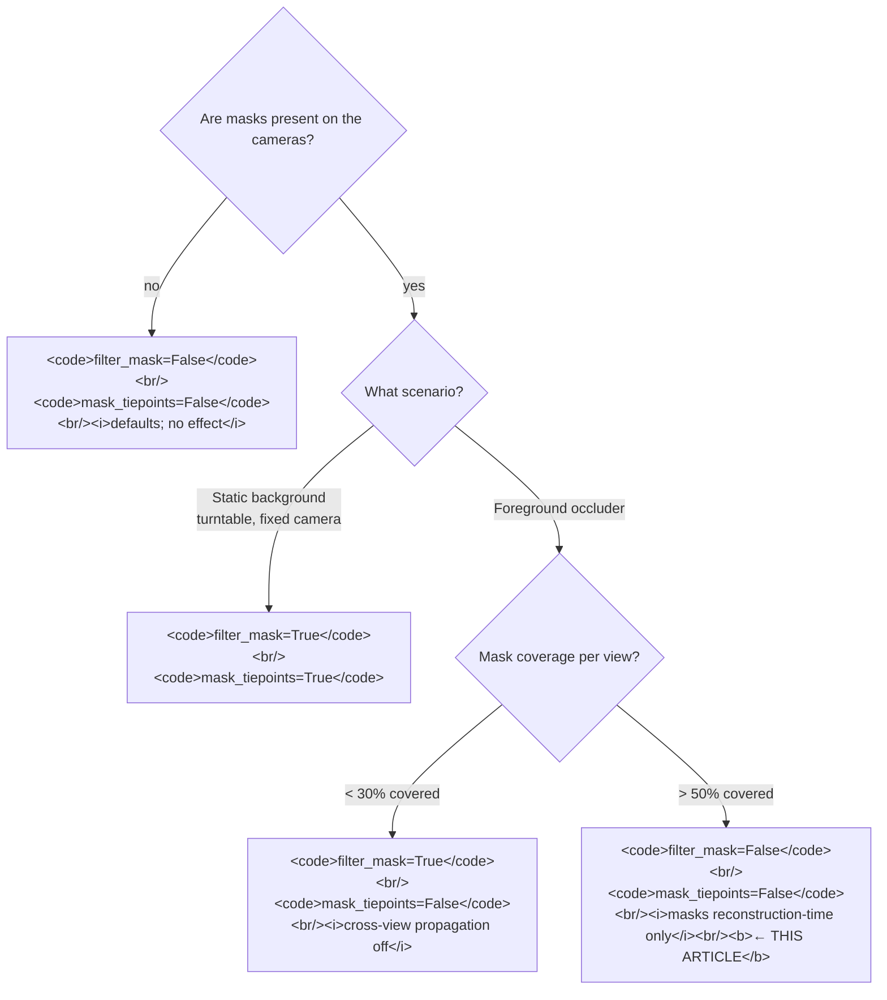

# `filter_mask=True` starves `matchPhotos` when masks cover most of the image
> **Confidence:** *medium.* The user manual presents
> `filter_mask` as a way to exclude masked regions from feature
> detection without warning about the heavy-masking failure mode.
> The failure is operational (testable on a controlled dataset)
> but is not directly stated in the manual; mark as inferred
> until Tier 3 reproduction.

This article documents a failure mode complementary to the one
covered by [`mask_tiepoints` cross-view propagation and the
foreground-occluder case](mask-tiepoints-cross-view.md). Where
the C.1 article addresses **wrong tie points being dropped** by
the cross-view propagation flag, this article addresses **the
keypoint pool collapsing** when the per-view exclusion flag is
combined with heavy masks.

The two failure modes are independent but commonly co-occur in
foreground-occluder workflows; the recommended combination for
heavy masking is `filter_mask=False` and `mask_tiepoints=False`,
making the masks effectively reconstruction-time-only constraints.

## What the manual says (and what it doesn't)

The user manual's description of `filter_mask`:

> "If apply mask to key points option is selected, areas
> previously masked on the photos are excluded from feature
> detection procedure." — *Metashape Professional Edition User
> Manual* (2.3), "Aligning photos" / "Apply mask to" (page 39).

This is correct for **moderate masking** — small foreground
occluders covering up to ~30% of each frame. Feature detection
in the unmasked region of each image continues to find enough
keypoints to support cross-view matching; the masked regions are
correctly ignored.

The manual does **not** warn about the failure that occurs when
masks cover **>50% of each frame**. In that regime, the
per-view keypoint pool drops below the level needed for robust
cross-view matching, and `matchPhotos` returns far fewer tie
points than the unmasked alignment would produce. `alignCameras`
either succeeds with terrible RMS or fails entirely.

## Why it happens

`Chunk.matchPhotos` operates per-view at feature-detection time:
it runs SIFT-like descriptors on the (filtered) image and writes
the keypoints to the chunk. The per-view keypoint count is
bounded above by `keypoint_limit=` (default 40 000) and below by
detector-quality and image-content density.

When a mask covers a large fraction of the image, the detector
runs only on the unmasked complement. The number of keypoints
extractable from the complement is bounded by its area — and
by its texture content. Heavily-masked images often have the
*scene of interest* in the masked region (the occluder is the
foreground, but the scene is what one wants to reconstruct),
leaving the unmasked complement with sparse, low-feature-density
content (background sky, blurred backdrop, etc.).

Cross-view matching needs both endpoints of any pair to have
sufficient feature density. When *every* view's keypoint pool is
collapsed, the cross-view candidate set has too few cross-image
matches to converge on a coherent bundle. `alignCameras` reports
high RMS or fails to align cameras.

## The decision matrix

Combine the `filter_mask` and `mask_tiepoints` flags by mask
scenario and coverage:

| Mask scenario | Coverage | `filter_mask` | `mask_tiepoints` | Effect |
|---------------|:--------:|:-------------:|:----------------:|--------|
| Static background, single keyframe (turntable) | any | True | True | Background suppressed cross-view; the documented use case from the manual. |
| Foreground occluder, small (<30% of view) | small | True | False | Per-view exclusion is fine; cross-view propagation disabled to prevent the C.1 failure. |
| Foreground occluder, **heavy (>50% of view)** | heavy | **False** | False | Masks not used at alignment time; applied during *Build Depth Maps* and dense reconstruction only. |
| No masks present | — | False | False | Defaults; flags are no-ops. |

The article's central claim is that `filter_mask=True` is the
**wrong setting** for the heavy-masking row, despite being the
"obviously-right" setting on first reading of the manual.

## Why `filter_mask=False` is safe for heavy-mask workflows

A common worry: "if I disable `filter_mask`, won't the matcher
match features on the masked regions, polluting the bundle?" The
answer in practice is no, for two reasons:

- **The matcher's tie-point construction will reject masked-region
  matches at `mask_tiepoints` time** if you set
  `mask_tiepoints=True` — but then you have the C.1 failure mode.
  For heavy-mask workflows, you usually want `mask_tiepoints=False`
  too; the masks then operate at downstream stages only.
- **Reconstruction stages honour masks regardless.** *Build Depth
  Maps* (`Chunk.buildDepthMaps`) and dense reconstruction
  (`Chunk.buildPointCloud`) honour `Camera.mask` independently of
  what `filter_mask`/`mask_tiepoints` were set to at *matchPhotos*
  time. The masked occluder cannot leak into the dense product.

The cost of `filter_mask=False` is that **a small number of
foreground-occluder features may enter the alignment's tie-point
graph**. If the occluder is a static foreground (e.g., a railing,
a fixed shop sign), this is fine and may even help — those
features are valid scene features. If the occluder is *dynamic*
(a person walking through some frames, a vehicle), the occluder
features in those frames cannot match across views (the occluder
isn't there in other frames), so they fail to form tie points
and are pruned by the bundle naturally.

## Caveats

- **The 50% threshold is an estimate.** The actual failure
  threshold depends on `keypoint_limit=`, image resolution, and
  image content. A high-resolution image with rich unmasked
  content may be fine at 70% mask coverage; a low-resolution
  image with sparse unmasked content may starve at 30%. Tier 3
  reproduction with varying coverage fractions would calibrate
  the threshold for typical datasets.
- **The article's claim is inferred.** The user manual does not
  warn about the heavy-masking failure mode; the failure is
  empirical, not documented. Mark as confidence: medium until
  controlled reproduction.
- **`filter_mask=True, mask_tiepoints=True` is the documented
  turntable case.** The article does not contradict that — for
  turntable workflows the documented combination is correct.
  The article addresses the *separate* heavy-mask scenario.
- **Reconstruction-stage masking is not affected.** `Camera.mask`
  is honoured by `buildDepthMaps`, `buildPointCloud`,
  `buildOrthomosaic`, and other stages independently of the
  matchPhotos flags. The full workflow pattern is: alignment with
  masks off → reconstruction with masks on (default).

## Decision picker



## Runnable demonstration

The Building sample is single-band and unmasked, so a
demonstration of the heavy-masking failure requires a controlled
dataset with synthetic high-coverage masks. The technique is
testable but the appropriate dataset is not part of the Agisoft
sample collection.

> **Demo verified:** ✗ — pending Tier 3 reproduction on a
> dataset with controlled mask-coverage fractions (20%, 40%,
> 60%, 80%) on each view. The article's central claim is the
> failure threshold lives somewhere in the 30%–60% range; only
> empirical reproduction can pin it down for typical content.

```python
"""Test the filter_mask starvation hypothesis.

Pre-condition: a dataset where masks have been applied to a
known fraction of each image (synthetic rectangular masks work).
Run alignment three times with different flag combinations.
"""
import Metashape

DATASET = "/path/to/dataset_with_masks"  # adjust
doc = Metashape.app.document

results = []
for filt, mask_tp, label in [
    (True,  True,  "filter_mask=T, mask_tp=T (turntable default)"),
    (True,  False, "filter_mask=T, mask_tp=F (light occluder)"),
    (False, False, "filter_mask=F, mask_tp=F (heavy occluder)"),
]:
    chunk = doc.addChunk()
    chunk.label = label
    chunk.addPhotos([f"{DATASET}/IMG_{i:04d}.JPG" for i in range(50)])
    # Apply identical masks across all variants. (Mask creation
    # depends on dataset; replace with your loader.)

    chunk.matchPhotos(downscale=1,
                      filter_mask=filt, mask_tiepoints=mask_tp)
    chunk.alignCameras()

    aligned = sum(1 for c in chunk.cameras if c.transform is not None)
    n_tracks = len(chunk.tie_points.tracks) if chunk.tie_points else 0
    results.append((label, aligned, n_tracks))

for label, aligned, n_tracks in results:
    print(f"{label:<55}  aligned={aligned:>3}/50  tracks={n_tracks:>6}")
```

**Expected output:** for *heavy-mask* coverage, the
`filter_mask=False` variant produces noticeably more tracks and
at least as many aligned cameras as the `filter_mask=True`
variant. If the *light-occluder* variant outperforms both
heavy-mask variants, the test confirms the article's failure
threshold is somewhere in between.

## See also

- [`mask_tiepoints` cross-view propagation and the foreground-occluder case](mask-tiepoints-cross-view.md)
  — the companion mask gotcha (filter_mask vs mask_tiepoints
  affect different stages; both surface during *Align Photos*).
- [AI-assisted mask generation](ai-mask-generation.md)
  — for *generating* the masks that this article's
  recommendations apply to.
- [Diagnosing under-aligned chunks](diagnosing-under-aligned-chunks.md)
  — when starvation has already produced low-tie-point counts
  and you need the broader diagnostic ladder.

## References

- *Metashape Professional Edition User Manual* (2.3), "Aligning
  photos" / "Apply mask to" (page 39) — the canonical
  description of `filter_mask` (does not warn about the
  heavy-masking failure mode).
- *Metashape Python Reference* (2.3.1), `Chunk.matchPhotos` —
  documents `filter_mask` and `mask_tiepoints` kwargs.
- [*Aligning photos with background suppression from single mask* (Agisoft KB)](https://agisoft.freshdesk.com/support/solutions/articles/31000158967)
  — the canonical description of the *Apply mask to Key points*
  (per-view) and *Apply mask to Tie points* options analyzed here.
- [`mask_tiepoints` cross-view propagation and the
  foreground-occluder case](mask-tiepoints-cross-view.md) — the companion failure mode; both articles share
  the decision matrix.
