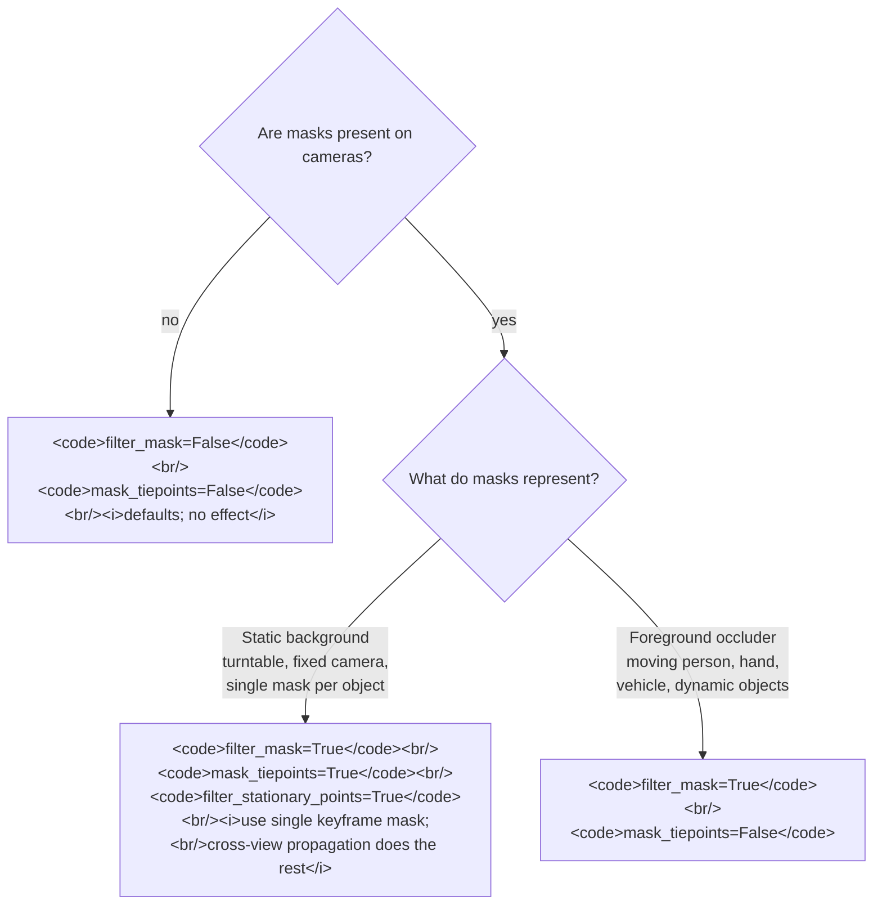

# `mask_tiepoints` cross-view propagation and the foreground-occluder case
> **Confidence:** *medium.* The cross-view propagation behaviour
> is documented unambiguously in the user manual. The
> *foreground-occluder failure mode* — the central operational
> claim of this article — is *inferred* from the manual's
> turntable description rather than directly stated. Treat as a
> strong working hypothesis pending Tier 3 confirmation.

Image masks are used in two operationally-different scenarios that
the GUI exposes through the *same* dialog: turntable-with-static-
background captures, and outdoor captures with foreground occluders
(hands, people, vehicles). These two cases want **opposite
defaults** for one of the alignment options — and the GUI's
default favours the turntable case.

This article is the cross-reference for choosing the right
combination of `filter_mask` and `mask_tiepoints` based on what
the masks actually represent.

## The two parameters

`Chunk.matchPhotos` exposes two independent mask-related flags:

| Python kwarg | GUI checkbox | Effect |
|--------------|-------------|--------|
| `filter_mask=True` | "Apply mask to key points" | Per-view: masked pixels are excluded from feature detection in that view. |
| `mask_tiepoints=True` | "Apply mask to tie points" | Cross-view: when a feature in any view is masked, *all* tie points whose tracks include that feature are dropped — even tie points whose other endpoints sit in unmasked views. |

The GUI defaults are `filter_mask=False`, `mask_tiepoints=True`.
This is the *turntable-scene default* — the rationale is in the
user manual:

> "Apply mask to tie points option means that certain tie points
> are excluded from alignment procedure. Effectively this implies
> that if some area is masked at least on a single photo, relevant
> key points on the rest of the photos picturing the same area
> will be also ignored during alignment procedure (a tie point is
> a set of key points which have been matched as projections of
> the same 3D point on different images). **This can be useful to
> be able to suppress background in turntable shooting scenario
> with only one mask.**" — *Metashape Professional Edition User
> Manual* (2.3), "Aligning photos" / "Apply mask to" (page 39).

## The two scenarios

### Scenario A — Turntable (or any static-background scene)

Object on turntable, fixed camera, static studio background. The
*background* in every view is the same physical region. A mask
that separates object from background only needs to be drawn
*once* — the cross-view propagation extends its effect to all
other views.

```python
# Turntable scene — the GUI defaults are correct.
chunk.matchPhotos(
    downscale=1,
    filter_mask=True,        # mask out background in each view
    mask_tiepoints=True,     # propagate to other views (default)
)
```

The single-keyframe mask does the right thing: tie points whose
tracks pass through the background in any view are dropped, the
turntable feature density on the object survives, and the
alignment fits the object only.

### Scenario B — Foreground occluder

Outdoor (or any moving) capture; a hand, person, or vehicle
occludes part of the scene of interest in *some* views. The mask
covers the occluder where present.

The mask in views A, B, C corresponds to *different physical
content* — the part of the static scene the occluder happened to
be in front of at that moment. Tie points on those scene parts
are valid evidence the bundle wants. Cross-view propagation
**discards them**: a feature the occluder happened to coincide
with in view A is matched to its appearances in views D, E, F
(where the occluder isn't present); the propagation rule then
says "this tie point's track touches a masked region in some
view → drop it."

```python
# Foreground-occluder scene — DISABLE cross-view propagation.
chunk.matchPhotos(
    downscale=1,
    filter_mask=True,        # mask out the occluder in views where present
    mask_tiepoints=False,    # ← do NOT propagate to other views
)
```

This combination keeps the per-view exclusion (the occluder's
features themselves are correctly dropped from the views where it
appears) but does not penalise the static-scene tie points that
happen to share screen positions across views.

## How to tell which scenario you have

A practical heuristic — examine the masked regions across views:

- **Turntable:** masked regions in all views correspond to the
  *same physical content* (the studio background). The mask in
  one view, projected through the camera-to-world transform, lies
  in the same world space as the masks in other views.
- **Foreground occluder:** masked regions in different views
  correspond to *different physical content*. The occluder moves
  through the scene; the mask follows it.

A symptom-based heuristic — observe alignment quality:

- **`mask_tiepoints=True` on a foreground-occluder scene** often
  produces alignments that are *worse* than the unmasked
  alignment, especially when the occluder covers a large fraction
  of the captured scene area. If "I added masks and alignment got
  worse" matches your case, try `mask_tiepoints=False`.

## Caveats

- **The article's central claim is inferred, not observed.** The
  user manual states the cross-view propagation behaviour
  positively (turntable case is the documented use). It does not
  explicitly state the foreground-occluder failure mode. Project-
  owner Tier 3 reproduction on a controlled occluder dataset
  would promote this to *observed*.
- **`filter_mask=False, mask_tiepoints=True` is a strange
  combination.** Without per-view exclusion, the matcher treats
  the masked region's features as valid keypoints; cross-view
  propagation then decides whether tie points connecting them are
  discarded. This combination is rarely useful; the manual's
  documented turntable case implicitly assumes
  `filter_mask=True`. The `Chunk.matchPhotos` defaults
  (`filter_mask=False`, `mask_tiepoints=True`) work for the
  turntable case only when an `Apply mask to key points` toggle
  was set somewhere upstream — verify in your specific GUI
  workflow.
- **`filter_mask=True` has its own failure mode at heavy
  mask coverage.** When masks cover more than ~50% of each
  frame, the per-view keypoint pool can collapse below
  matching-feasible levels, starving `matchPhotos` of cross-view
  candidates regardless of `mask_tiepoints`. See
  [`filter_mask=True` starves matchPhotos when masks cover most
  of the image](filter-mask-starvation.md) for the decision matrix
  combining both flags by mask scenario and coverage.
- **`Exclude stationary tie points` (`filter_stationary_points=True`,
  default `True`) is a related but distinct option.** It targets
  tie points that don't move between views — typical of
  static-background turntable shots — and is independent of the
  mask-based propagation. The two options are complementary; on
  turntable scenes both are usually beneficial.
- **Masks must exist on the cameras.** Both flags are no-ops on
  cameras whose `Camera.mask` is unset. The article assumes masks
  have been imported / drawn upstream — `chunk.generateMasks(…)`
  or `Camera.mask = Metashape.Mask()` etc.

## Decision picker



## Runnable demonstration on the Building sample dataset

The Building sample has no foreground occluder, but the
behavioural difference is testable on any dataset by introducing
a synthetic occluder mask on a subset of cameras.

> **Demo verified:** ✗ — pending Tier 3 reproduction on Metashape
> Pro 2.2 / 2.3 with the *Building* sample dataset and synthetic
> occluder masks. The underlying APIs are introspection-verified;
> the inferred behaviour described in the article requires
> empirical confirmation.

```python
"""Compare alignments with and without mask_tiepoints cross-view
propagation, on a synthetic-occluder version of the Building set.
"""
import Metashape

DATASET = "/path/to/building"
doc = Metashape.app.document

def make_chunk_with_synthetic_occluder():
    chunk = doc.addChunk()
    chunk.addPhotos([f"{DATASET}/IMG_{i:04d}.JPG" for i in range(50)])
    # Apply a synthetic rectangular mask in the centre of cameras
    # 10..14 (simulating an occluder visible only in those views).
    # In production, masks come from segmentation, manual painting,
    # or chunk.generateMasks(…) — adapt this snippet to your
    # actual mask-creation pipeline.
    import os
    import tempfile
    import numpy as np
    from PIL import Image as PILImage    # for buffer-to-PNG conversion

    for c in chunk.cameras[10:15]:
        W, H = c.sensor.width, c.sensor.height
        # Synthetic centre-rectangle mask covering ~25% of the frame.
        mask_array = np.full((H, W), 255, dtype=np.uint8)  # 255 = unmasked
        cx_start, cx_end = int(W * 0.4), int(W * 0.6)
        cy_start, cy_end = int(H * 0.4), int(H * 0.6)
        mask_array[cy_start:cy_end, cx_start:cx_end] = 0    # 0 = masked
        # Persist to PNG and load via Mask.load() — the supported path.
        # (Metashape.Image has no public buffer-write API; loading from
        # a file is the documented mask-construction pattern.)
        with tempfile.NamedTemporaryFile(suffix=".png", delete=False) as f:
            mask_path = f.name
        PILImage.fromarray(mask_array, mode="L").save(mask_path)
        mask = Metashape.Mask()
        mask.load(mask_path)
        c.mask = mask
        os.unlink(mask_path)
    return chunk

# Variant 1 — propagation ON (default).
chunk_a = make_chunk_with_synthetic_occluder()
chunk_a.label = "mask_tiepoints=True (turntable default)"
chunk_a.matchPhotos(downscale=1, filter_mask=True, mask_tiepoints=True)
chunk_a.alignCameras()

# Variant 2 — propagation OFF.
chunk_b = make_chunk_with_synthetic_occluder()
chunk_b.label = "mask_tiepoints=False (foreground-occluder mode)"
chunk_b.matchPhotos(downscale=1, filter_mask=True, mask_tiepoints=False)
chunk_b.alignCameras()

for chunk in (chunk_a, chunk_b):
    aligned = sum(1 for c in chunk.cameras if c.transform is not None)
    n_tracks = len(chunk.tie_points.tracks) if chunk.tie_points else 0
    print(f"{chunk.label:<55}  aligned={aligned:>3}/50  tracks={n_tracks:>6}")
```

**Expected output:** *Foreground-occluder mode* should produce a
higher track count and at least as many aligned cameras —
because cross-view propagation is *not* discarding tie points
based on what some other view's masks happened to cover. If
Variant 2 underperforms on this dataset (Building is not
occluder-prone), the test is inconclusive — the demonstration
needs a true foreground-occluder dataset.

## See also

- [`filter_mask=True` starves `matchPhotos` when masks cover most of the image](filter-mask-starvation.md)
  — the companion mask gotcha (filter_mask vs mask_tiepoints
  affect different stages and surface differently).
- [AI-assisted mask generation](ai-mask-generation.md)
  — for *generating* the masks that the two gotcha articles
  consume.
- [Recovery paths for unaligned cameras](recovery-paths-unaligned-cameras.md)
  — when the wrong mask combination has produced unaligned
  cameras and you need to recover.

## References

- *Metashape Professional Edition User Manual* (2.3), "Aligning
  photos" / "Apply mask to" parameter description (page 39); same
  text under Automation chapter, "Aligning chunks → Apply mask to"
  (page 164–165). The canonical cross-view propagation
  description is on page 39.
- *Metashape Python Reference* (2.3.1), `Chunk.matchPhotos` —
  documents `filter_mask` and `mask_tiepoints` kwargs (defaults
  `False` and `True`).
- [*Aligning photos with background suppression from single mask* (Agisoft KB)](https://agisoft.freshdesk.com/support/solutions/articles/31000158967)
  — Agisoft's explanation of the same two options: *Apply masks to
  Key points* is per-view (excludes masked areas from feature
  detection), while *Apply masks to Tie points* propagates across
  views (the one-mask turntable case).
