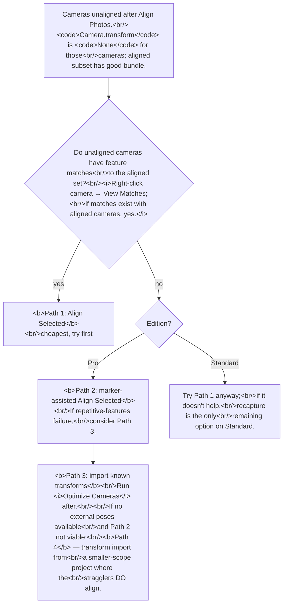

# Recovery paths for unaligned cameras

> **Confidence:** *high.* The four recovery paths are well-known
> from forum threads with multiple attestations from Agisoft
> support; all referenced APIs (`alignCameras`,
> `detectMarkers`, `Camera.transform`) are
> introspection-confirmed on Metashape 2.2.

After *Align Photos*, some cameras are usually left unregistered —
NA in the *Workspace* pane, `camera.transform is None` in Python.
The instinct to "re-run *Align Photos* and hope for better luck" is
**wrong**: it discards the existing alignment in full. The right
response is one of three recovery paths, picked by what the
straggler cameras lack and which Metashape edition you have.

## Diagnostic: which cameras are unaligned

A camera is unaligned when its `transform` matrix is `None`. In
the GUI, the *Workspace* pane displays *NA* next to the camera
label and the *Reference* pane lists no estimated position. In
Python:

```python
import Metashape

chunk = Metashape.app.document.chunk
unaligned = [c for c in chunk.cameras if c.transform is None]
aligned   = [c for c in chunk.cameras if c.transform is not None]

print(f"aligned   : {len(aligned):>4}")
print(f"unaligned : {len(unaligned):>4}")
for c in unaligned:
    print(f"  NA: {c.label}")
```

This is also the test you run after each recovery step to confirm
progress.

## Path 1 — `Align Selected Cameras` (cheapest, most common)

> "Maybe you mean Align Selected Cameras and not Align Photos?
> Because the latter operation discards all the previous
> information, whereas Align Selected uses the existing matching
> points and tries to align the selected cameras with the already
> aligned subset." — Alexey Pasumansky, 2015-12-11, PhotoScan 1.2
> ([permalink](https://www.agisoft.com/forum/index.php?topic=4671.msg23593#msg23593))

This is the most common recovery route. It re-runs the
*bundle-adjustment* portion of alignment for the selected cameras
only, against the existing tie-point graph. No new feature matching
runs. The cost is small — typically seconds for a handful of
cameras.

When it works:

- The straggler cameras *do* share matches with already-aligned
  cameras, but the original *Align Photos* run failed to converge
  the bundle for them (often a noisy GCP or a single-pose camera
  with limited support).
- A re-run with only the stragglers in the bundle has a smaller
  search space and often converges where the full-chunk solve
  did not.

### GUI

1. *Workspace* pane → select the unaligned cameras (Ctrl-click
   to multi-select; right-click → *Filter by Cameras → Filter
   Photos* + *Inverse selection* is a fast pick).
2. *Workflow → Align Selected Cameras* (or right-click →
   *Align Selected Cameras*).

### Python

```python
chunk = Metashape.app.document.chunk
unaligned = [c for c in chunk.cameras if c.transform is None]

chunk.alignCameras(cameras=[c.key for c in unaligned])

# Re-check.
still_unaligned = [c for c in chunk.cameras if c.transform is None]
print(f"recovered : {len(unaligned) - len(still_unaligned)}")
print(f"remaining : {len(still_unaligned)}")
```

The `cameras=` argument takes a list of camera *keys* (integers),
not `Camera` objects. The default `reset_alignment=False` is what
makes this a *recovery* operation rather than a re-alignment —
do not override it.

> "When Python is used, the Align Photos stage is split into two
> steps: `chunk.matchPhotos()` — when feature points are detected
> and matched, and `chunk.alignCameras()` — that uses existing
> matches for scene structure estimation." — Alexey Pasumansky,
> 2015-03-22, PhotoScan 1.1
> ([permalink](https://www.agisoft.com/forum/index.php?topic=3599.msg18062#msg18062))

The split matters: `alignCameras` does not invoke matching. If the
straggler cameras have no matches to the aligned set, Path 1
cannot recover them — try Path 2 or Path 3.

## Path 2 — Marker-assisted `Align Selected` (Pro only)

When Path 1 fails because the stragglers lack feature matches,
markers act as substitute constraints. The procedure (documented
in topic=1505):

1. **Reset alignment for the unaligned cameras only.** In the GUI,
   right-click → *Reset Camera Alignment* on the selection. (In
   Python: `for c in unaligned: c.transform = None`.)
2. **Place ≥4 markers on each unaligned image.** Each marker must
   have ≥2 projections on already-aligned images so the bundle has
   absolute positions for it.
3. **Select the unaligned cameras → *Align Selected Cameras*.**

> "You can use markers as valid matches to help the alignment.
> [...] place at least four markers on each of such photos (each
> marker should have at least two projections on correctly
> aligned images), then select these cameras and perform Align
> Selected operation." — Alexey Pasumansky, 2013-09-03,
> PhotoScan 1.0
> ([permalink](https://www.agisoft.com/forum/index.php?topic=1505.msg7674#msg7674))

The markers serve as additional 2D-3D correspondences in the
bundle. Four is the minimum for a non-degenerate fit (3D pose has
6 DOF; each marker projection contributes 2 equations; 4 markers
give 8 equations); placement on visually-distinct points is
critical.

### The four-image-corner variant (full pose lock)

When you have **one camera** whose intrinsics and exterior
orientation you want **fully constrained** before bundle
adjustment — typically a top-down "site plan" view, an
orthorectified backdrop, or any single image whose pose you know
exactly in world coordinates — place 4 markers at known world
coordinates with projections at the **four corners of that
image**:

```python
# image dimensions in pixels; world-frame corners centred, Y up
W, H = camera.sensor.width, camera.sensor.height
corner_specs = [
    ("_tl", (-W/2, +H/2, 0.0), (0,   0)),
    ("_tr", (+W/2, +H/2, 0.0), (W,   0)),
    ("_bl", (-W/2, -H/2, 0.0), (0,   H)),
    ("_br", (+W/2, -H/2, 0.0), (W,   H)),
]
corner_markers = []
for label, world_pos, pix in corner_specs:
    m = chunk.addMarker()
    m.label = label
    m.reference.location = Metashape.Vector(world_pos)
    m.reference.accuracy = Metashape.Vector([0.5, 0.5, 0.5])
    m.reference.enabled  = True
    m.projections[camera] = Metashape.Marker.Projection(
        Metashape.Vector(pix), True)   # pinned=True
    corner_markers.append(m)

chunk.alignCameras(cameras=[camera.key])

# Optional: remove the scaffolding markers after alignment.
# chunk.remove(corner_markers)
```

Four 2D-3D correspondences plus the camera's known calibration
give `alignCameras` an exact PnP solution for that camera. Other
cameras then align relative to it. This is more reliable than
relying on a single `camera.reference.location` +
`camera.reference.rotation` because the corners give Metashape the
**scale** of the image content explicitly via the marker positions
in world units.

The world coordinates given to the corners can be anything you
need — set them to match the world frame the rest of the chunk's
references live in. The markers are scaffolding; remove them
after they have served their purpose, or leave them disabled.

### Failure mode (the repetitive-features caveat)

Marker-assisted recovery can also fail in scenes with strongly
repetitive features:

> "I use the Pro version, and have in some cases added dozens of
> markers. To no avail, if the subject I intend to model has
> repetitive features (architecture), as it seems the false
> matches outweigh the manually places [sic] ones." — Heinrich,
> 2013-09-11, PhotoScan 1.0
> ([permalink](https://www.agisoft.com/forum/index.php?topic=1505.msg7934#msg7934))

When this happens, the bundle's existing false matches are
consistent with the wrong pose, and the markers — even many of
them — do not have enough weight to override. Two mitigations
worth trying before giving up:

- *Disable* (do not delete) the most-likely-false-matched
  cameras' contributions by setting `camera.enabled = False` on
  cameras whose tie-point projections are demonstrably bad. This
  removes their influence from the bundle without losing them.
- Run `chunk.matchPhotos(cameras=[unaligned], reset_matches=False,
  pairs=[…])` with explicit pairs that constrain the matcher to
  visually-distinct cameras, then `alignCameras`.

Neither is a guaranteed fix; in repetitive scenes, sometimes the
right answer is to recapture with disambiguating placement (an
asymmetric marker, an out-of-pattern object), rather than to
recover algorithmically.

## Path 3 — Camera transform import (Pro, advanced)

When the unaligned cameras' positions are known from an external
source — survey, GNSS, parallel SLAM run, mechanically-fixed rig
geometry — the cleanest fix is to set `camera.transform` directly
and let *Optimize Cameras* refine the bundle around the imposed
poses.

```python
chunk = Metashape.app.document.chunk
known_poses: dict[str, Metashape.Matrix] = {…}  # cam_label → 4×4

for c in chunk.cameras:
    if c.label in known_poses:
        c.transform = known_poses[c.label]
        c.reference.location = c.transform.translation()  # if you also want it in the Reference pane

chunk.optimizeCameras(fit_f=True, fit_cx=True, fit_cy=True, …)
```

The same effect is achievable through a GUI export-XML / edit /
import-XML workaround (described in topic=1505), but the Python
form is cleaner. **Caveat:** this
path is appropriate only when the external poses are
genuinely accurate. Imposing inaccurate transforms biases the
bundle.

## Path 4 — Transform import from a smaller-scope project (Pro)

When Path 1 keeps failing on the same RANSAC-degenerate cameras
no matter how many times you try, and Path 2/3 don't fit (no
markers can be placed; no external pose data), the workaround
that often succeeds is to **align the same cameras in a
smaller-scope Metashape project where they do align**, then copy
their `Camera.transform` over to the main project.

The "smaller-scope project where they align" can be:

- A subset chunk containing only the stragglers plus a few of
  the well-aligned neighbours.
- A separately-prepared chunk with looser matching parameters.
- A chunk where you placed scaffolding markers (Path 2) just to
  get the stragglers aligned.

```python
# Source: a smaller-scope project where stragglers DO align.
small_doc = Metashape.Document()
small_doc.open("/path/to/small_project.psz")
small_chunk = small_doc.chunks[0]
small_T = small_chunk.transform.matrix

# Build a label → world-frame transform map from the small project.
small_world_transforms: dict[str, Metashape.Matrix] = {
    c.label: small_T * c.transform
    for c in small_chunk.cameras
    if c.transform is not None
}

# Target: the main project, with the same images but where
# stragglers are stuck. Copy world-frame transforms onto them
# (re-expressed in the main chunk's local frame).
main_chunk = Metashape.app.document.chunk
main_T_inv = main_chunk.transform.matrix.inv()
copied = 0
for cam in main_chunk.cameras:
    if cam.transform is None and cam.label in small_world_transforms:
        cam.transform = main_T_inv * small_world_transforms[cam.label]
        copied += 1

print(f"transforms copied: {copied}")

# Refine with Optimize Cameras (the imported transforms are
# approximate because they came from a different chunk's frame).
main_chunk.optimizeCameras(fit_f=True, fit_cx=True, fit_cy=True,
                            fit_k1=True, fit_k2=True, fit_k3=True,
                            fit_p1=True, fit_p2=True)
```

The transforms are **approximate** — they were fitted in a
different chunk's coordinate frame, with a different bundle
context. The role of the final `optimizeCameras` is to refine
them against the main project's tie-point graph. If the main
chunk's bundle is well-conditioned, the refinement is
straightforward; if not, it may itself fail (in which case
Path 4 has the same fundamental problem as Path 1 — the bundle
cannot converge).

This path exists because RANSAC-style alignment is *not
reproducible across chunk contexts*. The same images, in
different chunks, with different tie-point graphs, can produce
different alignment outcomes. Path 4 exploits that to escape a
local-minimum failure in the main project.

### Caveats specific to Path 4

- **The world-frame transforms must actually be in the same
  world frame** in both projects. If the small-scope project
  uses a different `chunk.crs` or a different `chunk.transform`
  origin, the imported transforms will land far from where they
  should.
- **The cameras must have the same labels in both projects.**
  This is typically straightforward (the labels are derived from
  filenames, which are stable across projects) but is worth
  verifying with `assert {c.label for c in small_chunk.cameras} >=
  {set of straggler labels}` before the loop.
- **`optimizeCameras` after import is not optional.** The
  imported transforms are starting points, not final answers.
  Without `optimizeCameras`, the bundle does not absorb the
  imports as constraints; subsequent reconstruction stages may
  produce poor results.

## Path picker



## Caveats

- **`Align Photos` is the wrong tool here.** It discards the
  existing matching graph and full bundle. Use it only when the
  goal is to redo matching from scratch — typically because the
  matching itself was bad.
- **Path 1 success is not guaranteed.** A second attempt with
  different `min_image=` or `adaptive_fitting=True` sometimes
  helps; persistent failure means the cameras lack matches and
  Path 2 (or 3) is required.
- **Path 2 requires Pro.** Standard edition has no marker support.
  Standard users with stragglers have only Path 1 available — and
  if it fails, recapture is the remaining option.
- **The `cameras=` argument is by key, not by object.** The Python
  call is `chunk.alignCameras(cameras=[c.key for c in stragglers])`;
  passing `Camera` objects directly raises a `TypeError`.

## Runnable demonstration on the Building sample dataset

The script below force-resets a subset of cameras' alignment on the
[Building](../../reference/sample-data.md#building) dataset, then
runs Path 1 and reports recovery rate.

> **Demo verified:** ✗ — pending Tier 3 reproduction on Metashape
> Pro 2.2 / 2.3 with the *Building* sample dataset. The underlying
> APIs are introspection-verified but the demo as written has not
> been run end-to-end. Required before the manual ships.

```python
"""Demonstrate Path 1 recovery on the Building dataset.

Pre-condition: Building loaded; chunk fully aligned in advance.
This script artificially un-aligns 5 cameras (chosen at random),
then recovers them via Path 1.
"""
import random
import Metashape

random.seed(42)
chunk = Metashape.app.document.chunk

# Step 1: pick 5 aligned cameras at random and reset them.
aligned = [c for c in chunk.cameras if c.transform is not None]
victims = random.sample(aligned, k=min(5, len(aligned)))
for c in victims:
    c.transform = None
print(f"un-aligned: {[c.label for c in victims]}")
print(f"NA cameras now: {sum(1 for c in chunk.cameras if c.transform is None)}")

# Step 2: Path 1 recovery.
chunk.alignCameras(cameras=[c.key for c in victims])

# Step 3: report.
recovered = [c for c in victims if c.transform is not None]
still_na = [c for c in victims if c.transform is None]

print()
print(f"recovered : {len(recovered)}/{len(victims)}")
for c in recovered:
    print(f"   ✓ {c.label}")
for c in still_na:
    print(f"   ✗ {c.label}  (Path 1 failed; would need Path 2 or 3)")
```

**Expected output:** all 5 randomly-disabled cameras should
recover via Path 1 since they had matches in the original chunk
alignment. A 0/5 recovery on this run would indicate something
deeper wrong with the chunk.

## See also

- [Helping alignment when photos don't align: markers, references, and what to use when](helping-alignment.md)
  — the unified decision framework for picking between Path 1
  / Path 2 / reference priors / recapture, with answers to
  "how many markers do I need" and the GUI annotation
  workflow.
- [Diagnosing under-aligned chunks](diagnosing-under-aligned-chunks.md)
  — the diagnostic ladder you should run before reaching for
  any of the recovery paths in this article.
- [Synthetic position priors via `ReferencePreselectionSource`](synthetic-priors-reference-preselection.md)
  — the reference-based alternative for whole-project
  alignment failures (where Path 1 / Path 2 don't apply).

## References

- [Forum thread, *Photos That Don't Align - Helpful Trick*, 2015](https://www.agisoft.com/forum/index.php?topic=4671.0)
  — Path 1 origin; the user-discovered trick + the
  Agisoft-support clarification (msg 23377).
- [Forum thread, *Align selected camera in python script*, 2015](https://www.agisoft.com/forum/index.php?topic=3599.0)
  — Python equivalent of Path 1; discussion of the
  `matchPhotos`/`alignCameras` split (msgs 18056, 18062).
- [Forum thread, *Manual camera position?*, 2013](https://www.agisoft.com/forum/index.php?topic=1505.0)
  — Path 2 procedure (msg 7807); the
  repetitive-features caveat (msg 7916); the XML import
  workaround that motivates Path 3.
- *Metashape Python Reference* (2.3.1), `Chunk.alignCameras` —
  documents `cameras=` and `reset_alignment=` (default `False`).
- *Metashape Pro User Manual* (2.3), ch. 3 *General workflow*,
  § *Align Photos* — official description of the *Align Selected
  Cameras* command and the *Workspace* pane camera state.
