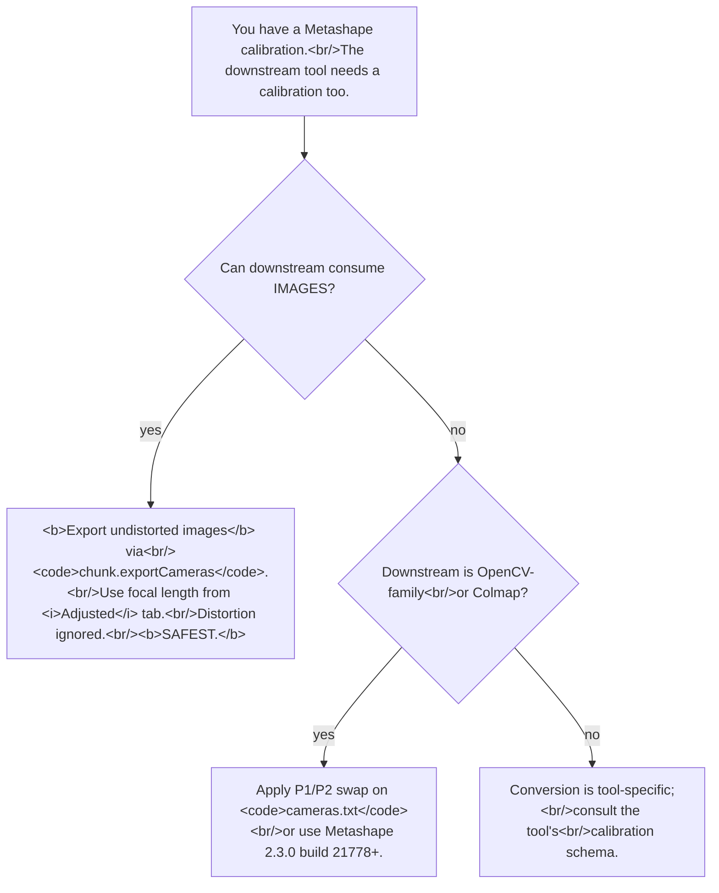

# Metashape's distortion model and converting to OpenCV / Colmap
> **Confidence:** *high.* The two load-bearing facts — the P1/P2
> swap relative to OpenCV, and the per-parameter units (`f`, `cx`,
> `cy`, `b1`, `b2` in pixels; `k1`–`k4`, `p1`, `p2` dimensionless,
> per the [Agisoft KB](https://agisoft.freshdesk.com/support/solutions/articles/31000158119) and consistent with the direct-pass
> conversion code below) — have explicit documentation. The
> "export undistorted images is the safe path" recommendation
> is a synthesis from multiple threads.

Cross-tool photogrammetry pipelines (Metashape → Colmap;
Metashape → OpenCV downstream; Metashape calibration → external
3D-Gaussian-Splatting) routinely break on a coefficient mismatch
that's easy to overlook. This article documents the model
Metashape uses, the three specific incompatibilities with OpenCV
conventions, and the safer-than-coefficients fallback.

## What model Metashape uses

`Metashape.Calibration` carries a Brown-Conrady-style
parameterisation. The full attribute set on the class
(introspected on Metashape 2.2.2):

```python
calibration.f         # focal length (pixels)
calibration.cx, cy    # principal-point offset from sensor centre (pixels)
calibration.k1..k4    # radial distortion coefficients
calibration.p1, p2    # tangential distortion (Brown-Conrady)
calibration.p3, p4    # higher-order tangential (rarely populated)
calibration.b1, b2    # affinity / non-orthogonality
calibration.width     # image width (pixels)
calibration.height    # image height (pixels)
calibration.type      # camera model (frame, fisheye, spherical, etc.)
calibration.rpc       # rational-polynomial coefficients (satellite)
```

For what each of these parameters *means* — and how to judge
whether an adjusted calibration is physically plausible (`cx`/`cy`
of hundreds of pixels, or `b1`/`b2` of tens, usually signal a bad
estimate worth re-aligning with those values fixed) — see
Agisoft's own [*What does camera calibration results mean in Metashape?* (Agisoft KB)](https://agisoft.freshdesk.com/support/solutions/articles/31000158119),
which also walks through the Distortion Plot (the Distortion,
Profile and Correlation tabs). This article assumes those basics
and focuses on the cross-tool conversion problem.

Two units conventions matter:

- **Units differ by parameter.** `f`, `cx`, `cy` and the affinity
  terms `b1`, `b2` are in pixels; the distortion coefficients
  `k1`–`k4` and `p1`, `p2` are dimensionless (they act on the
  focal-length-normalised radius), per the [Agisoft KB](https://agisoft.freshdesk.com/support/solutions/articles/31000158119) — which is
  why the conversion code below passes them straight to OpenCV's
  (dimensionless) `distCoeffs`. The older Lens-utility model
  (quoted below) described its coefficients as "inverse pixels";
  either way, none of them are in millimetres or microns.
- **The transformation direction is undistorted → distorted.**
  Metashape applies the model to map an idealised pinhole
  position to the observed (distorted) pixel. Tools that apply
  the model in the opposite direction (distorted → undistorted)
  produce numerically different coefficients even when the
  underlying physical lens is the same.

The canonical formula reference is the *Metashape Professional User
Manual* (2.3), p. 231
([PDF](https://www.agisoft.com/pdf/metashape-pro_2_3_en.pdf)). The
model originated in the standalone Lens utility, whose manual first
described it:

> "Distortion model used in Lens and PhotoScan is described in
> Lens Manual ([downloads.agisoft.ru/lens/doc/en/lens.pdf](http://downloads.agisoft.ru/lens/doc/en/lens.pdf), last
> page). Coefficients are expressed in inverse pixels.
> Coefficients could be converted if the model of the original
> calibration you are using has the same transformation
> direction (from undistorted to distorted in PhotoScan/Lens).
> In other case conversion might be too complicated and even
> almost impossible." — Alexey Pasumansky, 2011-09-13,
> PhotoScan ~0.8
> ([permalink](https://www.agisoft.com/forum/index.php?topic=232.msg949#msg949))

The model has been stable from PhotoScan 0.8 through Metashape
2.2.2; the Lens-manual reference still applies.

## Three specific incompatibilities with OpenCV

### 1. The P1 / P2 swap

OpenCV's `calibrateCamera` produces tangential coefficients in
the order `(p1, p2)` where Metashape produces them in the
**opposite** order. Specifically:

- Metashape's `calibration.p1` ⇔ OpenCV's `p2`
- Metashape's `calibration.p2` ⇔ OpenCV's `p1`

The Colmap export format (`cameras.txt`) in Metashape did **not**
correct for this swap until Metashape 2.3.0 build 21778+. Earlier
builds — including all 2.x builds before 2.3.0 build 21778 —
write the values with Metashape's ordering, which a downstream
Colmap or OpenCV tool consumes as if they were OpenCV-ordered.

> "OpenCV is using different order of P1 and P2 coefficients
> compared to common photogrammetry applications (including
> Metashape), but seems like in cameras.txt file this case is
> not treated on export when Colmap export format is used. In
> 2.3.0 release it would be fixed (already included to 2.3.0
> build 21778 pre-release version)." — Alexey Pasumansky,
> 2025-12-16, Metashape 2.3 pre-release
> ([permalink](https://www.agisoft.com/forum/index.php?topic=17434.msg74607#msg74607))

If your installed build is older than 2.3.0 build 21778 and
you're exporting to Colmap, **swap p1 and p2 in the
post-export `cameras.txt`**:

```python
# Post-export fix-up for older builds.
# After: chunk.exportCameras("output_dir/cameras.txt", format=Metashape.CamerasFormatColmap, ...)
import re

cameras_txt = open("output_dir/cameras.txt").read()
def swap_p(line):
    # cameras.txt format for OPENCV camera type:
    #   CAMERA_ID OPENCV W H f cx cy k1 k2 p1 p2
    # Tangential coefficients are positions 9 and 10 (0-indexed
    # from CAMERA_ID).
    parts = line.split()
    if len(parts) >= 11 and parts[1] == "OPENCV":
        parts[9], parts[10] = parts[10], parts[9]
    return " ".join(parts)
fixed = "\n".join(swap_p(l) for l in cameras_txt.splitlines())
open("output_dir/cameras.txt", "w").write(fixed)
```

For Metashape 2.3.0 build 21778+, the fix is automatic — verify
your build first.

### 2. Half-pixel shift on the principal point (pixel-corner vs pixel-centre)

Metashape and OpenCV place the image coordinate origin at
*different sub-pixel locations*. The result is a **half-pixel
shift** on `cx` / `cy` when the same physical principal point is
expressed in each tool's convention.

**Metashape's convention** is documented in the Pro 2.3 user
manual:

> "The image coordinate system has origin in the middle of the
> top-left pixel (with coordinates (0.5, 0.5))." — *Metashape
> Professional Edition User Manual* (2.3), camera model section.

The accompanying projection formula uses `u = w * 0.5 + cx + …`
and `v = h * 0.5 + cy + …`, where `cx, cy` are the documented
*offset of the principal point from the sensor centre*. With
`cx = cy = 0`, the projected point lands at `(W/2, H/2)`.

The implication: in Metashape, **the centre of pixel `(i, j)`
has coordinates `(i + 0.5, j + 0.5)`** — the *pixel-corner
convention*, where pixel-coordinate origin is at the top-left
corner of the top-left pixel.

**OpenCV's convention** is the *pixel-centre convention*: the
centre of pixel `(i, j)` has coordinates `(i, j)`. OpenCV's
`calibrateCamera` returns `cx, cy` in that frame, so a
geometrically-centred principal point in OpenCV is at
`((W − 1) / 2, (H − 1) / 2)` — a *half pixel less* than
Metashape's `(W / 2, H / 2)`.

The conversion:

```text
cx_opencv = cx_metashape + (W / 2) - 0.5
cy_opencv = cy_metashape + (H / 2) - 0.5

cx_metashape = cx_opencv - (W / 2) + 0.5
cy_metashape = cy_opencv - (H / 2) + 0.5
```

```python
# Metashape sensor.calibration → OpenCV cameraMatrix.
calib = sensor.calibration
W, H = calib.width, calib.height

opencv_cx = calib.cx + W / 2 - 0.5
opencv_cy = calib.cy + H / 2 - 0.5

# Reverse — OpenCV cameraMatrix → Metashape sensor.calibration.
metashape_cx = opencv_cx - W / 2 + 0.5
metashape_cy = opencv_cy - H / 2 + 0.5
```

A 0.5-pixel offset on a 24-megapixel image at 1 m altitude
projects to a fraction of a millimetre on the ground — usually
imperceptible. But in **fine-calibration applications** (sub-
millimetre metrology, multi-tool calibration handoff, camera-
factory comparison), the half-pixel shift is the difference
between "calibration agrees" and "calibration is biased."

**Colmap's convention** depends on the camera model used in the
export. Colmap source code documents per-model conventions; the
`OPENCV` model in Colmap follows OpenCV's pixel-centre
convention. Metashape's Colmap export targets the `OPENCV`
model — meaning the principal point in the exported
`cameras.txt` should be written with the half-pixel shift
applied. Verify by reading a `cx, cy` value in your specific
Metashape build's `cameras.txt` and comparing to the same
sensor's `sensor.calibration.cx, cy`. If they agree, no shift
is being applied (which is wrong for OpenCV-consuming tools).
If they differ by approximately `(W − 1)/2`, the shift is
applied correctly.

The canonical-thread statement in [topic=17434](https://www.agisoft.com/forum/index.php?topic=17434.0)
covers the P1/P2 swap fix in 2.3.0 build 21778+ but does not
explicitly address the half-pixel principal-point convention.
**Verify both the swap and the half-pixel application** when
auditing a Colmap export.

### 3. Direction-of-transformation mismatch

Some external tools apply distortion in the opposite direction
(distorted → undistorted) from Metashape (undistorted →
distorted). Direct coefficient transfer between such tools is
**not** a simple sign flip — the `k_n` and `p_n` values are
genuinely different functions of the lens optics, even with the
same `f`/`cx`/`cy`.

The terse documented statement: "conversion might be too
complicated and even almost impossible." The forum thread does
not document a generic conversion procedure. The pragmatic
recommendation is to use Metashape's *Convert Images* feature
to render undistorted (pinhole) images and feed those into the
downstream tool, sidestepping the coefficient mismatch entirely.

## The safer-than-coefficients fallback

When the downstream tool can consume images, the cleanest path is
to render undistorted source images via Metashape's *File → Export
→ Convert Images* (GUI) or, in Python, by exporting the Colmap
or Bundler camera bundle with `convert_to_pinhole=True`:

```python
# Bundler/Colmap export with the convert-to-pinhole flag set.
# The exported images alongside the camera positions are
# pinhole-equivalent — Metashape has applied the inverse
# distortion during export.
chunk.exportCameras(
    path="output_dir/cameras.txt",
    format=Metashape.CamerasFormatColmap,
    save_images=True,
    convert_to_pinhole=True,    # the safer-than-coefficients flag
    image_path="{filename}.jpg",
)
```

The downstream tool then just needs the focal length (pinhole)
and principal point; distortion coefficients are irrelevant
because the images themselves are already undistorted.

A wrinkle with current 2.x: the GUI's *File → Export → Convert
Images* feature was reorganised between 1.x and 2.x. The Python
path (`chunk.exportCameras` with `convert_to_pinhole=True`) is
the more stable interface. If the GUI behaviour you remember
from 1.x doesn't appear in 2.x, this Python workaround still
works (topic=14738):

> "If you need to replicate the results of the previous versions
> for Convert Images option (related to undistort operation),
> then you should enable Precalibrated option for the Initial
> tab of the Camera Calibration dialog and substitute the
> default focal length value (in pixels) with the value from
> the Adjusted tab. Then use Convert Images dialog with
> Transform to Initial Calibration option enabled." — Alexey
> Pasumansky, 2022-08-15, Metashape 1.8 / 2.0 transition
> ([permalink](https://www.agisoft.com/forum/index.php?topic=14738.msg64636#msg64636))

## Caveats

- **Pre-2.3.0-build-21778 Colmap exports have the P1/P2 bug.**
  Verify your build (`Metashape.app.version`) before relying on
  the export. The cameras.txt-fix script above is the
  immediate workaround.
- **Units are per-parameter, not uniform.** `f`, `cx`, `cy` are in pixels, and so
  are `b1`, `b2` — the affinity and non-orthogonality (skew)
  terms (`b1` is the `fy − fx` focal-length difference and `b2`
  the skew, exactly as the OpenCV-`K` mapping above uses them,
  and as the Agisoft KB states). Only the radial `k_n` and
  tangential `p_n` terms are dimensionless multipliers applied to
  the focal-length-normalised radius. Don't multiply `k_n` by image
  height to "convert to physical units" — they're already
  pixel-relative.
- **`fit_p3, fit_p4` exist on the bundle but rarely matter.**
  Most consumer-camera projects leave them at zero. Higher-order
  tangential terms can be enabled in `optimizeCameras(...)` for
  fisheye or extreme-distortion lenses, but the default of
  `False` is correct for typical drone / DSLR projects.
- **`type` matters when round-tripping.** Frame cameras, fisheye
  cameras, and spherical cameras use different effective models
  internally; saving a frame-camera Calibration and loading it
  into a fisheye sensor produces wrong results. Match the
  `Calibration.type` to the sensor's `type`.
- **The Lens-manual link is the canonical reference.** The
  manual itself (PDF, on agisoft's downloads page) documents the
  exact polynomial form. This article does not reproduce the
  formula because it has been stable but is most authoritatively
  cited from the original document.

## Decision tree for cross-tool calibration handoff



## Worked example: OpenCV undistortion with and without the half-pixel correction

The half-pixel principal-point shift (#2 above) is most visible
in a side-by-side comparison: undistort the same source image
through (a) Metashape's *Convert Images* / `chunk.exportCameras(convert_to_pinhole=True)`
pipeline, (b) OpenCV's `cv2.undistort` with the half-pixel
correction applied, and (c) OpenCV's `cv2.undistort` *without*
the correction. Result: (a) and (b) agree to sub-pixel, while
(c) is offset by half a pixel — visible as a slight ringing on
edges or a translation in pixel-difference comparison.

The recipe below is the **canonical convention-conversion
pattern** for handing Metashape calibrations to OpenCV (and to
Colmap pipelines that consume OpenCV-format intrinsics, like
NeRFstudio's data converter, OpenSfM, etc.):

```python
"""Undistort a Metashape image with OpenCV; compare to Metashape's
own undistortion. Demonstrates the half-pixel principal-point
correction.

Pre-condition:
- A chunk with at least one aligned camera + sensor.calibration.
- The original (distorted) source image accessible from disk.
- OpenCV (`pip install opencv-python`) and numpy installed.
"""
import cv2
import numpy as np
import Metashape

def metashape_calib_to_opencv_K(calib: Metashape.Calibration,
                                 *, half_pixel_correction: bool = True
                                 ) -> np.ndarray:
    """Convert Metashape Calibration to OpenCV cameraMatrix K.

    Metashape stores cx, cy as offset from the sensor centre at
    (W/2, H/2) using the pixel-corner convention (centre of pixel
    (i, j) is at (i + 0.5, j + 0.5)). OpenCV uses the pixel-centre
    convention (centre of pixel (i, j) is at (i, j)). The
    conversion shifts cx, cy by -0.5 in each axis.

    The general affine OpenCV K matrix maps Metashape's f / b1 / b2
    parameters as:
        fx    = f          (Metashape focal in pixels)
        fy    = f + b1     (b1 is the y-axis affinity term)
        skew  = b2         (b2 is the non-orthogonality term)

    For typical consumer cameras both b1 and b2 are zero and the
    matrix reduces to the standard fx == fy, skew == 0 form.

    Set half_pixel_correction=False to see what happens WITHOUT
    the correction (the result will be offset by 0.5 px).
    """
    K = np.eye(3)
    K[0, 0] = calib.f                  # fx
    K[0, 1] = calib.b2                 # skew (non-orthogonality)
    K[1, 1] = calib.f + calib.b1       # fy (with b1 affinity)
    K[0, 2] = calib.cx + calib.width  / 2
    K[1, 2] = calib.cy + calib.height / 2

    if half_pixel_correction:
        K[0, 2] -= 0.5
        K[1, 2] -= 0.5

    return K

def metashape_calib_to_opencv_distortion(calib: Metashape.Calibration,
                                          *, swap_p1_p2: bool = True
                                          ) -> np.ndarray:
    """Convert Metashape distortion coefficients to OpenCV order.

    OpenCV's distCoeffs order is [k1, k2, p1, p2, k3]. Metashape
    uses an opposite (p1, p2) order relative to OpenCV — set
    swap_p1_p2=False on Metashape 2.3.0 build 21778+ if you've
    confirmed that the export already corrects the swap; leave
    True for older builds (the safer default).
    """
    if swap_p1_p2:
        # Metashape's p1 corresponds to OpenCV's p2 and vice versa.
        return np.array([calib.k1, calib.k2,
                         calib.p2, calib.p1,        # ← swapped
                         calib.k3])
    else:
        return np.array([calib.k1, calib.k2,
                         calib.p1, calib.p2,
                         calib.k3])

def undistort_with_opencv(image_path: str, K: np.ndarray,
                           distortion: np.ndarray,
                           image_size: tuple[int, int]) -> np.ndarray:
    """Standard cv2.undistort pipeline: derive new pinhole K, then
    undistort. Returns the rectified image."""
    img = cv2.imread(image_path)
    if img is None:
        raise FileNotFoundError(f"Could not read {image_path}")
    new_K, _roi = cv2.getOptimalNewCameraMatrix(
        K, distortion, image_size, alpha=0,
    )
    return cv2.undistort(img, K, distortion, None, new_K)

# ===== Run the comparison =====
chunk = Metashape.app.document.chunk
camera = next(c for c in chunk.cameras if c.transform is not None)
sensor = camera.sensor
calib = sensor.calibration
W, H = calib.width, calib.height

source_path = camera.photo.path
print(f"Source image: {source_path}")
print(f"  size: {W} × {H}")
print(f"  Metashape  cx, cy = ({calib.cx:.3f}, {calib.cy:.3f}) px from centre")

# Variant (b): WITH half-pixel correction (correct).
K_corrected = metashape_calib_to_opencv_K(calib, half_pixel_correction=True)
print(f"  OpenCV (corrected)  cx, cy = ({K_corrected[0, 2]:.3f}, {K_corrected[1, 2]:.3f})")

# Variant (c): WITHOUT half-pixel correction (incorrect).
K_naive = metashape_calib_to_opencv_K(calib, half_pixel_correction=False)
print(f"  OpenCV (NAIVE)      cx, cy = ({K_naive[0, 2]:.3f}, {K_naive[1, 2]:.3f})")

distortion = metashape_calib_to_opencv_distortion(calib, swap_p1_p2=True)
print(f"  Distortion (OpenCV order, P1/P2 swapped): {distortion}")

# Run undistortion both ways.
img_corrected = undistort_with_opencv(source_path, K_corrected, distortion, (W, H))
img_naive     = undistort_with_opencv(source_path, K_naive,     distortion, (W, H))

# Save both outputs.
cv2.imwrite("/tmp/undistorted_corrected.png", img_corrected)
cv2.imwrite("/tmp/undistorted_naive.png", img_naive)

# Pixel difference between the two OpenCV variants.
diff = cv2.absdiff(img_corrected, img_naive).astype(np.int32).sum(axis=2)
print()
print(f"Pixel difference (naïve vs corrected):")
print(f"  max  : {diff.max()}")
print(f"  mean : {diff.mean():.2f}")
print(f"  RMS  : {np.sqrt((diff ** 2).mean()):.2f}")
print()
print("The difference is concentrated at high-frequency edges (where")
print("a half-pixel shift is most visible). Save and view as PNG to")
print("see the offset directly.")

# To compare with Metashape's own undistort, export the same camera's
# undistorted image via *File → Export → Convert Images* (GUI) or via
# `chunk.exportCameras(convert_to_pinhole=True)` (Python). Then load the export and compute
# absdiff against img_corrected — agreement should be sub-pixel
# (visually identical).
```

**Expected output:**

- `K_corrected.cx` is `0.5 px less` than `K_naive.cx` (and same
  for `cy`).
- The pixel difference between the two OpenCV variants has its
  energy at **edges** in the image — the half-pixel shift
  manifests as edge-localised differences.
- A correct comparison against Metashape's own undistortion (via
  *Convert Images*) should show:
  - `img_corrected` ≈ Metashape (sub-pixel agreement)
  - `img_naive` ≠ Metashape (visible offset)

This pattern is what NerfStudio-style downstream pipelines use:
read a Metashape-Colmap-exported `cameras.txt`, subtract `0.5`
from `cx` / `cy` to convert to OpenCV's pixel-centre convention,
run `cv2.undistort`, then *add `0.5` back* if writing the result
to a Colmap-format `cameras.txt` for further downstream
consumption. The round-trip preserves the convention at each
stage.

## Runnable demonstration on the Aerial-with-GCPs sample dataset

The script below reads a chunk's calibration, prints the values
with their conventional units, and demonstrates a P1/P2
post-export swap on the Colmap output.

> **Demo verified:** ✗ — pending Tier 3 reproduction on Metashape
> Pro 2.2 / 2.3 with the *Aerial-with-GCPs* sample dataset. The
> underlying APIs and conventions are introspection- and
> forum-confirmed; the demo as written has not been run
> end-to-end.

```python
"""Inspect calibration and demonstrate the P1/P2 swap on Colmap export.

Pre-condition: Aerial-with-GCPs project, alignment complete,
sensor[0] is the camera's sensor.
"""
import os, re
import Metashape

chunk = Metashape.app.document.chunk
sensor = chunk.sensors[0]
calib = sensor.calibration

# --- 1. Inspect ---
print(f"Sensor type    : {sensor.type}")
print(f"Image size     : {calib.width} × {calib.height} px")
print(f"Focal length f : {calib.f:.3f} px      (pinhole)")
print(f"Principal pt   : ({calib.cx:.3f}, {calib.cy:.3f}) px from sensor centre  (Metashape, pixel-corner)")
# Convert to OpenCV's pixel-centre convention.
opencv_cx = calib.cx + calib.width  / 2 - 0.5
opencv_cy = calib.cy + calib.height / 2 - 0.5
print(f"  OpenCV cx, cy: ({opencv_cx:.3f}, {opencv_cy:.3f}) px from origin   (pixel-centre)")
print()
print(f"k1 = {calib.k1:.4e}      (dimensionless)")
print(f"k2 = {calib.k2:.4e}")
print(f"k3 = {calib.k3:.4e}")
print(f"k4 = {calib.k4:.4e}")
print(f"p1 = {calib.p1:.4e}      (Metashape order; OpenCV's p2)")
print(f"p2 = {calib.p2:.4e}      (Metashape order; OpenCV's p1)")

# --- 2. Export to Colmap and (if pre-21778) swap p1/p2 ---
EXPORT_DIR = "/tmp/metashape-colmap"
os.makedirs(EXPORT_DIR, exist_ok=True)
chunk.exportCameras(EXPORT_DIR + "/cameras.txt",
                    format=Metashape.CamerasFormatColmap)

# Check Metashape build to see if the export already corrects P1/P2.
build_str = Metashape.app.version  # "2.x.y.NNNNN"
build_num = int(build_str.split(".")[-1])
needs_swap = build_num < 21778      # the build that introduced the fix

if needs_swap:
    print(f"\nMetashape build {build_num} predates the P1/P2 fix; swapping in cameras.txt")
    txt = open(EXPORT_DIR + "/cameras.txt").read()
    fixed_lines = []
    for line in txt.splitlines():
        parts = line.split()
        if len(parts) >= 11 and parts[1] == "OPENCV":
            parts[9], parts[10] = parts[10], parts[9]
        fixed_lines.append(" ".join(parts))
    open(EXPORT_DIR + "/cameras.txt", "w").write("\n".join(fixed_lines))
else:
    print(f"\nMetashape build {build_num} ≥ 21778; P1/P2 swap already applied on export")
```

**Expected output:** the calibration print is human-readable
and units-annotated. The build-check output indicates whether
the P1/P2 swap was needed; on Metashape 2.2.2 (pre-2.3.0)
the script applies the swap.

## References

- [Forum thread, *Distortion Coefficients*, 2011](https://www.agisoft.com/forum/index.php?topic=232.0)
  — the canonical "what units / what model" answer
  (msg 756, 2011-09-13, PhotoScan ~0.8).
- [Forum thread, *Metashape's calibration coefficients don't
  match OpenCV/Colmap?!*, 2025](https://www.agisoft.com/forum/index.php?topic=17434.0)
  — the P1/P2 swap and the Metashape 2.3.0 build 21778 fix
  (msg 74780).
- [Forum thread, *Camera export: distortion model*, 2022](https://www.agisoft.com/forum/index.php?topic=14738.0)
  — the GUI Convert Images workaround for 1.x / 2.x
  transition (msg 63992).
- [Forum thread, *Undistort Photos*, 2014](https://www.agisoft.com/forum/index.php?topic=1247.0)
  — the canonical "export undistorted images" workflow.
- [Forum thread, *Export COLMAP in Standard*, 2024](https://www.agisoft.com/forum/index.php?topic=16518.0)
  — Colmap export support discussion.
- *Metashape Professional Edition User Manual* (2.3), camera
  model section — the canonical statement that "the image
  coordinate system has origin in the middle of the top-left
  pixel (with coordinates (0.5, 0.5))" plus the projection
  formulas using `w * 0.5 + cx` (pixel-corner convention).
- [*What does camera calibration results mean in Metashape?* (Agisoft KB)](https://agisoft.freshdesk.com/support/solutions/articles/31000158119)
  — Agisoft's own explanation of each calibration parameter
  (`f`, `cx`, `cy`, `b1`, `b2`, `k1`–`k4`, `p1`, `p2`), how to
  spot an implausible adjusted calibration, and how to read the
  Distortion Plot's Distortion / Profile / Correlation tabs.
- [*Export undistorted photos* (Agisoft KB)](https://agisoft.freshdesk.com/support/solutions/articles/31000168141)
  — Agisoft's canonical *Convert Images* / *Transform to initial
  calibration* workflow (the undistorted-image fallback used
  above), including how to recover a correct export when
  EXIF/calibration data is missing (copy the focal length from
  the *Adjusted* tab into a *Precalibrated* *Initial* tab).
- *Metashape Professional User Manual* (2.3), p. 231
  ([PDF](https://www.agisoft.com/pdf/metashape-pro_2_3_en.pdf)) — the
  canonical distortion-model formula reference.
- [`sensor.calibration` vs `sensor.user_calib`](sensor-calibration-vs-user-calib.md) — companion article on the two Calibration
  instances per sensor.
- [Rolling-shutter compensation: Regularized vs Full](rolling-shutter-compensation.md) —
  companion article on per-frame motion compensation, which
  models a different lens-imperfection class (within-frame
  motion) than the static distortion model documented here.
