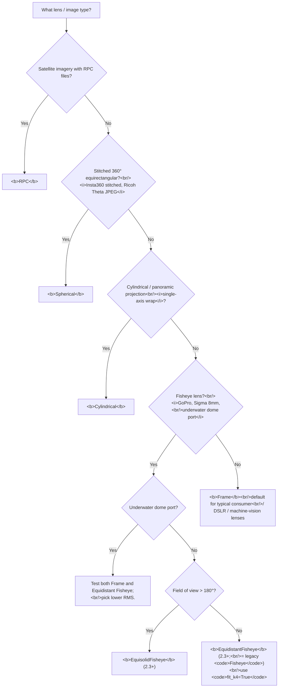

# Fisheye and spherical sensors: the seven projection types and when each applies
> **Confidence:** *medium.* The seven-value `Sensor.Type` enum
> (`Frame, Fisheye, EquidistantFisheye, EquisolidFisheye,
> Spherical, Cylindrical, RPC`) is introspection-confirmed on
> Metashape 2.3.1. The legacy `Fisheye` type is the *equidistant*
> projection — verified by comparing the distortion formula in the
> 2.2 manual (p. 243) with the 2.3 *Equidistant* formula (p. 232):
> they are identical. `EquisolidFisheye` (added in 2.3.0) is a
> genuinely new model for >180° lenses. The
> sensor-type-is-not-auto-detected claim is forum-attested (source
> thread t=2901). The underwater dome-port observation is
> single-user empirical (t=2901, 2015-01-18).

## What Metashape does and doesn't auto-detect

When you import images via *Workflow → Add Photos*, Metashape
reads EXIF metadata for:

- Focal length (initial value for `f`).
- Image dimensions (`calibration.width / .height`).
- Camera make / model (used to group images into sensors).

But Metashape **does not auto-detect lens projection type from
EXIF**. The default for every imported image is
`Sensor.Type.Frame` — a rectilinear camera with the standard
Brown-Conrady distortion model. For fisheye, spherical, or
cylindrical cameras, the user must explicitly change the type:

> "PS takes care of the calibration but you have to specify
> that it's a fisheye lens." — bigben, 2014-09-25, PhotoScan 1.1
> ([permalink](https://www.agisoft.com/forum/index.php?topic=2901.msg15355#msg15355))

> "Fisheye and Spherical camera types are available in
> PhotoScan Pro only. Standard edition supports only Frame
> camera type." — Alexey Pasumansky, 2015-01-19, PhotoScan 1.1
> ([permalink](https://www.agisoft.com/forum/index.php?topic=2901.msg17259#msg17259))

If the *Camera Type* dropdown is greyed out in the *Camera
Calibration* dialog, the project is on Standard edition. The
Python equivalent (`sensor.type = ...`) raises an error in
Standard.

## The seven projection types

As of Metashape 2.3.1 the `Sensor.Type` enum has seven values
(introspection-confirmed; the integer in parentheses is the stable
enum value, which is why `EquisolidFisheye` is 10, not 5):

| `Sensor.Type` | Projection | Typical lens / source | Notes |
|---------------|-----------|----------------------|-------|
| `Frame` (1) | Rectilinear | Consumer / DSLR / machine-vision lenses, < ~100° FoV | Default. Brown–Conrady distortion model with `k1`–`k4`, `p1`–`p4`, `b1`, `b2`. |
| `Fisheye` (2) | Equidistant fisheye (legacy name) | GoPro, Sigma 8mm, dome-port housings, ≥ ~100° FoV | Pro. The original fisheye type; **mathematically the equidistant model** (see below). Retained for backward compatibility. |
| `EquidistantFisheye` (3) | Equidistant, r = f·θ | Most fisheye lenses up to ~180° | Pro. Added in 2.3.0. Same projection as the legacy `Fisheye`, under an explicit name; Agisoft's recommended default for fisheye. |
| `EquisolidFisheye` (10) | Equisolid-angle, r = 2f·sin(θ/2) | Circular / hyper-hemispheric lenses, **> 180° FoV** | Pro. Added in 2.3.0. Use when the field of view exceeds 180°, where the equidistant model cannot fit the extreme periphery. |
| `Spherical` (4) | 360° equirectangular | Insta360 / Ricoh Theta *stitched* output | Pro. For the stitched equirectangular image, not the raw dual-fisheye DNG. |
| `Cylindrical` (6) | Single-axis panorama | Stitched cylindrical panoramas | Pro. Less common in field photogrammetry; test on a small subset before committing. |
| `RPC` (8) | Rational-polynomial coefficient | Satellite imagery (Pléiades, DigitalGlobe, etc.) | Pro. Used when the vendor supplies RPC files; not derivable from EXIF. |

For typical field photogrammetry the choice is between `Frame`
(rectilinear) and the fisheye family. For a fisheye lens, prefer
`EquidistantFisheye` (≤ ~180°) or `EquisolidFisheye` (> 180°); the
bare `Fisheye` value is the same equidistant model, kept for older
scripts. `Spherical` is for stitched 360° equirectangular input;
`Cylindrical` and `RPC` are specialty cases.

## When to use Fisheye

The decision is about lens *projection* (how straight lines map
to image lines), not just field-of-view. A 90° rectilinear lens
preserves straight lines; a 90° fisheye lens curves them. The
diagnostic:

- Photograph a flat wall with horizontal / vertical lines (door
  jamb, brick course, building edge).
- If the lines stay straight in the image, the lens is
  rectilinear → `Frame`.
- If the lines curve outward (barrel) or the field of view
  exceeds ~150° in any axis, the lens is fisheye → `Fisheye`.

For action cameras and consumer wide-angle lenses, the
manufacturer's specifications and forum consensus are the
quickest reference:

> "It's not about focal length or fov, it's all about the lens
> projection. The Hero3 is a fisheye, not sure about the 4, but
> changing it to rectilinear would have been a significant
> change that would have been a new 'feature'.
>
> Photoscan doesn't doesn't [sic] detect lens projection from
> the image metadata, it just defaults to 'Frame'.
>
> There is less apparent distortion in a fisheye images at
> smaller fov. The GoPro just crops the sensor, so if it's
> fisheye at super-wide it's fisheye at everything else. You
> can still get a result using Photoscan, but you will get a
> better result if you use Fisheye for the lens parameter." —
> bigben, 2015-01-21, PhotoScan 1.1
> ([permalink](https://www.agisoft.com/forum/index.php?topic=2901.msg17322#msg17322))

## Equidistant vs Equisolid (and the legacy `Fisheye`)

Metashape offers two fisheye projection models. Both share the
Brown–Conrady-style `k1`–`k4` / `p1`, `p2` / `b1`, `b2` distortion
terms; they differ **only** in how the angle from the optical axis
maps to image radius (the `norm` factor below). With `x0 = X/Z`,
`y0 = Y/Z`, `r0 = sqrt(x0² + y0²)`, and θ = atan(r0) the angle from
the optical axis:

| Model | `norm` factor | Image radius | Use when |
|-------|---------------|--------------|----------|
| **Equidistant** | `atan(r0) / r0` | r = f·θ | Most fisheye lenses, up to ~180° |
| **Equisolid** | `2·sin(atan(r0)/2) / r0` | r = 2f·sin(θ/2) | Hyper-hemispheric lenses, **> 180°** |

The mapped coordinates `x = x0·norm`, `y = y0·norm` then pass
through the *same* radial/tangential distortion and
`u = w/2 + cx + x'f + …` projection in both models (2.3 Pro
manual, *Fisheye cameras*, p. 232–233).

**The legacy `Fisheye` type is the equidistant model.** Through
Metashape 2.2 there was a single `Fisheye` type whose formula
(2.2 Pro manual, p. 243) is `x = x0 · atan(r0)/r0` — identical to
the 2.3 *Equidistant* formula. Metashape 2.3.0 gave that model an
explicit name (`EquidistantFisheye`) and **added** the genuinely
new `EquisolidFisheye` for >180° lenses. Therefore:

- `Fisheye` and `EquidistantFisheye` are the **same projection**
  (kept as distinct enum values — `Fisheye` = 2,
  `EquidistantFisheye` = 3 — for backward compatibility).
- `EquisolidFisheye` is **new and different**; choose it only for
  genuinely >180° (circular / hyper-hemispheric) optics.

> **Version availability.** `EquidistantFisheye` and
> `EquisolidFisheye` exist only in Metashape **2.3.0 and later**.
> On 2.2 and earlier the only fisheye type is `Fisheye` (the
> equidistant model) — there is no equisolid option, in the GUI or
> the API, so a genuinely >180° lens cannot be modelled exactly
> before 2.3. Projects authored in 2.3 that use
> `EquidistantFisheye`/`EquisolidFisheye` also will not round-trip
> to an older version.

Agisoft's own guidance: *"For most images with fisheye effect, use
the Equidistant Fisheye camera model. For images with a viewing
angle greater than 180 degrees, use the Equisolid"* — see
[*New features in Agisoft Metashape 2.3.x* (Agisoft KB)](https://agisoft.freshdesk.com/support/solutions/articles/31000177202).

## The Python API surface

```python
import Metashape

chunk = Metashape.app.document.chunk

# All seven enum values (Metashape 2.3.1):
print(Metashape.Sensor.Type.Frame,
      Metashape.Sensor.Type.Fisheye,             # equidistant (legacy name)
      Metashape.Sensor.Type.EquidistantFisheye,  # 2.3.0+
      Metashape.Sensor.Type.EquisolidFisheye,    # 2.3.0+, for >180° lenses
      Metashape.Sensor.Type.Spherical,
      Metashape.Sensor.Type.Cylindrical,
      Metashape.Sensor.Type.RPC)

# Set per-sensor (Pro only for the non-Frame types).
for sensor in chunk.sensors:
    if "GoPro" in sensor.label or "GP" in sensor.label.upper():
        # 2.3+: EquidistantFisheye. On 2.2 and earlier use .Fisheye.
        sensor.type = Metashape.Sensor.Type.EquidistantFisheye
    elif "_360" in sensor.label or "Insta360" in sensor.label:
        sensor.type = Metashape.Sensor.Type.Spherical
    # else leave as default Frame.

# Inspect.
for sensor in chunk.sensors:
    print(f"{sensor.label!r:>30}  type={sensor.type}  "
          f"calibration.type={sensor.calibration.type}")
```

`sensor.type` and `sensor.calibration.type` are typically
identical (the calibration belongs to the sensor and inherits
its type). The latter is read-only on a calibration loaded from
disk; set the former and the calibration follows.

## Fisheye models in the GUI and Python API

In the GUI, *Camera Calibration → Camera Type* (Metashape 2.3+)
offers two fisheye options:

- **Equidistant Fisheye** — the default fisheye model; image
  radius proportional to the angle from the optical axis
  (r = f·θ). Use for most fisheye lenses up to ~180°.
- **Equisolid Fisheye** — solid-angle-preserving
  (r = 2f·sin(θ/2)); use for >180° hyper-hemispheric lenses.

Metashape implements **only** these two fisheye models — there is
no Stereographic or Orthographic fisheye type (in the GUI or the
API).

Both are exposed in the Python API as
`Sensor.Type.EquidistantFisheye` and
`Sensor.Type.EquisolidFisheye` (2.3.0+), alongside the legacy
`Sensor.Type.Fisheye` (the equidistant model under its old name).
On Metashape 2.2 and earlier the API and GUI expose only the
single `Fisheye` type, so a >180° equisolid lens cannot be
modelled exactly before 2.3.

### Exporting an Equisolid sensor to Colmap

A January 2026 forum report on build 2.3.0.21868 documented that
*Export Cameras → Colmap* fails for an **Equisolid Fisheye**
sensor with the error *"Unsupported calibration type"*:

> "V2.3.0 (build 21868)
>
> As images are 180deg+ I am selecting 'Equisolid Fisheye' in
> camera calibration. Align Photos, get nice looking Sparse
> Cloud. Can build working model, texture, point cloud.
>
> On ->Export Cameras, the process starts, and when at
> completion the process fails with an error message:
> 'Unsupported calibration type, Retry Processing?'" —
> AVsupport, 2026-01-14, Metashape 2.3
> ([permalink](https://www.agisoft.com/forum/index.php?topic=17446.msg135648#msg135648))

Two things to know:

- Metashape's changelog later records *"Added fisheye camera model
  support for Export Cameras command in Colmap format"*, so a
  newer 2.3.x build may already resolve this — verify on your
  specific build before assuming the failure persists.
- A common workaround is to switch the sensor to `Fisheye` /
  `EquidistantFisheye` before export, which Colmap accepts. **But
  that changes the projection model:** because `Fisheye` *is* the
  equidistant model, the swap is lossless only for lenses that are
  genuinely ≤ ~180°. For a true >180° lens originally modelled as
  Equisolid, re-exporting as Equidistant misfits the periphery —
  prefer a build where the Equisolid Colmap export works.

## Common gotchas

### Underwater dome-port lenses may behave like Frame, not Fisheye

A counterintuitive empirical observation:

> "I noticed that results with PhotoScan set to 'fisheye'
> actually aligned LESS well than aligning with normal settings.
> My guess is that this is because the fisheye camera actually
> compensates for some of the light refraction that normally
> causes perspective distortion underwater (this is why many
> traditional underwater camera housings have a 'dome' in front
> of the camera lens). As such pictures caught using a fisheye
> camera underwater are actually less distorted than pictures
> caught with a fisheye lens on land, and as such the 'fisheye'
> setting in PhotoScan appears to work less well on underwater
> images." — ThomasVD, 2015-01-18, PhotoScan 1.1
> ([permalink](https://www.agisoft.com/forum/index.php?topic=2901.msg17239#msg17239))

The dome-port refraction partially cancels the fisheye barrel
distortion, so the *effective* projection in the captured pixels
is closer to rectilinear. For underwater fisheye-in-dome-port
captures: test both `Frame` and `Fisheye` on a small subset
and pick the one that yields lower reprojection RMS and more
aligned cameras.

### Insta360 / Ricoh dual-fisheye DNG: split into two cameras

Direct import of dual-fisheye DNG (two-fisheye-half images stored
in a single DNG) is not supported. The community-validated
workflow from forum topic 16091 (msg 79105, 2023-12-21):

> "Not sure with insta dng's but I've had some success with
> ricoh Theta and photoshop. Import DNGfile, crop to the left
> fisheye half extent and save as jpg, then import again and
> crop to the right half to save as new jpg just make sure the
> left and right cameras are always exported into different
> folders and you let Metashape know they are different cameras.
> Use the photos as multicamera or as single camera files, its
> up to you." — JMR, 2023-12-21, Metashape 2.0
> ([permalink](https://www.agisoft.com/forum/index.php?topic=16091.msg69300#msg69300))

The two halves become two `Fisheye` sensors; multi-camera-rig
geometry then ties them together (see [Declaring a
fixed-geometry multi-camera rig in Python](multi-camera-rig-python.md)).

### Spheres-of-points artifacts at zero-baseline panorama stations

When using fisheye + nodal-ninja-style panorama capture with
multiple zero-baseline images per station, the tie-point cloud
shows "spheres of points" around each camera station. These
are matches between zero-parallax pairs that cannot be
triangulated to a real 3D position; Metashape places them on a
unit sphere as placeholders.

> "These spheres of points around the camera stations displays
> the matches only for images from the same camera station
> (such points could not be positioned in 3D space due to lack
> of distance info)." — Alexey Pasumansky, 2015-01-22,
> PhotoScan 1.1
> ([permalink](https://www.agisoft.com/forum/index.php?topic=2901.msg17372#msg17372))

These points have uncertainty exactly 1 and are filtered out
during dense reconstruction; the user can ignore them for
tie-point-cloud purposes. They do not appear in exported tie-point
clouds.

## Caveats

- **Edition gating:** the fisheye family (`Fisheye`,
  `EquidistantFisheye`, `EquisolidFisheye`), `Spherical`,
  `Cylindrical`, and `RPC` are Pro features. Setting them on a
  Standard install raises an error or is silently ignored.
- **No EXIF auto-detection.** The user must explicitly set
  `sensor.type` for non-Frame lenses; this is still true as of
  Metashape 2.3.1.
- **Equidistant/Equisolid require 2.3.** `EquidistantFisheye` and
  `EquisolidFisheye` were added in 2.3.0 and are exposed in both
  the GUI and the Python API. On 2.2 and earlier only the generic
  `Fisheye` (equidistant) type exists, so a >180° lens cannot be
  modelled exactly. There is **no** Stereographic or Orthographic
  fisheye type in any version.
- **Equisolid → Colmap export.** A 2.3.0.21868 report showed
  *Export Cameras → Colmap* failing for an Equisolid sensor; a
  later 2.3.x changelog entry adds Colmap fisheye-export support,
  so verify on your build. Swapping to `Fisheye` /
  `EquidistantFisheye` is lossless only for ≤ ~180° lenses.
- **Fisheye `k4` is non-zero in practice.** Most fisheye
  lenses need the `fit_k4=True` flag in `optimizeCameras()` to
  converge; the default `fit_k4=False` is appropriate for
  consumer rectilinear cameras but typically too restrictive
  for fisheye.

## Decision tree



## References

- [Forum thread, *Fisheye support OMG!!!*, 2014–2015](https://www.agisoft.com/forum/index.php?topic=2901.0)
  — primary source. discussion of Pro-only fisheye/spherical
  (msg 14671). bigben on lens-projection-not-FoV (msg 14741).
  discussion of dome-port underwater fisheye behaving like Frame
  (msg 14651). discussion of spheres-of-points artifacts
  (msg 14728).
- [Forum thread, *Insta360 double Fisheye DNG's*, 2023](https://www.agisoft.com/forum/index.php?topic=16091.0)
  — the dual-fisheye crop-and-import workflow (msg 79105).
- [Forum thread, *Bug 2.3.0.21868: Cannot Export Equisolid
  Fisheye Cameras*, 2026](https://www.agisoft.com/forum/index.php?topic=17446.0)
  — the Equisolid Colmap-export bug.
- [Forum thread, *Negative focal length and fisheye*, 2017](https://www.agisoft.com/forum/index.php?topic=6644.0)
  — companion thread on fisheye-specific calibration pitfalls.
- [Forum thread, *Improving spherical-camera quality by using
  their fisheye sub-images*, 2020](https://www.agisoft.com/forum/index.php?topic=10905.0)
  — companion thread on the fisheye-vs-spherical decision.
- *Metashape Python Reference* (2.3.1): `Sensor.type`,
  `Sensor.Type` (enum: Frame, Fisheye, EquidistantFisheye,
  EquisolidFisheye, Spherical, Cylindrical, RPC),
  `Calibration.type`. Enum values introspection-confirmed on 2.3.1.
- *Metashape Professional User Manual* (2.3), *Camera Calibration
  → Camera types* and *Fisheye cameras* — Equidistant (p. 232) and
  Equisolid (p. 233) formulas. The legacy single-`Fisheye` formula
  in the 2.2 manual (p. 243) is identical to the 2.3 Equidistant
  model.
- [*New features in Agisoft Metashape 2.3.x* (Agisoft KB)](https://agisoft.freshdesk.com/support/solutions/articles/31000177202)
  — introduces the Equidistant and Equisolid fisheye camera models.
- *Metashape changelog*: 2.3.0 "Added Equidistant Fisheye and
  Equisolid Fisheye camera models with hyper hemispheric lens
  support"; and "Added fisheye camera model support for Export
  Cameras command in Colmap format."
- [Metashape's distortion model and converting to OpenCV /
  Colmap](distortion-model-opencv-colmap.md) — companion
  article on the underlying distortion-coefficient surface.
