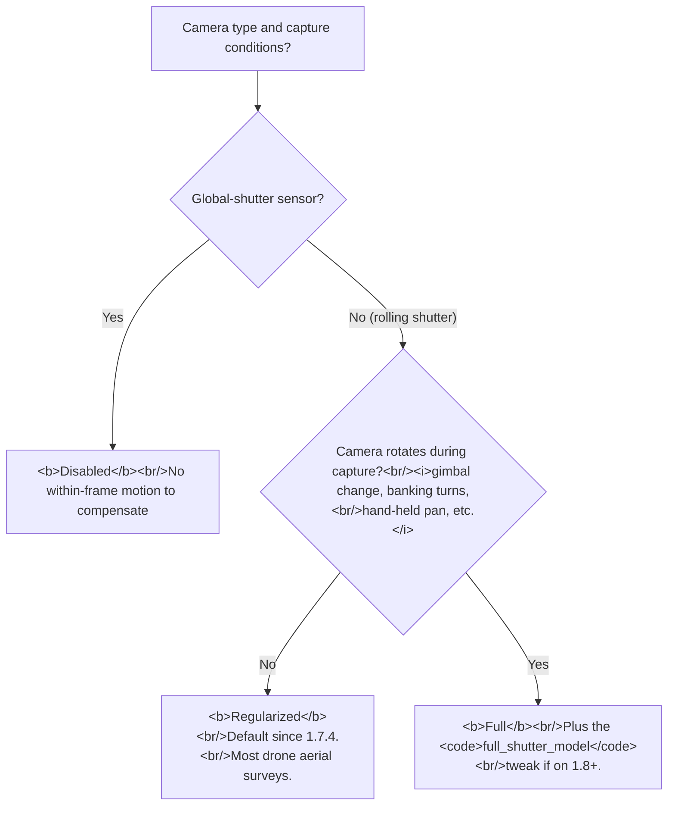

# Rolling-shutter compensation: Regularized vs Full, when to use which
> **Confidence:** *medium.* The Regularized vs Full distinction
> is forum-attested in the source thread; the
> per-photo-vs-averaged behaviour is forum-attested with a
> 2025 confirmation; the bug-restriction history (1.7.4 limit
> and the `full_shutter_model` tweak) is forum-attested. The
> `Sensor.rolling_shutter` API surface is introspection-confirmed
> on Metashape 2.2.2.

## What rolling shutter does to photogrammetry

Most consumer drones, action cameras, and mobile-phone sensors
use a *rolling-shutter* CMOS readout: the sensor is read out
row-by-row over a few milliseconds rather than all at once. If
the camera moves during the readout interval, different rows of
the image capture the scene from slightly different camera
poses. The result: vertical lines lean, edges shear, and
photogrammetric reprojection errors grow systematically with
camera velocity.

For most aerial surveys at 5 m/s flying speed and a 10 ms
readout, the within-frame motion is ≈5 cm — negligible for
overview surveys but significant for centimetre-grade
metrology. Faster flights, faster subjects (vehicles, animals,
spinning turntables) and tighter accuracy targets all push
rolling-shutter effects from "ignorable" to "dominant" in the
error budget.

Metashape's *Rolling Shutter Compensation* models this
during bundle adjustment by adding per-photo parameters that
absorb the within-frame motion.

## The two compensation models

The dropdown offers three settings:

| Setting | Per-frame parameters | Suitable for |
|---------|---------------------|--------------|
| **Disabled** | 0 | Global-shutter cameras (most professional / cinema cameras, machine-vision cameras with global-shutter sensors). Also static-acquisition cases (turntable with the camera still). |
| **Regularized** | 2 (Tx, Ty in the image plane) | Drone flights where the camera does **not rotate** during capture: parallel-line aerial surveys, single-direction passes, cars on a stable car-mount. The default since version 1.7.4. |
| **Full** | 6 (Tx, Ty, Tz + Rx, Ry, Rz) | Hand-held capture, helicopter-mounted survey with banking turns, gimbal cameras with active stabilisation, any case where camera attitude changes during the readout interval. |

The canonical explanation:

> "Regularized model is suitable for the case when the drone
> flies without turning the camera, i.e. during the shooting to
> a new route, the camera does not turn and the drone moves in
> parallel.
>
> When using a Regularized, only two parameters are optimized
> for each frame: axis shift XY in the plane of the photo. When
> using the Full model, 6 parameters are optimized for each
> frame: shift along the XYZ axes and rotation along the XYZ
> axes." — Alexey Pasumansky, 2022-07-31, Metashape 1.8
> ([permalink](https://www.agisoft.com/forum/index.php?topic=14670.msg64472#msg64472))

## Per-photo, not averaged

Newcomers to the feature commonly ask whether the compensation
is computed once per dataset (averaged across all images) or
once per image. The answer is per-image:

> "The rolling shutter compensation parameters are applied on a
> per foto basis, as seen in following screen shot..." —
> Paulo, 2025-06-27, Metashape 2.2
> ([permalink](https://www.agisoft.com/forum/index.php?topic=14670.msg73828#msg73828))

The implication for hand-flown drone capture: even when the
flight speed and direction vary frame-to-frame (gusts, manual
piloting, deliberate hover-and-shoot moments), the compensation
adapts per image. There is no need to "group" frames by speed.

## Static photos in a moving sequence

A common edge case: a drone survey includes a few hover-still
photos for ground-control marker visibility, mixed in with the
moving-flight passes. The compensation parameters for the
hover-still photos should be zero (no within-frame motion), and
typically *Regularized* (or even *Disabled*) compensation handles
them correctly.

The question then is: **does the user need to do anything to
mark the static frames?** No — the bundle adjusts each frame's
parameters independently, and a frame with no motion produces
near-zero compensation parameters.
A more conservative practice that some forum users adopt is:

- Move the static frames to their own *Camera group* via the
  *Workspace → Cameras → New Camera Group* (or
  `chunk.addCameraGroup()`).
- Set the group's *Rolling Shutter Compensation* to *Disabled*
  via the *Tools → Camera Calibration* dialog applied per-group.

This is defensive and rarely changes outcomes; the default
behaviour (per-frame compensation, with zero-effect on
zero-motion frames) is operationally correct for nearly all
mixed-motion datasets.

## Bug history: the 1.7.4 restriction and the `full_shutter_model` tweak

A subtle gotcha for users moving from PhotoScan 1.6 / 1.7 to
Metashape 1.8+:

> "Since version 1.7.4, rolling shutter compensation has been
> restricted to using only 2 parameters Tx and Ty. [...] To
> increase alignment stability, in version 1.7.4 we constrained
> rolling shutter model to translation in xy-plane.
>
> Now if you want to use full compensation model (6 parameters)
> then you can use following tweaks (since version 1.8):
>
> `AlignCameras/full_shutter_model = True`
> `OptimizeCameras/full_shutter_model = True`
>
> Try them and see if it improves results after redoing alignment
> and optimization." — Paulo (relaying Agisoft Support),
> 2022-05-11, Metashape 1.8
> ([permalink](https://www.agisoft.com/forum/index.php?topic=14480.msg63654#msg63654))

The implication: even when *Tools → Camera Calibration → Rolling
Shutter Compensation* is set to *Full*, the underlying bundle
adjustment defaults to the 2-parameter form unless the
`full_shutter_model` tweaks are explicitly enabled. To force
the 6-parameter behaviour:

```python
import Metashape

# Set the per-sensor compensation model.
for sensor in chunk.sensors:
    sensor.rolling_shutter = Metashape.Shutter.Model.Full

# Enable the 6-parameter form via Application settings (the
# Metashape "tweaks" mechanism is exposed in the Python API as
# `Metashape.app.settings.setValue(key, value)` — there is no
# per-chunk tweaks attribute).
Metashape.app.settings.setValue("AlignCameras/full_shutter_model", "True")
Metashape.app.settings.setValue("OptimizeCameras/full_shutter_model", "True")

# Now re-run alignment and optimization.
chunk.matchPhotos(downscale=1, keep_keypoints=True)
chunk.alignCameras()
chunk.optimizeCameras(...)
```

The tweak names are case-sensitive and version-specific; verify
by running the alignment with the tweaks set and checking that
the bundle's per-frame rolling-shutter parameters include the
3-axis translation and 3-axis rotation components (visible via
the *Reference* pane's per-camera data or via
`camera.shutter.translation` / `camera.shutter.rotation` on
recent versions of Metashape — these accessors are unverified
on Metashape 2.2.2 and may not exist on all builds; verify with
`hasattr(camera.shutter, 'translation')` before relying on them).

## When NOT to enable rolling-shutter compensation

The compensation introduces additional bundle-adjustment
parameters that need data to constrain. On thin datasets — short
overlap, few cameras, sparse tie points — the extra degrees of
freedom can destabilise alignment rather than improve it.
*Regularized* is conservative enough for most cases, but in
extreme cases (small-block aerial sets with marginal overlap)
*Disabled* may yield more reproducible results.

The diagnostic: if enabling compensation increases reprojection
error or causes cameras to fail alignment, the dataset is too
thin for the compensation model. *Disable* it and re-run; the
RMS should drop and the failed cameras should re-align.

## Decision picker



## Caveats

- **`Sensor.rolling_shutter` is a per-sensor setting**, not
  per-camera. Multi-sensor projects (e.g. Micasense
  multispectral rigs) can have different compensation models
  per band; iterate `chunk.sensors` to set them.
- **Tweaks are not stable API.** `AlignCameras/full_shutter_model`
  was introduced in 1.8; whether it persists in 2.x and beyond
  is not documented. Re-verify on a target version before
  relying on it.
- **`Disabled` and zero-motion equivalence is not exact.** A
  frame with no within-frame motion produces near-zero
  compensation parameters — but the bundle still spends a few
  parameters on it. On extremely thin datasets, *Disabled* on a
  static-frame group is marginally cheaper than *Regularized*
  with zero-effect parameters; on production datasets the
  difference is below noise.
- **The compensation does not retroactively fix shape errors in
  the captured pixels.** It compensates *the camera pose* for
  bundle-adjustment purposes, but the rolling-shutter induced
  pixel shear in the source image is unchanged. Patch out
  rolling-shutter-affected regions if pixel-level fidelity
  matters (see [Applying Patch on multiple shapes](../orthomosaic/applying-patch-multiple-shapes.md)).
- **Pre-1.7.4 projects loaded into newer versions retain the
  6-parameter model**, but new alignments default to the
  2-parameter form. Mixing old and new alignments in the same
  project yields inconsistent rolling-shutter parameter sets.

## Runnable demonstration

The script below sets the rolling-shutter compensation per
sensor and prints the effective configuration. Demo verification
is ✗ pending Tier 3 — the per-frame parameter inspection
requires a real bundle to have run.

> **Demo verified:** ✗ — pending Tier 3 reproduction. The
> `Sensor.rolling_shutter` and `Shutter.Model` API surfaces
> are introspection-verified on Metashape Pro 2.2.2; the
> per-camera shutter-parameter introspection (`camera.shutter.
> translation`, `camera.shutter.rotation`) requires running
> `alignCameras` after the configuration and is gated at Tier 3.

```python
"""Configure rolling-shutter compensation per sensor + tweaks."""
import Metashape

doc = Metashape.app.document
chunk = doc.chunk

print("=== current compensation per sensor ===")
for s in chunk.sensors:
    print(f"  {s.label!r:>20}  {s.rolling_shutter}")

# Choose the model based on capture conditions.
COMPENSATION = Metashape.Shutter.Model.Regularized
# COMPENSATION = Metashape.Shutter.Model.Full
# COMPENSATION = Metashape.Shutter.Model.Disabled

for s in chunk.sensors:
    s.rolling_shutter = COMPENSATION

# If using Full and on Metashape 1.8+, also enable the
# 6-parameter form via Application settings (these are the
# documented "tweaks" — exposed via Metashape.app.settings,
# version-specific).
if COMPENSATION == Metashape.Shutter.Model.Full:
    Metashape.app.settings.setValue("AlignCameras/full_shutter_model", "True")
    Metashape.app.settings.setValue("OptimizeCameras/full_shutter_model", "True")

print(f"\n=== set all sensors to {COMPENSATION} ===")
for s in chunk.sensors:
    print(f"  {s.label!r:>20}  {s.rolling_shutter}")

print(f"\n=== application-settings tweaks ===")
for key in ("AlignCameras/full_shutter_model",
            "OptimizeCameras/full_shutter_model"):
    val = Metashape.app.settings.value(key)
    print(f"  {key} = {val}")
```

**Expected output:** the per-sensor compensation model is set
uniformly to the chosen `Shutter.Model`. If `Full` was
selected, the two `full_shutter_model` settings are stored in
the application settings. After running, re-execute the chunk's
`matchPhotos` + `alignCameras` to apply the new configuration.

## References

- [Forum thread, *Rolling shutter*, 2022–2025](https://www.agisoft.com/forum/index.php?topic=14670.0)
  — primary source for the Regularized-vs-Full distinction
  (msg 64384, 2022-07-31) and the per-photo-not-
  averaged confirmation (msg 135030, 2025-06-27).
- [Forum thread, *Rolling shutter compensation in 1.8 does not correct all parameters*, 2022](https://www.agisoft.com/forum/index.php?topic=14480.0)
  — primary source for the 1.7.4-restriction history and the
  `full_shutter_model` tweaks (Agisoft Support,
  2022-05-11, msg 64151).
- [Forum thread, *Rolling Shutter bug?*, 2021](https://www.agisoft.com/forum/index.php?topic=12235.0)
  — companion thread on a specific 1.7-era bug.
- [Forum thread, *Rolling shutter integration*, 2017](https://www.agisoft.com/forum/index.php?topic=5144.0)
  — early-era thread; predates the Regularized/Full split.
- [Forum thread, *Distance and angle calculation and rolling shutter in 1.4*, 2018](https://www.agisoft.com/forum/index.php?topic=8548.0)
  — older thread on metrology effects.
- *Metashape Python Reference* (2.3.1):
  `Sensor.rolling_shutter`, `Shutter`, `Shutter.Model`,
  `Application.Settings.setValue`, `Application.Settings.value`.
- *Metashape Professional Edition User Manual* (2.3),
  Camera Calibration section, *Rolling Shutter Compensation*.
