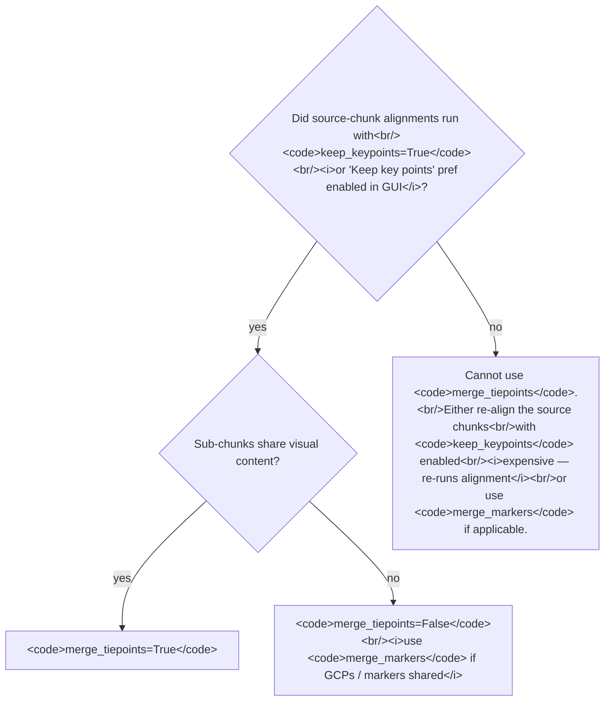

# The `merge_tiepoints` option (and the `keep_keypoints` prerequisite)

> **Series:** Part 3 of 3 on `mergeChunks` semantics.
> Previous: [What `mergeChunks` actually does ←](what-mergechunks-does.md)
> · [No camera deduplication ←](no-camera-deduplication.md).

> **Confidence:** *high.* The `keep_keypoints` prerequisite is
> directly attested by two 2023 forum posts from Agisoft support
> with permalinks; the `Chunk.matchPhotos(keep_keypoints=True)`
> and `Document.mergeChunks(merge_tiepoints=True)` parameters
> are introspection-confirmed on Metashape 2.2.

`merge_tiepoints=True` is the only mechanism that makes
`mergeChunks` actually find and consolidate cross-chunk tie points
into the merged chunk's tie point cloud. It is **not** the same as
*Align Chunks (point based)* — that operation discards its tie
points after fitting the alignment. `merge_tiepoints` retains them.

The option has a hard prerequisite that is not always obvious from
the GUI: keypoints (per-image feature descriptors) must have been
preserved on the source chunks at alignment time. Forget this and
the GUI checkbox will be greyed out, or — in Python — the merge
will silently produce no cross-chunk tie points.

## When to use `merge_tiepoints`

Use `merge_tiepoints=True` when the merged-chunk tie point cloud
needs to be **a single connected bundle** rather than two
sub-bundles touching at a marker. The two cases that motivate it:

- **Sub-chunks photograph genuinely overlapping content.** A flight
  with two passes over the same area, for example: each pass
  matches well as its own chunk, but the cross-pass overlap
  produces additional shared tie points that the merged chunk
  benefits from.
- **`Optimize Cameras` on the merged chunk needs to refine
  cross-chunk geometry.** Without `merge_tiepoints` (and without
  `merge_markers`), the optimisation has no information linking
  the sub-chunks; see
  [What `mergeChunks` actually does](what-mergechunks-does.md).

When neither applies — for example sub-chunks that photograph
adjacent but non-overlapping zones — `merge_tiepoints=True` will
either find very few cross-chunk matches (low value) or none at
all (no effect, but processing time wasted).

## The `keep_keypoints` prerequisite

> "Merge Tie Points option requires key points to be present in
> the chunks that you are planning to merge. With this option
> enabled Metashape is trying to find the corresponding tie points
> between the chunks, i.e the tie points found in different chunks
> but considered to be identical would be merged to the single
> tie point instance in the merged chunk." — Alexey Pasumansky,
> 2023-05-04, Metashape 2.0
> ([permalink](https://www.agisoft.com/forum/index.php?topic=15490.msg67279#msg67279))

> "Merge Tie Points option is not available if there are no key
> points stored in the chunks being merged, as it wouldn't be
> possible to match tie points in different chunks." — Alexey
> Pasumansky, 2023-10-31, Metashape 2.1
> ([permalink](https://www.agisoft.com/forum/index.php?topic=15960.msg68783#msg68783))

The "key points" referenced here are not tie points. They are the
per-image **feature descriptors** computed during *Match Photos*
(the first phase of *Align Photos*). By default they are not
persisted — once `matchPhotos` has built the tie-point graph, the
keypoints are discarded.

To keep them:

- **Python:** call `chunk.matchPhotos(keep_keypoints=True, …)`
  when running alignment.
- **GUI:** in *Preferences → Advanced*, enable *Keep key points*
  before running *Align Photos*.

Both forms write the same persistent keypoint data. The
prerequisite is **set at alignment time, not at merge time** —
re-running `matchPhotos` later only to enable `keep_keypoints`
requires re-matching and re-aligning (the full pipeline from
feature detection onward).

## Decision flow



## Caveats

- **Processing time increases considerably.** The cross-chunk
  feature matching runs across every cross-chunk image pair. For
  two 100-image chunks: 10 000 pair attempts on top of the merge
  itself. Plan accordingly.
- **`merge_tiepoints=True` fails silently on disjoint chunks.**
  The cross-chunk tie-point matching step needs **visual overlap
  between the source chunks** to find any matches. When the
  chunks photograph entirely-disjoint regions (e.g., opposite
  sides of a structure with no camera looking at both), the step
  produces no merged tie points and the merge either errors with
  `Null tie points` or completes with a degenerate tie-point cloud.
  Use `merge_tiepoints=False` when visual overlap cannot be
  guaranteed; rely on `merge_markers=True` or external references
  for cross-chunk linkage instead.
- **The GUI checkbox is the canonical disabled-state indicator.**
  When it greys out, no source chunk has stored keypoints. In the
  Python API there is no equivalent introspection; if you set
  `merge_tiepoints=True` without keypoints stored, the operation
  succeeds but produces no merged tie points.
- **`merge_tiepoints` and `merge_markers` are independent.** Both
  introduce cross-chunk constraints but via different evidence.
  Setting both is supported and usually redundant — markers are
  high-weight constraints, tie points are low-weight constraints,
  and the bundle handles their combination automatically.

## Runnable demonstration on the Building sample dataset

The script below splits the
[Building](../../reference/sample-data.md#building) dataset into
two chunks, aligns each with `keep_keypoints=True`, then merges
once with `merge_tiepoints=False` and once with `True`, comparing
tie-point-cloud sizes.

> **Demo verified:** ✗ — pending Tier 3 reproduction on Metashape
> Pro 2.2 / 2.3 with the *Building* sample dataset. The underlying
> APIs are introspection-verified but the demo as written has not
> been run end-to-end. Required before the manual ships.

```python
"""Compare merge with and without merge_tiepoints.

Pre-condition: Building sample loaded into a fresh project. Run
this script via Tools → Run Script… — it sets up two chunks, runs
alignment with keep_keypoints=True on each, then performs two
merges back-to-back.
"""
import Metashape

DATASET = "/path/to/building"  # adjust

doc = Metashape.app.document

# Setup: two chunks, half the cameras each. Use the existing
# alignment from the GUI if you've already run it; otherwise
# alignment runs here with keep_keypoints=True.
chunk_a = doc.chunks[0]
chunk_b = doc.chunks[1]

for chunk in (chunk_a, chunk_b):
    if not chunk.tie_points:
        chunk.matchPhotos(downscale=1, keep_keypoints=True)
        chunk.alignCameras()

# Align the chunks point-based (separate from merge_tiepoints).
doc.alignChunks(chunks=[chunk_a.key, chunk_b.key],
                reference=chunk_a.key, method=0)

# Merge once WITHOUT merge_tiepoints.
doc.mergeChunks(chunks=[chunk_a.key, chunk_b.key],
                merge_markers=False, merge_tiepoints=False)
m_no = doc.chunks[-1]
print(f"merge no_tp:  {len(m_no.tie_points.tracks):>7} tracks, "
      f"{len(m_no.tie_points.points):>7} points")

# Merge again WITH merge_tiepoints.
doc.mergeChunks(chunks=[chunk_a.key, chunk_b.key],
                merge_markers=False, merge_tiepoints=True)
m_yes = doc.chunks[-1]
print(f"merge tp:     {len(m_yes.tie_points.tracks):>7} tracks, "
      f"{len(m_yes.tie_points.points):>7} points")

print(f"delta tracks: {len(m_yes.tie_points.tracks) - len(m_no.tie_points.tracks):>+7}")
```

**Expected output:** the `merge tp` chunk should have somewhat
fewer tracks than `merge no_tp` (because matching pairs across
chunks are *consolidated* into single tracks, not added as new
ones), but the same or higher number of points contributing to the
tie point cloud. If the two values are identical, either keypoints
were not stored or the chunks have no visually-overlapping content
to match.

## References

- [Forum thread, *What do the Merge Tie Points do…*, 2023](https://www.agisoft.com/forum/index.php?topic=15490.0)
  — definition of the option (msg 69850).
- [Forum thread, *Tie points checkbox disabled…*, 2023](https://www.agisoft.com/forum/index.php?topic=15960.0)
  — discoverability of the prerequisite (msgs 72204;
  user surya-aereo's confirmation that *Keep Key Points* must be
  enabled before alignment).
- *Metashape Python Reference* (2.3.1), `Chunk.matchPhotos` —
  documents the `keep_keypoints` parameter (default `False`).
- *Metashape Pro User Manual* (2.3), ch. 3 *General workflow*,
  § *Merging chunks* — official description of the *Merge Tie
  Points* checkbox.
