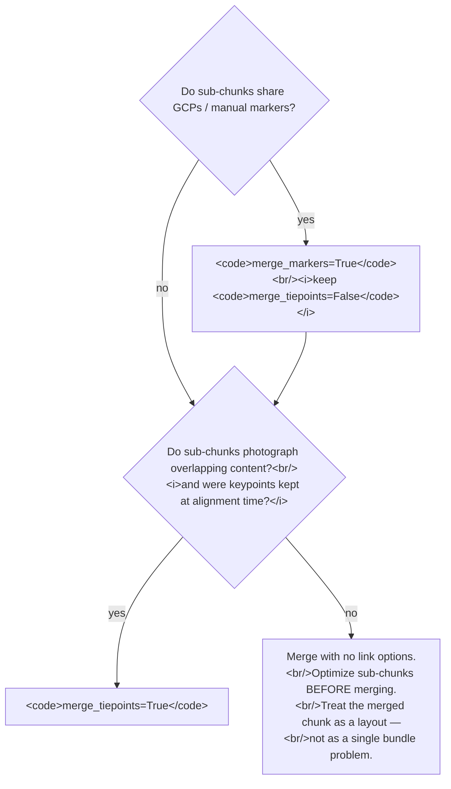

# What `mergeChunks` actually does (and what it does not)

> **Series:** Part 1 of 3 on `mergeChunks` semantics.
> Continue with [No camera deduplication →](no-camera-deduplication.md)
> and [The `merge_tiepoints` option →](merge-tiepoints-and-keep-keypoints.md).

> **Confidence:** *high.* The architectural behaviour
> (no cross-chunk tie points, no camera deduplication) is
> directly attested by Agisoft support with permalinks; the
> full `Document.mergeChunks` kwarg surface is
> introspection-confirmed on Metashape 2.2.

A common misunderstanding is that *Align Chunks* + *Merge Chunks*
is equivalent to "alignment of all images in one chunk." It is not.
Merging chunks performs an **architectural placement** — the
sub-chunks land in their previously-aligned relative positions —
and **introduces no new tie points across the chunk boundary** by
default. A subsequent *Optimize Cameras* on the merged chunk treats
each source sub-chunk as an independent block.

This clarification was confirmed in the source thread; the
architectural behaviour has been stable through Metashape
2.2.2.

## What `mergeChunks` does

`Workflow → Merge Chunks` (GUI) and `Document.mergeChunks(…)`
(Python API) do exactly one geometric operation: place the source
chunks' contents (cameras, tie points, optionally markers, dense
cloud, mesh, etc.) into a new chunk in the relative positions
established by a prior *Align Chunks* run.

The defaults of the Python entry point reveal the lean design:

```python
Document.mergeChunks(
    copy_laser_scans=True,
    copy_masks=True,
    copy_depth_maps=False,
    copy_point_clouds=False,
    copy_models=False,
    copy_tiled_models=False,
    copy_elevations=False,
    copy_orthomosaics=False,
    merge_markers=False,
    merge_tiepoints=False,
    merge_assets=False,
    chunks=[...],
)
```

(introspected from Metashape 2.2.2)

The two structural-coupling options — `merge_markers` and
`merge_tiepoints` — both default to `False`. Use the defaults and
you get an unfused merge: cameras and tie points are placed but
not connected.

## What it does *not* do

> "The method of the chunk alignment operation doesn't make any
> difference, it's only a tool that orients chunks relatively to
> each other, no new tie points are introduced and no additional
> connection between the chunks is created. Almost the only way to
> "connect" the merged chunks before the optimization is to use
> markers that have projections on the images from both subsets
> (for example, if you use Merge Markers) option. So unless you
> are merging the markers, the subsets would be optimized
> independently in the merged chunk." — Alexey Pasumansky,
> 2017-03-14, PhotoScan 1.3
> ([permalink](https://www.agisoft.com/forum/index.php?topic=6691.msg32347#msg32347);
> reposted in the thread index at
> <https://www.agisoft.com/forum/index.php?topic=6691.0>)

Three concrete consequences:

1. **No cross-chunk tie points.** A tie point in the merged result
   connects only cameras that came from the same source chunk.
   *View Matches* on a camera shows matches only to its
   originally-co-chunked siblings.
2. **`Optimize Cameras` is structurally-independent.** With no
   cross-chunk constraint, the bundle has no information linking
   the sub-chunks' intrinsics or exterior orientations.
   Optimisation converges to N independent local optima. Residual
   geometric error between sub-chunks (typically whatever *Align
   Chunks* left, sometimes ≥1 m on marker-based alignments —
   [topic=3325](https://www.agisoft.com/forum/index.php?topic=3325.0))
   stays.
3. **No camera deduplication.** The same image, present in two
   source chunks (e.g. via *Align Chunks (camera based)*), appears
   twice in the merged chunk. Each copy carries the tie points of
   its source chunk only — see
   [`mergeChunks` does not deduplicate cameras](no-camera-deduplication.md)
   for why post-merge cleanup is risky.

## How to actually link the sub-chunks at merge time

Two flags introduce real cross-chunk constraints:

- **`merge_markers=True`.** Markers with the same `marker.label`
  in multiple source chunks are merged into single instances in
  the merged chunk, and their per-camera projections are unified.
  *Optimize Cameras* then has those markers as linking constraints,
  identical to GCPs in a single-chunk project.
- **`merge_tiepoints=True`.** Metashape attempts to find
  cross-chunk feature matches at merge time and consolidates
  matching pairs into single tie-point instances in the merged
  chunk. **Hard prerequisite:** keypoints must have been preserved
  on the source chunks (see
  [The `merge_tiepoints` option](merge-tiepoints-and-keep-keypoints.md)).

Either option introduces meaningful cross-chunk constraints; both
together are redundant in most cases (markers contribute weighted
constraints; tie points contribute many low-weight constraints).
Pick the one that matches the project: markers when GCPs or
manually-placed targets exist; tie points when the sub-chunks
photograph genuinely overlapping content.

## Decision sketch



## Caveats

- **The `merge_assets` flag is unrelated to optimisation.** It
  copies derived assets (the same set the `copy_*` flags govern,
  bundled together for convenience). It does not introduce any
  cross-chunk constraint.
- **`Optimize Cameras` after a no-link merge is not useless** —
  it still re-optimises each sub-chunk's bundle with whatever new
  reference data the merge introduced. It just does not improve
  inter-sub-chunk geometry. If the goal is sub-chunk geometric
  consistency, *Optimize Cameras* on a no-link merge is the wrong
  lever; use `merge_markers` or `merge_tiepoints` at merge time
  instead.
- **GUI users:** the *Workflow → Merge Chunks* dialog exposes the
  same options as checkboxes. The *Merge Tie Points* checkbox is
  greyed out when no source chunk has stored keypoints — the
  prerequisite documented in
  [The `merge_tiepoints` option](merge-tiepoints-and-keep-keypoints.md).

## Runnable demonstration on the Building sample dataset

The script below splits the [Building](../../reference/sample-data.md#building)
sample (50 images) into two halves, aligns each as its own chunk,
runs *Align Chunks (point based)*, then merges with
`merge_tiepoints=False`. After the merge it counts the tie points
linked to a known cross-chunk image pair — the count should be
zero, confirming the no-cross-chunk-tie-points claim.

> **Demo verified:** ✗ — pending Tier 3 reproduction on Metashape
> Pro 2.2 / 2.3 with the *Building* sample dataset. The underlying
> APIs are introspection-verified but the demo as written has not
> been run end-to-end. Required before the manual ships.

```python
"""mergeChunks does not produce cross-chunk tie points.

Run via Tools → Run Script… on the *Building* sample after
Align Photos has been completed in two split chunks.
"""
import Metashape

DATASET = "/path/to/building"  # adjust

doc = Metashape.app.document

# Setup: two chunks, each with half of the 50 images, both
# aligned. (Pre-condition: do this in the GUI or in a separate
# setup script before running the rest.)
chunk_a = doc.chunks[0]   # cameras 0..24
chunk_b = doc.chunks[1]   # cameras 25..49

# Step 1: align the two chunks point-based.
doc.alignChunks(
    chunks=[chunk_a.key, chunk_b.key],
    reference=chunk_a.key,
    method=0,  # point-based
)

# Step 2: merge with NO cross-chunk linkage.
doc.mergeChunks(
    chunks=[chunk_a.key, chunk_b.key],
    merge_markers=False,
    merge_tiepoints=False,
)

# Inspect: cross-chunk tie points in the merged chunk.
# Tie-point projections are accessed per-camera via
# `chunk.tie_points.projections[camera]`, which returns a list of
# `Projection` objects (each with `track_id`, `coord`, `size`).
# A track is "cross-chunk" iff it has projections on at least one
# camera from each source chunk.
merged = doc.chunks[-1]   # mergeChunks appends the merged chunk
src_a_cams = [c for c in merged.cameras if c.label in {x.label for x in chunk_a.cameras}]
src_b_cams = [c for c in merged.cameras if c.label in {x.label for x in chunk_b.cameras}]

# Build per-source track-id sets.
tracks_in_a = set()
for cam in src_a_cams:
    tracks_in_a.update(p.track_id for p in merged.tie_points.projections[cam])
tracks_in_b = set()
for cam in src_b_cams:
    tracks_in_b.update(p.track_id for p in merged.tie_points.projections[cam])

cross_chunk = len(tracks_in_a & tracks_in_b)

print(f"merged tie points : {len(merged.tie_points.tracks)}")
print(f"cross-chunk tracks: {cross_chunk}")
# Expected: cross-chunk tracks = 0 (despite point-based alignChunks).
```

**Expected output:** `cross-chunk tracks` is zero. Re-running the
final block after a re-merge with `merge_tiepoints=True` (and
`keep_keypoints=True` set on the source-chunk alignments) should
produce a non-zero count.

## References

- [Forum thread, *Optimisation of Merged Chunks*, 2017](https://www.agisoft.com/forum/index.php?topic=6691.0)
  — primary source; the clarification (msg 32510).
- [Forum thread, *Merging different chunks flawlessly?*, 2015](https://www.agisoft.com/forum/index.php?topic=3325.0)
  — practical 462-image / 4-chunk case with a 1 m residual,
  motivating the question.
- *Metashape Professional Edition User Manual* (2.3), §"Merging
  chunks" — the official description does not state the
  no-cross-chunk-tie-points behaviour; this article is the
  expert-level overlay.
