# Tightening reference accuracies after `alignCameras`: when the similarity-transform residual isn't enough
> **Confidence:** *medium.* The recipe's *direction* — that
> non-linear drift needs non-linear bundle adjustment — is
> forum-grounded ([topic=8054](https://www.agisoft.com/forum/index.php?topic=8054.0)).
> The specific *two-or-three-phase weighting* (tight camera refs
> first, loose camera refs with tight markers second, optionally
> disabled camera refs third) is operational synthesis: the
> direction is sound, the magnitudes are illustrative, and the
> "what to avoid" findings are empirical from a single project
> context. Reproducibility on similar projects is high.

This article is the operational sequel to
[When does `optimizeCameras` actually do something?](when-optimize-cameras-helps.md).
That article established the **similarity-vs-bundle** distinction:
`alignCameras` + reference data does *not* by itself run
non-linear bundle adjustment; it runs a 7-parameter similarity
transformation only. This article is the recipe for *what to do
when the similarity transformation isn't enough*.

## Symptom

`alignCameras` reports a healthy result — most cameras aligned,
internal SfM reprojection RMS in the px range — but the
world-frame agreement with reference data is bad:

```python
# After alignCameras + reference data import.
chunk = Metashape.app.document.chunk
T = chunk.transform.matrix

deltas = []
for c in chunk.cameras:
    if c.transform is None or c.reference.location is None:
        continue
    world_pos = T.mulp(c.transform.translation())
    deltas.append((world_pos - c.reference.location).norm())

import statistics
print(f"camera reference delta — median: {statistics.median(deltas):.3f} m")
print(f"camera reference delta — max   : {max(deltas):.3f} m")

# Same check for markers.
m_deltas = []
for m in chunk.markers:
    if m.position is None or m.reference.location is None:
        continue
    world_pos = T.mulp(m.position)
    m_deltas.append((world_pos - m.reference.location).norm())
print(f"marker reference delta — median: {statistics.median(m_deltas):.4f} m")
```

If the median delta is **metres** even though
`camera_location_accuracy` was set to a tight value (e.g., 0.5 m
or less), and marker reference residuals are similarly inflated,
this article applies.

## Why it happens

`alignCameras` with `reference.enabled=True` runs the SfM bundle
on tie-point evidence and then applies a **single similarity
transform** to land the result in the reference frame. The
transform has 7 parameters (3 translation, 3 rotation, 1 scale).
The user manual's canonical statement (discussed in
[D.1](when-optimize-cameras-helps.md)) is that this similarity
transform is *linear*: it can compensate only a linear (global)
misalignment between the model and the reference data. Any
*non-linear* deformation of the reconstructed structure cannot be
removed this way — it is removed instead by **optimizing** the
tie-point cloud and camera parameters against the known reference
coordinates (discussed in the forum at
[topic=8054](https://www.agisoft.com/forum/index.php?topic=8054.0)).

If the SfM-recovered structure has *non-linear* drift — typical
in noisy match domains: large repeating textures, low-parallax
views, structural ambiguity — the similarity fit minimises
residuals globally but cannot bend the structure locally. Median
residuals of metres survive even after a "successful" alignment.

## The fix: a two- or three-phase non-linear bundle adjustment

Both phases hold camera intrinsics fixed (`fit_*=False`). The
underlying assumption is that **you trust the camera model more
than the BA's ability to refine it from noisy tie points** —
typical when:

- The camera was factory-calibrated.
- The images come from CGI or synthetic rendering with known
  intrinsics.
- A separate calibration project produced the calibration and
  the current project is using it as imported reference.

When intrinsics *do* need refinement, this recipe is the wrong
tool — see [D.1](when-optimize-cameras-helps.md)'s table of
`fit_*` flags for the standard refinement set.

### Phase 1 — Tight camera refs anchor the structure

Tighten **both** per-camera reference accuracy (e.g., 5 cm) and
per-marker reference accuracy (e.g., 1 mm), plus the chunk-level
defaults. Run `updateTransform()` to re-fit the chunk transform
from the tightened references, then `optimizeCameras` with
calibration held fixed.

```python
import Metashape

chunk = Metashape.app.document.chunk

# Per-camera tight reference accuracy.
# Skip slave cameras of multi-camera rigs — they inherit the
# master's pose plus the rig offset; per-slave refs would
# fight the rig declaration.
for c in chunk.cameras:
    if c.master and c.master != c:
        continue                             # slave; skip
    if c.reference and c.reference.location is not None:
        c.reference.accuracy          = Metashape.Vector([0.05, 0.05, 0.05])  # 5 cm
        c.reference.rotation_accuracy = Metashape.Vector([0.5,  0.5,  0.5])   # 0.5°

# Per-marker tight reference accuracy.
for m in chunk.markers:
    if m.reference and m.reference.location is not None:
        m.reference.accuracy = Metashape.Vector([0.001, 0.001, 0.001])        # 1 mm

# Chunk-level defaults (applied where per-item is unset).
chunk.camera_location_accuracy = Metashape.Vector([0.05, 0.05, 0.05])
chunk.camera_rotation_accuracy = Metashape.Vector([0.5,  0.5,  0.5])
chunk.marker_location_accuracy = Metashape.Vector([0.001, 0.001, 0.001])

# Re-fit chunk transform from the tightened references.
chunk.updateTransform()

# Phase 1 BA — calibration HELD FIXED.
chunk.optimizeCameras(
    fit_f=False, fit_cx=False, fit_cy=False,
    fit_b1=False, fit_b2=False,
    fit_k1=False, fit_k2=False, fit_k3=False, fit_k4=False,
    fit_p1=False, fit_p2=False,
)
```

This pulls the rig back to rough alignment with the seeded
references. The tight camera refs prevent runaway drift on
cameras whose tie-point support is weak — important because the
non-linear BA can otherwise move a poorly-supported camera by
metres in the direction of the bundle's residual gradient.

After Phase 1, marker reference residuals should be in the
**cm range** (typical: 10–20 mm). Camera reference residuals are
*also* in the metre range still, because cameras and markers are
both being refit and the tight camera priors prevent the bundle
from moving the cameras much.

### Phase 2 — Loosen camera refs so markers dominate

Loosen the camera reference accuracies (e.g., 5 m); keep the
markers tight (1 mm).

```python
# Camera refs LOOSE; markers still tight.
for c in chunk.cameras:
    if c.master and c.master != c:
        continue
    if c.reference and c.reference.location is not None:
        c.reference.accuracy          = Metashape.Vector([5.0,  5.0,  5.0])    # 5 m
        c.reference.rotation_accuracy = Metashape.Vector([50.0, 50.0, 50.0])   # 50°

chunk.camera_location_accuracy = Metashape.Vector([5.0, 5.0, 5.0])

# Phase 2 BA — same flags as Phase 1, calibration held fixed.
chunk.optimizeCameras(
    fit_f=False, fit_cx=False, fit_cy=False,
    fit_b1=False, fit_b2=False,
    fit_k1=False, fit_k2=False, fit_k3=False, fit_k4=False,
    fit_p1=False, fit_p2=False,
)
```

The ~5000× weight ratio between markers (1 mm) and camera refs
(5 m) makes **markers the dominant constraint** in the bundle's
cost function. The camera refs still provide a soft "don't drift
wildly" anchor — important because some cameras may not see any
markers, and without any prior they can drift hundreds of metres
during BA — but they no longer fight the markers.

After Phase 2, marker reference residuals should be in the
**low-mm range** (typical: 5–10 mm), bounded by the markers'
declared accuracy. Camera reference residuals improve to the
0.5–2 m range — the cameras are now *correctly* drifted from
their (loose) references because the markers, which have
millimetre-level world-frame ground truth, dominate the fit.

### Phase 3 (optional) — Disable camera refs entirely

Once Phase 2 has converged and the rig structure is verified
correct, the camera references stop adding information. Disabling
them entirely lets the markers + SfM tie-point graph fully
constrain the scene — and typically gives a small additional
improvement (~3% on a typical multi-camera-rig project: marker
3D RMS 1.23 mm → 1.20 mm; 2D residuals also improve slightly).

```python
# Phase 3 — disable camera refs; markers + tie points constrain everything.
for c in chunk.cameras:
    if c.master and c.master != c:
        continue
    if c.reference and c.reference.location is not None:
        c.reference.location_enabled = False
        c.reference.rotation_enabled = False

chunk.optimizeCameras(
    fit_f=False, fit_cx=False, fit_cy=False,
    fit_b1=False, fit_b2=False,
    fit_k1=False, fit_k2=False, fit_k3=False, fit_k4=False,
    fit_p1=False, fit_p2=False,
)
```

**Critical prerequisite: the rig must be correctly oriented.**
Phase 3 is only safe when the multi-camera rig (if any) has
internally-consistent rotations and the cube-face cross-matches
(or stereo cross-matches, etc.) lock the structure tightly
enough that camera references are no longer needed as a
stabiliser. See the *Anti-pattern 1* section below for the
specific failure mode when this prerequisite is violated.

For projects without a multi-camera rig — or with a rig that
has been verified consistent via [The slave-sensor transform:
composition rule, axis convention, and recipes](../camera-calibration/slave-sensor-transform-recipes.md)'s
empirical-verification recipe and image-content check — Phase 3
is a safe small-improvement step. For projects where the rig's
correctness is uncertain, **stop at Phase 2**.

## What to avoid (anti-patterns that look right but fail)

The recipe is the result of testing several alternatives. Three
**intuitive-looking variations make things worse**, all
documented here so they don't have to be re-discovered.

### Anti-pattern 1 — Phase 3 with a broken rig

```python
# WRONG when the rig has internal inconsistencies.
for c in chunk.cameras:
    c.reference.location_enabled = False
    c.reference.rotation_enabled = False

chunk.optimizeCameras(
    fit_f=False, fit_cx=False, fit_cy=False,
    fit_b1=False, fit_b2=False,
    fit_k1=False, fit_k2=False, fit_k3=False, fit_k4=False,
    fit_p1=False, fit_p2=False,
)
```

Phase 3 *is* a valid optional improvement — *but only* when the
rig (if any) has been verified correct. The buggy-rig version
is the failure mode: in the source project, an early experiment
with Phase 3 on a multi-camera rig that had a slave-sensor
labelling error (Up sensor swapped with Down) produced **markers
got worse (5 mm → 50 mm) and one weakly-tie-pointed camera
drifted 218 m** from its reference.

Why it fails when the rig is broken: when the slave-sensor
rotations are inconsistent with the actual image content, the
cross-camera tie points don't lock the structure into a
geometrically-correct configuration. Cameras that are weakly
tie-pointed have no other constraint — the camera reference
that *was* providing a soft "don't go to infinity" anchor is
now disabled, and the BA's gradient pulls them freely toward
whatever-tie-point-noise gradient happens to dominate.

**The fix is not to skip Phase 3** but to **fix the rig first**.
See [The slave-sensor transform: composition rule, axis
convention, and recipes](../camera-calibration/slave-sensor-transform-recipes.md)
— specifically the empirical-verification recipe (compare
`master.transform · compose(R, t)` to `slave.transform`) and the
image-content check (back-project a shared-edge pixel and verify
agreement). With a correct rig, Phase 3 gives the small
~3% improvement documented above. With a broken rig, Phase 3
catastrophises.

The diagnostic: if Phase 3 makes residuals *worse* rather than
slightly better, the rig is broken. Stop at Phase 2 and fix the
rig.

### Anti-pattern 2 — Skipping Phase 1

```python
# WRONG.
# Right after alignCameras, with default loose camera refs:
chunk.camera_location_accuracy = Metashape.Vector([5.0, 5.0, 5.0])
chunk.marker_location_accuracy = Metashape.Vector([0.001, 0.001, 0.001])
chunk.optimizeCameras(
    fit_f=False, fit_cx=False, fit_cy=False,
    fit_b1=False, fit_b2=False,
    fit_k1=False, fit_k2=False, fit_k3=False, fit_k4=False,
    fit_p1=False, fit_p2=False,
)
```

Reasoning that *seems* right: "skip the tight-camera-refs phase;
go straight to the loose-camera-refs-with-tight-markers fit."
Result: the BA settles into a different local minimum that
doesn't satisfy the references. Marker residuals stay in the
metre range.

Why it fails: the gradient signal from a few markers (typically
tens to hundreds of marker projections) is **weak compared to
the millions of tie-point residuals**. Without Phase 1's tight
camera refs to first pull the structure into rough alignment,
the BA's gradient is dominated by the tie points and the markers
get treated as outliers. The tight-camera-refs phase is the
"don't lose the markers" stabiliser; without it, the markers'
contribution gets averaged out.

### Anti-pattern 3 — Tightening marker accuracy below practical precision

```python
# WRONG.
for m in chunk.markers:
    m.reference.accuracy = Metashape.Vector([0.0001, 0.0001, 0.0001])  # 0.1 mm
chunk.marker_location_accuracy = Metashape.Vector([0.0001, 0.0001, 0.0001])
chunk.optimizeCameras(...)
```

Reasoning that *seems* right: "tighter markers = better
constraint = lower marker RMS." Result: marker 3D RMS does drop
on paper (e.g., 1.2 mm → 0.4 mm), but at the cost of
**distorting the SfM structure to fit click-and-paint noise**.

The bound on useful marker accuracy is whichever of these is
larger:

- **Pixel-click precision projected to world units.** A subpixel
  click (typically ~0.3 px) at focal length `f` and depth `d`
  corresponds to ~`0.3 × d / f` metres in world space. For a
  typical setup (`f = 4000` px, `d = 14` m), that's about 1 mm.
- **Physical paint / target precision.** Painted markers on a
  surface (sports court, building facade) are typically accurate
  to ~1 mm; printed targets are accurate to a fraction of a
  millimetre but their *placement on the scene* often isn't.

Setting marker `accuracy` below ~1 mm forces the bundle to fit
*click noise* — i.e., the residual RMS goes down because
markers are over-fit, not because the underlying geometry is
better. Downstream measurements based on the resulting model
have *worse* real-world accuracy than the on-paper RMS suggests.

**Rule of thumb:** keep marker accuracy at or above your
estimated real-world marker precision (typically 1–5 mm).
Below 1 mm sigma, you're optimising noise.

## Caveats

- **`fit_*=False` only when calibration is trusted.** If you
  don't know the camera intrinsics precisely (typical of
  consumer-camera projects without separate lab calibration),
  do not hold them fixed — let the BA refine them with the
  default `fit_f=True, fit_cx=True, fit_cy=True, fit_k1..k3=True,
  fit_p1=True, fit_p2=True`. The recipe still applies; only the
  `fit_*` flags differ.
- **Magnitudes are illustrative.** The 5 cm / 1 mm / 5 m values
  are appropriate for synthetic-data or factory-calibrated
  projects with millimetre-level ground-truth markers. Real
  projects should derive their values from the actual
  measurement uncertainty: GNSS receivers might give 2–5 m on
  consumer hardware, total-station markers might give 5 mm,
  CAD-derived priors might give cm-to-mm depending on source.
  The *ratio* matters more than the absolute values — keep
  markers ~1000–10000× tighter than the loose camera refs in
  Phase 2.
- **The anti-patterns are project-specific in magnitude but
  general in direction.** The 218 m drift number is from one
  specific case. The general claim — "disabling camera refs can
  let weakly-tied cameras drift catastrophically" — holds for
  any project where some cameras have weak tie-point support.
  Plan the recipe assuming both anti-patterns are real failure
  modes in your context.
- **`updateTransform` is part of Phase 1 only.** It re-fits the
  similarity transform from the tightened reference accuracies.
  Calling it again in Phase 2 would re-re-fit on the loose camera
  refs, undoing Phase 1's anchoring. Don't.
- **Slave cameras of multi-camera rigs need the
  `c.master != c` skip.** Slaves' poses are computed from their
  master's pose plus the declared rig offset (see
  [Declaring a fixed-geometry multi-camera rig in Python](../camera-calibration/multi-camera-rig-python.md)).
  Setting `c.reference.accuracy` on a slave fights the rig
  declaration; skip slaves with the documented idiom.
- **The recipe applies after `alignCameras`, not after `Update
  Transform`.** `Update Transform` only re-runs the similarity
  fit; it doesn't run the bundle. The recipe presupposes that an
  `alignCameras` has already produced the SfM structure that's
  being refined.

## Decision tree

```mermaid
flowchart TD
    A["&lt;code&gt;alignCameras&lt;/code&gt; succeeded;&lt;br/&gt;references imported and applied."]
    A --> B["Measure:&lt;br/&gt;median &lt;code&gt;&#124;T·c.transform.translation&lpar;&rpar; − ref&#124;&lt;/code&gt;&lt;br/&gt;across cameras with references."]
    B -->|< 1× loose accuracy<br/>median in sub-prior range| C["No further refinement&lt;br/&gt;needed at this stage."]
    B -->|≥ 1× loose accuracy<br/>median in metres when<br/>prior was sub-metre| D["&lt;b&gt;Run the recipe.&lt;/b&gt;&lt;br/&gt;Phase 1: tight camera refs&lt;br/&gt;+ tight markers + Optimize.&lt;br/&gt;Phase 2: loose camera refs&lt;br/&gt;+ still-tight markers + Optimize."]
    D --> E["Re-measure."]
    E --> F{"Still inflated?"}
    F -->|No| G["Optional Phase 3:&lt;br/&gt;disable camera refs&lt;br/&gt;for small additional&lt;br/&gt;improvement&lt;br/&gt;&lt;i&gt;only if rig &lpar;if any&rpar;&lt;br/&gt;is verified correct&lt;/i&gt;"]
    F -->|Yes| H["Calibration may need refinement&lt;br/&gt;&lpar;use &lt;code&gt;fit_*=True&lt;/code&gt; for relevant&lt;br/&gt;parameters in a Phase 3 BA&rpar;&lt;br/&gt;or markers themselves may have&lt;br/&gt;wrong coordinates &lpar;debug from there&rpar;."]
```



## Runnable demonstration on the Aerial-with-GCPs sample dataset

The script below applies the full recipe on the
[Aerial-with-GCPs](../../reference/sample-data.md#aerial-images-with-gcps)
sample dataset and reports residuals before, after Phase 1, and
after Phase 2.

> **Demo verified:** ✗ — pending Tier 3 reproduction on Metashape
> Pro 2.2 / 2.3 with the *Aerial-with-GCPs* sample dataset. The
> underlying APIs are introspection-verified; the recipe's
> direction is forum-grounded; the specific magnitudes are
> illustrative. Required before the manual ships — particularly
> important for this article because the demo *is* the article's
> central claim.

```python
"""Apply the recipe and report residuals at each stage.

Pre-condition: Aerial-with-GCPs project, alignment complete,
GCPs imported and placed (with at least a few markers).
"""
import statistics
import Metashape

chunk = Metashape.app.document.chunk
T = chunk.transform.matrix

def report(label):
    cam_d = []
    mar_d = []
    for c in chunk.cameras:
        if c.transform is None or c.reference.location is None:
            continue
        d = (T.mulp(c.transform.translation()) - c.reference.location).norm()
        cam_d.append(d)
    for m in chunk.markers:
        if m.position is None or m.reference.location is None:
            continue
        d = (T.mulp(m.position) - m.reference.location).norm()
        mar_d.append(d)
    if cam_d:
        print(f"{label:>12} | camera Δ median={statistics.median(cam_d):.3f} m  "
              f"max={max(cam_d):.3f} m")
    if mar_d:
        print(f"{label:>12} | marker Δ median={statistics.median(mar_d)*1000:.1f} mm  "
              f"max={max(mar_d)*1000:.1f} mm")

report("baseline")

# ===== Phase 1 =====
for c in chunk.cameras:
    if c.master and c.master != c:
        continue
    if c.reference and c.reference.location is not None:
        c.reference.accuracy          = Metashape.Vector([0.05, 0.05, 0.05])
        c.reference.rotation_accuracy = Metashape.Vector([0.5,  0.5,  0.5])
for m in chunk.markers:
    if m.reference and m.reference.location is not None:
        m.reference.accuracy = Metashape.Vector([0.001, 0.001, 0.001])
chunk.camera_location_accuracy = Metashape.Vector([0.05, 0.05, 0.05])
chunk.marker_location_accuracy = Metashape.Vector([0.001, 0.001, 0.001])

chunk.updateTransform()
chunk.optimizeCameras(fit_f=False, fit_cx=False, fit_cy=False,
                       fit_b1=False, fit_b2=False,
                       fit_k1=False, fit_k2=False, fit_k3=False,
                       fit_k4=False, fit_p1=False, fit_p2=False)
T = chunk.transform.matrix
report("after P1")

# ===== Phase 2 =====
for c in chunk.cameras:
    if c.master and c.master != c:
        continue
    if c.reference and c.reference.location is not None:
        c.reference.accuracy          = Metashape.Vector([5.0,  5.0,  5.0])
        c.reference.rotation_accuracy = Metashape.Vector([50.0, 50.0, 50.0])
chunk.camera_location_accuracy = Metashape.Vector([5.0, 5.0, 5.0])

chunk.optimizeCameras(fit_f=False, fit_cx=False, fit_cy=False,
                       fit_b1=False, fit_b2=False,
                       fit_k1=False, fit_k2=False, fit_k3=False,
                       fit_k4=False, fit_p1=False, fit_p2=False)
T = chunk.transform.matrix
report("after P2")

# ===== Phase 3 (optional) — disable camera refs entirely =====
# Only safe if the rig (if any) is verified correct. See the
# slave-sensor-transform-recipes article for verification
# procedures.
RUN_PHASE_3 = False   # set True after rig is verified correct

if RUN_PHASE_3:
    for c in chunk.cameras:
        if c.master and c.master != c:
            continue
        if c.reference and c.reference.location is not None:
            c.reference.location_enabled = False
            c.reference.rotation_enabled = False

    chunk.optimizeCameras(fit_f=False, fit_cx=False, fit_cy=False,
                           fit_b1=False, fit_b2=False,
                           fit_k1=False, fit_k2=False, fit_k3=False,
                           fit_k4=False, fit_p1=False, fit_p2=False)
    T = chunk.transform.matrix
    report("after P3")
    # Expected: marker-Δ improves slightly (~3% on a typical project,
    # e.g., 1.23 mm → 1.20 mm). If marker-Δ gets WORSE, the rig has
    # internal inconsistencies — see anti-pattern 1 in the article.
```

**Expected output:** `baseline` shows camera-Δ in the metre range
and marker-Δ in the metre range too. After Phase 1, marker-Δ
drops to the cm range; camera-Δ stays similar (tight camera refs
prevent change). After Phase 2, marker-Δ drops to the mm range
(close to the declared 1 mm accuracy); camera-Δ improves to
sub-metre, with cameras correctly *drifted* from their loose
references because the markers now dominate.

If `baseline` is already in the cm range, the dataset doesn't
have the failure mode this recipe addresses — the recipe is a
no-op (or close to it) on well-behaved projects.

## References

- [Forum thread, *Georeferencing using GCPs: Optimize -vs- Update
  tool*, 2017](https://www.agisoft.com/forum/index.php?topic=8054.0)
  — primary source; the enumeration of when Optimize has
  effect; the user-manual quote on similarity-vs-bundle.
- *Metashape Professional Edition User Manual* (2.3),
  "Optimization of camera alignment" — the canonical
  similarity-vs-bundle distinction.
- *Metashape Python Reference* (2.3.1) — `Chunk.updateTransform`,
  `Chunk.optimizeCameras` (full 11-flag distortion-parameter
  surface), `Chunk.camera_location_accuracy`,
  `Chunk.marker_location_accuracy`, etc.
- [When does `optimizeCameras` actually do something?](when-optimize-cameras-helps.md) — the explanatory companion. This article is the
  operational sequel.
- [`chunk.transform.matrix` is local→world; `camera.transform`
  is local](../../topics/crs/chunk-frame-vs-camera-frame.md) — the per-axis `Vector` accuracy machinery used
  throughout this recipe.
