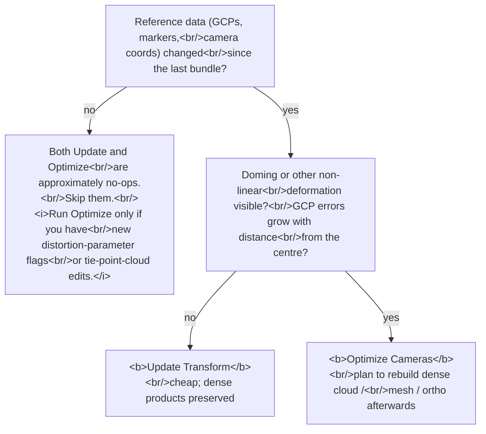

# When does `optimizeCameras` actually do something?

> **Confidence:** *high.* The Update-vs-Optimize mathematical
> distinction is documented in the official manual and forum
> threads; `optimizeCameras` and `updateTransform` are
> introspection-confirmed on Metashape 2.2.

The *Reference* pane has two visually-similar buttons that do
mathematically very different things: **Update Transform** runs a
linear similarity transform; **Optimize Cameras** runs the full
non-linear bundle adjustment. Picking the wrong one is a common
source of confusion — *Update* is a no-op when you wanted bundle
refinement; *Optimize* invalidates the point cloud and mesh when
you wanted just a coordinate-system update.

This article is the cross-reference for the two operations: what
each does, when each has a non-trivial effect, and which to pick
for a given situation.

## The mathematical difference

The user manual's *Optimization of camera alignment* section
describes this: georeferencing applies a **7-parameter similarity
transform** (3 translation, 3 rotation, 1 scale) to fit the model
to the reference data. That transform is linear, so it corrects
only a linear (global) misalignment — the usual main source of
georeferencing error — and cannot remove *non-linear* deformation.
Non-linear deformation is removed instead by **optimizing** the
tie-point cloud and camera parameters against the known reference
coordinates, which minimizes the combined reprojection-error and
reference-coordinate-misalignment error (discussed in the forum at
[topic=8054](https://www.agisoft.com/forum/index.php?topic=8054.0)).

In one paragraph:

| Operation | What it changes | What it preserves |
|-----------|----------------|-------------------|
| **Update** | Chunk transformation (rotation, translation, scale) | Tie point cloud points, tie-point projections, camera intrinsics, **all dense products** (point cloud, mesh, orthomosaic) |
| **Optimize Cameras** | Tie point cloud points, camera extrinsics (per-camera pose), camera intrinsics | Nothing downstream — **dense products are invalidated** |

The Update set is a strict subset of the Optimize set. *Optimize
Cameras* always does at least as much as *Update Transform*, and
generally more — but at the cost of invalidating downstream dense
products.

## When each has a non-trivial effect

A common surprise: hitting *Optimize Cameras* on a chunk where
nothing has changed since the last bundle produces almost no
visible difference. The operational answer, attested verbatim:

> "Just hitting optimize alone will have very little effect (some
> small effect due to stochastic nature of the algorithms,
> presumably?) unless:
>
> - You edit the sparse cloud
> - You add/move/remove any markers
> - You changed any GCP or camera coordinates
> - You change camera calibration groups/calibration model
> - You want to optimize additional lens distortion parameters
>
> Hitting the update button will do nothing unless:
>
> - You add/move/remove any markers
> - You changed any GCP or camera coordinates" — James,
> 2017-11-28, PhotoScan 1.3
> ([permalink](https://www.agisoft.com/forum/index.php?topic=8054.msg39160#msg39160))

Two practical implications:

- **Optimize Cameras "to make sure" is not productive.** If none
  of the trigger conditions has occurred, the bundle has nothing
  new to fit and the operation costs runtime without benefit.
- **The Update set is a subset of the Optimize set.** Update has
  effect only when reference data changed; Optimize has effect
  for that *plus* tie-point-cloud edits, calibration-group changes,
  and additional-distortion-parameter requests.

## The case for Update over Optimize

Two scenarios where Update is the right choice:

### 1. Trust the alignment; just want georeferencing.

The non-georeferenced alignment is already good — acceptable
reprojection RMS, no doming, tie point cloud free of obvious
mismatches. Introducing GCPs and hitting *Update Transform*
applies the coordinate-system rotation/translation/scale. Every
dense product remains valid in the new coordinate system.

```python
# Add GCP coordinates and apply.
chunk = Metashape.app.document.chunk
# … (GCPs imported via chunk.importReference, marker positions placed)
chunk.updateTransform()
# Point cloud, mesh, orthomosaic remain valid in the new CRS.
```

### 2. The dense product is already built.

*Optimize Cameras* refits the tie point cloud's tie points. The
point cloud, mesh, and orthomosaic are computed against
specific tie-point positions; refitting them invalidates the
downstream products. *Update Transform* preserves the
relative geometry, so dense products remain correct after
their CRS is updated.

> "The update tool is like an 'apply' button which affects the
> world coordinate system any time you modify your reference
> data, i.e. gcp or camera coordinates. It doesn't affect the
> positions of cameras relative to each other, so any dense
> cloud or mesh is preserved in the new coordinate system that
> you have defined/modified by the addition/edition of
> coordinate data." — James, 2017-11-28, PhotoScan 1.3
> ([permalink](https://www.agisoft.com/forum/index.php?topic=8054.msg38480#msg38480))

## The case for Optimize over Update

Two scenarios where Optimize is required:

### 1. Doming or other non-linear deformation.

Aerial nadir-only datasets exhibit *doming* — the model bulges or
sinks toward the centre because the bundle has too few
constraints to pin the absolute scale and shape. The doming is a
*non-linear* systematic error that no similarity transform can
correct.

The diagnostic: GCP errors grow monotonically with distance from
the dataset's centre, and re-running *Update Transform* does not
help (because the doming is non-linear by construction). The
remedy is *Optimize Cameras*, which uses the GCPs as bundle
constraints and refits the tie point cloud + cameras to flatten the
dome.

### 2. Refining intrinsics from GCPs.

When the lens-distortion model needs additional terms (k4, b2)
or the principal-point estimate is poor, only *Optimize Cameras*
exposes the relevant flags. *Update Transform* treats intrinsics
as fixed.

```python
chunk.optimizeCameras(
    fit_f=True, fit_cx=True, fit_cy=True,
    fit_k1=True, fit_k2=True, fit_k3=True, fit_k4=True,
    fit_p1=True, fit_p2=True,
    fit_b1=True, fit_b2=True,
    # adaptive_fitting=True   # only if many low-quality cameras
)
```

The Python kwargs match the GUI's checkboxes one-to-one. The
default set (`fit_f`, `fit_cx`, `fit_cy`, `fit_k1`-`fit_k3`,
`fit_p1`, `fit_p2`) is suitable for most consumer-camera
projects; `fit_k4` and `fit_b2` are typically needed only on
significantly distorted lenses (fisheye-like) or on rigs with
non-square pixels.

## Operational decision tree



## Caveats

- **Optimize invalidates the point cloud, mesh, and
  orthomosaic.** Plan dense reconstruction *after* the last
  Optimize, not before. The corollary: late-binding GCPs (added
  after the point cloud was built) force a rebuild.
- **Cameras with too few tie points may become unaligned.** If
  *Optimize* (or the prior Clean-Tie-Points step) reduces a
  camera's tie-point support below an internal threshold, the
  bundle drops it. Diagnose via `camera.transform is None`
  after Optimize.
- **`fit_corrections=True` unlocks an "additional corrections"
  extra parameter set** that is not exposed in the GUI's
  Optimize dialog (older versions; verify in current GUI). Use
  only when the bundle is obviously not converging on the
  standard parameter set; otherwise leave at the default.
- **`tiepoint_covariance=True` significantly increases cost.**
  It computes per-tie-point covariance matrices used for
  downstream uncertainty reporting. Enable only when the
  reporting pipeline needs them.
- **The `_b2` skew flag is unusual.** Consumer cameras almost
  never have skew, so leaving `fit_b2=False` is correct. Enable
  only on rigs known to have non-rectangular sensor arrays
  (uncommon).

## Runnable demonstration on the Aerial-with-GCPs sample dataset

The script below runs an *Optimize Cameras* on the
[Aerial-with-GCPs](../../reference/sample-data.md#aerial-images-with-gcps)
dataset, then re-runs it without intervening changes, and
compares tie-point counts and reprojection RMS — demonstrating
the "very little effect" observation in numbers.

> **Demo verified:** ✗ — pending Tier 3 reproduction on Metashape
> Pro 2.2 / 2.3 with the *Aerial-with-GCPs* sample dataset. The
> underlying APIs are introspection-verified but the demo as
> written has not been run end-to-end. Required before the
> manual ships.

```python
"""Confirm that Optimize Cameras with no intervening changes is
approximately a no-op (small numerical drift only)."""
import Metashape

chunk = Metashape.app.document.chunk

# Pre-condition: chunk is fully aligned with GCPs imported and
# placed; the tie point cloud has been edited (Clean Tie Points) at
# least once before this demo.

# Helper: capture tie-point count.
# Note: Reprojection RMS is not exposed as a single attribute on
# Track or Point; the full per-projection RMS computation is
# documented in ../../topics/repeatability-qa/
# reproducing-chunk-info-statistics-python.md . For the
# no-op-check below we just compare validated point counts.
def snapshot():
    pts = chunk.tie_points
    if not pts:
        return 0
    return sum(1 for p in pts.points if p.valid)

# First Optimize: should make a difference (assumes recent changes).
before = snapshot()
chunk.optimizeCameras()
after_first = snapshot()

# Second Optimize: nothing has changed; should be near-no-op.
chunk.optimizeCameras()
after_second = snapshot()

print(f"before     : valid points = {before:>7}")
print(f"after 1st  : valid points = {after_first:>7}  (delta {after_first - before:+})")
print(f"after 2nd  : valid points = {after_second:>7}  (delta {after_second - after_first:+})")
```

**Expected output:** the first Optimize produces a measurable
RMS change (positive or negative depending on what was edited
beforehand). The second Optimize produces near-zero delta. If the
second delta is large, something else changed in the chunk
between the two calls — or the bundle has not converged.

## References

- [Forum thread, *Georeferencing using GCPs: Optimize -vs- Update
  tool*, 2017](https://www.agisoft.com/forum/index.php?topic=8054.0)
  — primary source; the user-manual quote (msg 38901);
  the enumeration of when each tool has effect (msgs 39160,
  39163).
- *Metashape Professional Edition User Manual* (2.3),
  "Optimization of camera alignment" — the canonical paragraph
  on similarity transformation vs non-linear deformation removal.
- *Metashape Python Reference* (2.3.1),
  `Chunk.optimizeCameras` — full 11-flag distortion-parameter
  surface.
- *Metashape Python Reference* (2.3.1),
  `Chunk.updateTransform` — the Update button equivalent.
- Related: [The Clean Tie Points → Optimize Cameras loop](clean-tie-points-optimize-cameras-loop.md) — the Clean-Tie-Points workflow that creates a
  reason to *Optimize*.
- Operational sequel: [Tightening reference accuracies after
  `alignCameras`](tightening-reference-accuracies.md) — the multi-phase recipe for the case where the
  similarity-transform residual isn't enough.
