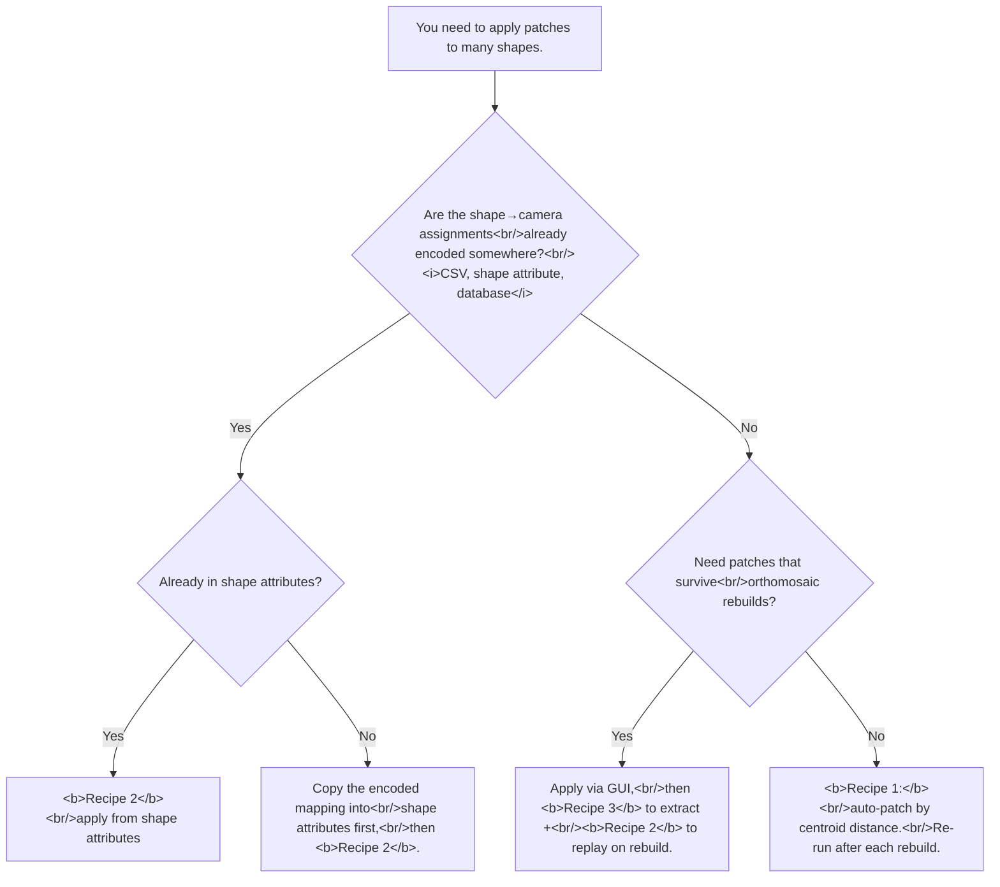

# Applying *Patch* on multiple shapes (orthomosaic patching by script)
> **Confidence:** *high.* Three working scripts in the source
> thread (Pasumansky, 2019, three msgs in topic=11105) cover the
> auto-rank, attribute-driven, and reverse-extract operations.
> The 2019-era scripts use the `shape.type ==
> Metashape.Shape.Type.Polygon` API; on Metashape 2.x the
> equivalent test is `isinstance(shape.geometry,
> Metashape.Geometry.Polygon)`. The `Orthomosaic.Patch`,
> `Orthomosaic.patches`, and `Orthomosaic.update` API surfaces
> are introspection-confirmed on Metashape 2.2.2.

## What *Patch* does (and the GUI gap)

*Patch* assigns a specific camera's image to a polygonal region
of the orthomosaic, overriding the default best-image selection.
Production use-cases:

- **Stitch correction.** Replace the default-blended region over
  a fast-moving subject (a bird, a car, a person) with a single
  consistent image to avoid the smear / ghosting that blending
  produces.
- **Source-image selection.** When two cameras with different
  exposures cover the same area, pick the one with the better
  exposure.
- **Survey-mark visibility.** Force the orthomosaic to use a
  specific image where a survey mark / ground-control feature
  is most clearly visible.

The GUI exposes this as *Right-click polygon shape → Assign
Image*, with a ranked candidate list whose top entries are
typically the cameras whose image-centre is closest to the
shape's centroid (with corrections for surface distance and
view-angle). The GUI handles **one shape at a time**.

For projects with hundreds of polygonal patches — typical of
production aerial surveys — the GUI is impractical. The Python
API exposes the patch operation directly:

```python
patch = Metashape.Orthomosaic.Patch()
patch.image_keys = [camera.key]
chunk.orthomosaic.patches[shape] = patch
chunk.orthomosaic.update()
```

The article documents three recipes covering common patching
workflows.

## Recipe 1 — Bulk auto-patch by centroid distance

Apply the closest-image-to-shape-centroid rule to every
polygonal shape in the chunk.

```python
"""Auto-patch each polygonal shape with the camera whose image
centre projects closest to the shape's centroid."""
import Metashape

doc = Metashape.app.document
chunk = doc.chunk
ortho = chunk.orthomosaic

if ortho is None:
    raise SystemExit("No orthomosaic — build one before patching.")

# Filter to polygonal shapes only (polygons enclose patch areas).
polygons = [
    s for s in chunk.shapes
    if isinstance(s.geometry, Metashape.Geometry.Polygon)
]

# Map each polygonal shape to the best aligned camera.
def shape_centroid_xy(shape):
    """Centroid of the polygon's exterior ring in chunk-local XY."""
    # `polygon.coordinates` is `list[list[Vector]]` — outer list
    # is rings (exterior + holes), inner list is the ring's points.
    # Use the exterior ring (index 0).
    rings = shape.geometry.coordinates
    if not rings:
        return None
    pts = rings[0]    # exterior ring: list[Vector]
    if not pts:
        return None
    cx = sum(p.x for p in pts) / len(pts)
    cy = sum(p.y for p in pts) / len(pts)
    return Metashape.Vector([cx, cy])

def project_image_centre(camera, target_z=0.0):
    """Project the image-centre ray onto z = target_z and return XY."""
    if camera.transform is None:
        return None
    # Camera centre in chunk-local frame.
    centre_local = camera.center
    # Image-centre direction in chunk-local frame.
    sensor = camera.sensor
    cx_pix = sensor.width / 2.0
    cy_pix = sensor.height / 2.0
    direction_cam = sensor.calibration.unproject(
        Metashape.Vector([cx_pix, cy_pix])
    )
    direction_world = camera.transform.mulv(direction_cam)
    # Solve for t such that centre_local.z + t * direction_world.z = target_z.
    if abs(direction_world.z) < 1e-9:
        return None
    t = (target_z - centre_local.z) / direction_world.z
    if t <= 0:
        return None    # camera is below the surface
    hit = centre_local + t * direction_world
    return Metashape.Vector([hit.x, hit.y])

aligned_cameras = [c for c in chunk.cameras if c.transform is not None]

for shape in polygons:
    sc = shape_centroid_xy(shape)
    if sc is None:
        continue

    # Find the camera whose image-centre projection is closest to
    # the shape centroid (XY only).
    best_camera = None
    best_dist = float("inf")
    for cam in aligned_cameras:
        ic = project_image_centre(cam)
        if ic is None:
            continue
        dist = (ic - sc).norm()
        if dist < best_dist:
            best_dist = dist
            best_camera = cam

    if best_camera is None:
        print(f"no candidate for shape {shape.label!r}, skipping")
        continue

    patch = Metashape.Orthomosaic.Patch()
    patch.image_keys = [best_camera.key]
    ortho.patches[shape] = patch
    print(f"shape {shape.label!r:>20} → {best_camera.label}  (d={best_dist:.2f})")

ortho.update()
print("orthomosaic patched and updated.")
```

The metric here is the simplified centroid-distance rule. The
GUI's ranking is more sophisticated:

> "GUI ranking of the cameras in the Assign Image dialog is
> also considering additional factors such as the distance of
> the selected area projected to the image plane from the image
> center, distance from camera to the 3D surface being textured,
> relative orientation of the camera normal and surface
> normals." — Alexey Pasumansky, 2019-07-10, Metashape 1.5
> ([permalink](https://www.agisoft.com/forum/index.php?topic=11105.msg50053#msg50053))

For most use-cases, the centroid-distance metric produces
results within a few candidates of the GUI's top pick. When the
script's pick differs from the GUI's, the difference is
typically in marginal cases where multiple cameras are roughly
equally suited.

## Recipe 2 — Patch by shape attribute (reusable across orthomosaics)

When patches need to **survive an orthomosaic rebuild** —
typical when the same polygonal regions need re-application
after re-georeferencing or re-meshing — encode the
camera-to-shape mapping in the shape's attributes:

```python
"""Auto-patch from shape.attributes['Patch'] (camera label).

Pre-condition: each polygon's `Patch` attribute is set to the
desired camera's label. The shape is in a group named
'Patches' (case-insensitive)."""
import Metashape

doc = Metashape.app.document
chunk = doc.chunk

if chunk is None or chunk.orthomosaic is None or not chunk.shapes:
    raise SystemExit("Need active chunk with orthomosaic and shapes.")

ortho = chunk.orthomosaic

# Filter: polygonal shapes in the 'Patches' group.
patches_list = [
    s for s in chunk.shapes
    if isinstance(s.geometry, Metashape.Geometry.Polygon)
    and s.group is not None
    and s.group.label.upper() == "PATCHES"
]

# Build label → Camera lookup (only aligned cameras).
camera_by_label = {
    c.label: c for c in chunk.cameras if c.transform is not None
}

assigned = 0
for shape in patches_list:
    # `shape.attributes` is a `Metashape.MetaData` object, which
    # supports `__getitem__`, `__setitem__`, `__contains__`,
    # `keys()`, `values()`, `items()` — but NOT `.get()`. Use
    # the `in` form instead.
    if "Patch" not in shape.attributes:
        continue    # no Patch attribute on this shape
    label_attr = shape.attributes["Patch"]
    if not label_attr:
        continue
    cam = camera_by_label.get(label_attr)
    if cam is None:
        # Try case-insensitive.
        cam = next(
            (c for c in chunk.cameras
             if c.transform is not None
             and c.label.upper() == label_attr.upper()),
            None,
        )
    if cam is None:
        print(f"no camera matching {label_attr!r} for shape {shape.label!r}, skipping")
        continue

    patch = Metashape.Orthomosaic.Patch()
    patch.image_keys = [cam.key]
    ortho.patches[shape] = patch
    assigned += 1

ortho.update()
print(f"applied {assigned} patches; orthomosaic updated.")
```

The `Patches` group convention is a script convention, not an
API rule — it lets you keep
patch-defining polygons separate from other shape work in the
same chunk. Drop the `s.group.label.upper() == "PATCHES"` filter
if your project keeps all polygons in the default group.

## Recipe 3 — Extract existing patches into shape attributes

The reverse direction. When you've manually applied patches via
the GUI and now want to **make them script-reusable**, populate
each polygon's `Patch` attribute with the assigned camera's
label.

```python
"""Reverse direction: encode existing patches into shape attributes
so they can be replayed on a re-built orthomosaic."""
import Metashape

doc = Metashape.app.document
chunk = doc.chunk
ortho = chunk.orthomosaic

if ortho is None or not ortho.patches:
    raise SystemExit("No patches to extract.")

# Build key → Camera lookup once.
camera_by_key = {c.key: c for c in chunk.cameras}

# Optional: collect all extracted shapes into a 'Patches' group
# so Recipe 2 can re-apply them.
patches_group = None
for g in chunk.shapes.groups:
    if g.label.upper() == "PATCHES":
        patches_group = g
        break
if patches_group is None:
    patches_group = chunk.shapes.addGroup()
    patches_group.label = "Patches"

extracted = 0
for shape, patch in ortho.patches.items():
    if not patch.image_keys:
        continue
    cam = camera_by_key.get(patch.image_keys[0])
    if cam is None:
        continue
    shape.attributes["Patch"] = cam.label
    if shape.label == "" or shape.label is None:
        shape.label = cam.label    # also use camera label as shape label
    shape.group = patches_group
    extracted += 1

print(f"extracted {extracted} patch assignments into shape attributes.")
```

After running this, save the project. The shapes — with their
`Patch` attribute populated — survive an orthomosaic rebuild
and can be re-applied via Recipe 2.

## The portability pattern

The intended workflow combining recipes 2 and 3:

1. Manually apply patches via the GUI on the initial
   orthomosaic.
2. Run Recipe 3 to extract patches into `Patch` attributes.
3. Save the project.
4. Re-build the orthomosaic (different resolution, different
   blending mode, after additional GCPs added, etc.).
5. Run Recipe 2 to re-apply the same shape→camera assignments
   on the new orthomosaic.

This pattern is the documented answer to "how do I keep my
patches when I re-build the orthomosaic" — there is no GUI
equivalent for the persist-and-replay workflow.

## Caveats

- **`Orthomosaic.Patch.image_keys` is a list.** A single camera
  per patch is the typical case; multi-camera blending within a
  single patch (multi-band imagery, exposure stacking) is
  possible by passing multiple keys. Verify with a small-scale
  test before relying on it in production.
- **`orthomosaic.update()` is required to render the patches.**
  The patch dictionary stores the assignments; `update()`
  re-renders the visible orthomosaic. Without the call, the
  patches are stored but not visible.
- **Recipe 1's metric does not match the GUI's exactly.** For
  marginal cases — multiple cameras with similar centroid
  distance — the script's pick may differ from the GUI's
  suggestion. The full GUI metric (centroid-distance,
  surface-distance, normal-alignment) is not exposed in the
  Python API.
- **Aligned cameras only.** Cameras with `camera.transform is
  None` cannot be used as patch sources. The recipes above
  filter accordingly.
- **The geometry-type API shifted in 2.x.** PhotoScan 1.x scripts
  use `shape.type == Metashape.Shape.Type.Polygon`; on Metashape
  2.x the equivalent is `isinstance(shape.geometry,
  Metashape.Geometry.Polygon)`. Translate any 1.x snippets
  copy-pasted from the forum.
- **Shape-attribute case sensitivity.** The recipes use
  `shape.attributes["Patch"]` — case-sensitive key. The GUI's
  attribute editor preserves the case you enter. If you use a
  different attribute name, update both directions of the
  pattern (Recipe 2 reader, Recipe 3 writer).

## Decision picker



## Runnable demonstration on the Aerial-with-GCPs sample dataset

The script below assigns a patch from the central camera to a
synthetic polygon over the dataset's centre, exercises Recipe 1
on a one-shape chunk, and verifies the patch was stored.

> **Demo verified:** ✗ — pending Tier 3 reproduction on
> Metashape Pro 2.2 / 2.3 with the *Aerial-with-GCPs* sample
> dataset. The API surface is introspection-verified;
> end-to-end execution requires a built orthomosaic and is
> blocked at Tier 3.

```python
"""Apply Recipe 1 to a synthetic polygon over the orthomosaic
centre. Verifies that:
  - Orthomosaic.Patch construction works
  - chunk.orthomosaic.patches[shape] = patch persists the assignment
  - chunk.orthomosaic.update() re-renders without errors
"""
import Metashape

doc = Metashape.app.document
chunk = doc.chunk

if chunk.orthomosaic is None:
    raise SystemExit("Build an orthomosaic before running this demo.")

ortho = chunk.orthomosaic

# Synthetic polygon: small square at the orthomosaic centre.
cx = (ortho.left + ortho.right) / 2
cy = (ortho.bottom + ortho.top) / 2
half = min(ortho.right - ortho.left, ortho.top - ortho.bottom) * 0.05

poly_pts = [
    Metashape.Vector([cx - half, cy - half, 0.0]),
    Metashape.Vector([cx + half, cy - half, 0.0]),
    Metashape.Vector([cx + half, cy + half, 0.0]),
    Metashape.Vector([cx - half, cy + half, 0.0]),
    Metashape.Vector([cx - half, cy - half, 0.0]),    # closing point
]

shape = chunk.shapes.addShape()
shape.geometry = Metashape.Geometry.Polygon(poly_pts)
shape.label = "demo_patch"

# Pick the camera nearest to the chunk centroid (Recipe 1
# simplified — single shape).
best_cam = None
best_dist = float("inf")
target = Metashape.Vector([cx, cy])
for cam in chunk.cameras:
    if cam.transform is None:
        continue
    img_xy = Metashape.Vector([cam.center.x, cam.center.y])
    d = (img_xy - target).norm()
    if d < best_dist:
        best_dist = d
        best_cam = cam

if best_cam is None:
    raise SystemExit("No aligned camera found.")

print(f"assigning patch from camera {best_cam.label}  (d={best_dist:.2f})")

patch = Metashape.Orthomosaic.Patch()
patch.image_keys = [best_cam.key]
ortho.patches[shape] = patch

print(f"patches dict size: {len(ortho.patches)}")
print(f"image_keys for demo_patch: {ortho.patches[shape].image_keys}")

ortho.update()
print("orthomosaic updated.")
```

**Expected output:** the synthetic polygon is added to the
chunk; `len(ortho.patches)` increments by 1; `image_keys`
contains the chosen camera's key; `update()` completes without
error. Save the project and re-open in the GUI to verify the
patch is visible.

## References

- [Forum thread, *Apply patch on multiple shapes*, 2019–2020](https://www.agisoft.com/forum/index.php?topic=11105.0)
  — primary source. The three the scripts: msg 49019
  (auto-rank by centroid), msg 49340 (patch from shape
  attribute), msg 49502 (extract patches into attributes).
  GUI ranking explanation: msg 49039.
- [Forum thread, *exportShapes — using shape attributes for export*, 2019](https://www.agisoft.com/forum/index.php?topic=10266.msg48076#msg48076)
  — the cited precedent for the shape-attribute pattern that
  the patching script reuses.
- *Metashape Python Reference* (2.3.1):
  `Chunk.orthomosaic`, `Orthomosaic.patches`,
  `Orthomosaic.Patch`, `Orthomosaic.update`, `Chunk.shapes`,
  `Shape.geometry`, `Shape.attributes`, `Geometry.Polygon`.
- *Metashape Pro User Manual* (2.3), ch. 5 *Orthomosaic*,
  § *Orthomosaic seamlines and patching* — official description
  of the *Patch* shape feature in the *Ortho* view.
- [*Orthomosaic seamline editing (patching)* (Agisoft KB)](https://agisoft.freshdesk.com/support/solutions/articles/31000148853)
  — the GUI Assign Images / Draw Patch workflow this script
  automates, plus the Fill tool for excluding objects or filling
  holes.
