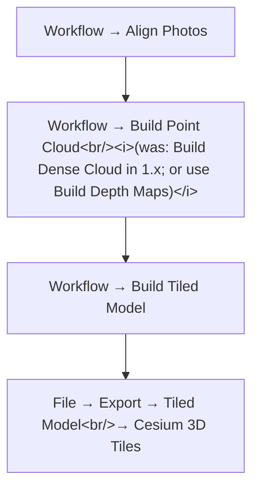
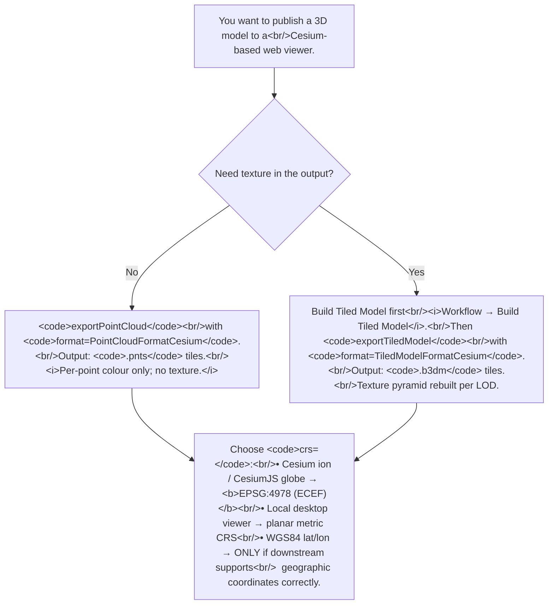

# Exporting to Cesium 3D Tiles: point cloud vs tiled model

> **Terminology note.** Metashape 2.x renamed the *Dense Cloud*
> entity to *Point Cloud* (the GUI command is now *Build Point
> Cloud* / *Export Point Cloud*). This article uses the current
> 2.x term *point cloud* in body prose; verbatim forum quotes
> from the 1.x era retain the original *Dense Cloud* wording.
> Both refer to the same per-image-pair triangulated cloud built
> from depth maps.
> **Confidence:** *medium.* The two-export-types distinction
> is documented in the source thread and Tier 1 introspection
> confirms `TiledModelFormatCesium` and `PointCloudFormatCesium`
> enum values on Metashape 2.2.2. The byte-alignment bug
> history is forum-attested as fixed in 1.4.1 but unverified
> against current 2.x releases. The CRS pitfall's failure mode
> is downstream-viewer-dependent.

## What Cesium 3D Tiles is and why it matters

[Cesium 3D Tiles](https://github.com/CesiumGS/3d-tiles) is the
de-facto standard for streaming large 3D datasets to web
viewers. A tileset consists of:

- A `tileset.json` manifest with the spatial hierarchy and
  level-of-detail (LOD) thresholds.
- A directory of per-tile content files, either:
  - `.pnts` — point-cloud tiles (no texture).
  - `.b3dm` — batched 3D model tiles (textured triangle mesh).

Cesium ion, CesiumJS, and several ESRI / Bentley / open-source
viewers consume this format. For aerial-survey and
photogrammetry-output sharing, exporting to 3D Tiles is the
fastest path from a Metashape project to a browser-streamable
3D experience.

## Two distinct exports map to two Cesium content types

The recurring source of confusion: there are **two different
Metashape exports** that both produce Cesium 3D Tiles output,
but they produce different *kinds* of tiles:

> "Metashape supports Dense Cloud and Tiled Model export to
> Cesium 3D Tiles format.
>
> Export -> Dense Cloud / Tiled Model -> Cesium 3D Tiles." —
> Alexey Pasumansky, 2019-02-22, PhotoScan 1.5
> ([permalink](https://www.agisoft.com/forum/index.php?topic=8227.msg47614#msg47614))

> "Exporting Cesium tiles from the dense cloud will contain the
> dense cloud only, from the tiled model — textured mesh
> blocks." — Alexey Pasumansky, 2019-02-25, PhotoScan 1.5
> ([permalink](https://www.agisoft.com/forum/index.php?topic=8227.msg47624#msg47624))

| Source | Action | Output format | Texture? |
|--------|--------|---------------|----------|
| Dense cloud (point cloud) | *File → Export → Point Cloud → Cesium 3D Tiles* | `.pnts` tiles | No (per-point colour only) |
| Tiled model (built after Build Tiled Model) | *File → Export → Tiled Model → Cesium 3D Tiles* | `.b3dm` tiles | Yes (texture pyramid built per LOD level) |

If your downstream Cesium viewer expects textured meshes, the
**point-cloud-to-Cesium path will not satisfy it** — even if
the point cloud has per-point RGB colour. The point-cloud
tileset is intended for point-cloud-aware Cesium content (a
genuine point cloud rendered as colored points, not a textured
mesh).

## Workflow gate: textured Cesium tilesets need Build Tiled Model first

For a textured Cesium tileset, the ordered prerequisites are:



The *Build Tiled Model* step accepts any of three sources:
depth maps, point cloud, or solid mesh. Per the canonical
thread:

> "If you need to have a textured model, then you should
> generate tiled model using Build Tiled Model option in the
> Workflow menu and then export using Export Tiled Model
> option from the File menu.
>
> Tiled model generation can be completed basing on depth
> maps, dense cloud or solid mesh, however, the texture will
> be rebuilt in any case for the LOD pyramid, according to
> the input resolution value." — Alexey Pasumansky, 2019-02-25,
> PhotoScan 1.5
> ([permalink](https://www.agisoft.com/forum/index.php?topic=8227.msg47629#msg47629))

The texture pyramid is rebuilt regardless of the source — the
tiled model has its own LOD-specific texture atlases, not the
single texture from the regular *Build Texture* step.

## Python API

### Textured tileset (.b3dm)

> **Version note:** the kwargs below (`model_compression`,
> `screen_space_error`, `tileset_version`) are
> introspection-confirmed on Metashape 2.2.2 but their exact
> set is version-specific. Older Metashape builds may not
> accept all of them. Verify with
> `inspect.getdoc(Metashape.Chunk.exportTiledModel)` against
> your installed version before relying on the full kwarg set.

```python
import Metashape

doc = Metashape.app.document
chunk = doc.chunk

# Pre-condition: Build Tiled Model has run.
if chunk.tiled_model is None:
    raise SystemExit("Build Tiled Model first.")

chunk.exportTiledModel(
    path="output_dir/cesium_tileset/tileset.json",
    format=Metashape.TiledModelFormat.TiledModelFormatCesium,
    texture_format=Metashape.ImageFormat.ImageFormatJPEG,
    crs=Metashape.CoordinateSystem("EPSG::4978"),  # ECEF, Cesium-compatible
    clip_to_boundary=True,
    model_compression=True,    # mesh compression for Cesium
    screen_space_error=16,     # default LOD threshold
    tileset_version="1.0",     # 3D Tiles 1.0 spec
)
```

The `model_format=` kwarg of `exportTiledModel` selects the
per-tile-content model format for the *zip* tileset format
(`TiledModelFormatZIP`). For `TiledModelFormatCesium` the
per-tile content is `.b3dm` (binary glTF + JSON header) and the
`model_format` kwarg is ignored.

### Point-cloud tileset (.pnts)

```python
chunk.exportPointCloud(
    path="output_dir/cesium_pointcloud/tileset.json",
    format=Metashape.PointCloudFormat.PointCloudFormatCesium,
    crs=Metashape.CoordinateSystem("EPSG::4978"),  # ECEF
    save_point_color=True,     # per-point RGB
    save_point_normal=False,   # not required for Cesium .pnts
    save_point_intensity=False,
)
```

`exportPointCloud` is the modern API name; the PhotoScan 1.x
`exportPoints` method is renamed. Old forum scripts using
`exportPoints` need translation when ported to Metashape 2.x.

## Coordinate-system pitfall

Cesium's globe rendering uses **Earth-Centered Earth-Fixed
(ECEF)** Cartesian coordinates internally — EPSG:4978. The
`crs=` argument to either export method should target this CRS
for direct Cesium-globe consumption.

The pitfall, attested verbatim:

> "If you are opening the model exported in WGS84 coordinate
> system (XY in degrees and Z in meters) in the application
> that doesn't support geographic coordinates, it will treat
> all XYZ values as the same scale units." — Alexey Pasumansky,
> 2019-02-27, PhotoScan 1.5
> ([permalink](https://www.agisoft.com/forum/index.php?topic=8227.msg47674#msg47674))

The failure mode: WGS84 geographic (EPSG:4326) puts longitude /
latitude in *degrees* and altitude in *metres* — a tile at
`(13.4°, 52.5°, 100 m)` will be interpreted as a 13.4-unit-wide
object 52.5 units north and 100 units up by a viewer that
doesn't translate the units. The model effectively disappears
in Cesium ion or appears at a wrong scale in 3ds Max / similar
tools.

The right CRS choices:

| Downstream viewer | `crs=` |
|-------------------|--------|
| Cesium ion (web) | `Metashape.CoordinateSystem("EPSG::4978")` (ECEF) |
| CesiumJS local viewer (with geographic transform) | `Metashape.CoordinateSystem("EPSG::4326")` works only if the viewer's tile-loader applies the geographic-to-ECEF transform |
| 3ds Max / Blender / desktop viewer (no geographic CRS support) | Project-local (planar) CRS in metres, NOT WGS84 |

For project-internal use, the chunk's existing CRS may already
be a planar metric system (UTM zones, state-plane). In that
case, omit the `crs=` argument or pass the chunk's CRS
directly: `crs=chunk.crs`.

## The 1.4.0 byte-alignment bug

Historical context — for users still on legacy installs:

> "Now that [the Cesium-side error reporting was improved] it's
> a lot easier to see tileset errors. The one that's popping up
> repeatedly is:
>
> Error: start offset of Float32Array should be a multiple of 4
>
> Looking at the file more closely I see that one of the
> feature table properties is not byte aligned correctly:
> 'NORMAL':{'byteOffset':22695}
>
> While it's just an implementation note right now, the spec
> states that properties should be byte aligned to their data
> type, so the byteOffset needs to be a multiple of 4." —
> jetdog6, 2018-01-10, PhotoScan 1.4.0
> ([permalink](https://www.agisoft.com/forum/index.php?topic=8227.msg39390#msg39390))

The issue was confirmed and fixed in 1.4.1:

> "This issue should be solved in the latest 1.4.1 release, so
> please make sure that you are exporting Cesium tiles from
> the latest version. If the problem persists in the version
> 1.4.1, please send the problematic export result to
> support@agisoft.com for the further investigation." —
> Alexey Pasumansky, 2018-03-02, PhotoScan 1.4.1
> ([permalink](https://www.agisoft.com/forum/index.php?topic=8227.msg40615#msg40615))

If you are stuck on a legacy install and seeing the
byte-alignment error in Cesium, upgrade to 1.4.1 or later
(any current 2.x release is well past this).

## Diagnosing "tileset not visible" in Cesium

Symptoms include the tileset loading without errors but no
geometry rendering, or the Cesium viewer showing a tiny dot
instead of the full model. Diagnostic order:

1. **CRS mismatch** (most common). Verify your `crs=` matches
   what the downstream viewer expects (table above). For a
   Cesium-ion globe view, EPSG:4978 (ECEF) is the safe choice.

2. **`tileset.json` is at an unexpected path.** The export
   creates a directory with `tileset.json` at its root and
   per-tile content files alongside (`Data/c0.b3dm`, etc.). If
   you point the Cesium viewer at the wrong path, it loads
   nothing or shows a tiny dot at the origin.

3. **Block size too small.** A point-cloud Cesium export with
   `block_width` / `block_height` set to a tiny value (e.g. 5
   cm) for a 500 m × 500 m survey produces tens of thousands of
   tiny tiles, each loading to ~empty. Use the default block
   size, or a value sized for the survey extent.

4. **Tile-content version mismatch.** A tileset exported with
   an old `tileset_version` may not load in newer Cesium
   viewers. Set `tileset_version="1.0"` (the 3D Tiles 1.0 spec)
   for current viewers; older Metashape versions defaulted to
   `"0.0"` which is non-standard.

## Caveats

- **Pro-only.** Both `exportTiledModel` and `exportPointCloud`
  with the Cesium format are Pro-only. The Standard edition
  GUI doesn't expose these export options.
- **Texture pyramid is rebuilt per LOD.** The textures embedded
  in the tiled model differ from the regular `Build Texture`
  output. If you've manually edited the regular texture (with
  *Patch* or via image editing), those edits do not propagate
  to the Cesium tiled-model export. The patch workflow
  (see [Applying Patch on multiple shapes](applying-patch-multiple-shapes.md))
  applies to the orthomosaic export, not the tiled-model export.
- **`Tiles3D` format vs `TiledModelFormatCesium`.** The
  Metashape API enum is `Metashape.TiledModelFormat.TiledModelFormatCesium`
  (introspection-confirmed on 2.2.2). Older 1.x scripts may
  reference `TiledModelFormatTiles3D` or similar; verify the
  enum value against your installed version before relying on
  copy-pasted forum scripts.
- **Cesium ion's datum-transformation requirements** can cause
  upload failures even when the local tileset works
  (forum topic 14251). When uploading to Cesium ion specifically,
  match the datum to the project area's expected datum
  (typically WGS84 / EPSG:4326 source coordinates with EPSG:4978
  output transform).
- **Cesium-ion v1 vs v3 tileset format**. A tileset exported
  for an older Cesium-ion version may fail to load in newer
  versions (forum topic 17024). Set `tileset_version="1.0"` for
  current Cesium ion + CesiumJS; verify the exact required
  version against the target viewer's documentation.

## Decision picker



## Runnable demonstration on the Aerial-with-GCPs sample dataset

The script below exports both a point-cloud tileset and a
textured-mesh tileset (after Build Tiled Model). It assumes
the chunk has Build Tiled Model already run.

> **Demo verified:** ✗ — pending Tier 3 reproduction on
> Metashape Pro 2.2 / 2.3 with the *Aerial-with-GCPs* sample
> dataset. The export-API surfaces are introspection-verified;
> the actual tileset rendering in a Cesium viewer requires
> serving the output and is gated at Tier 3.

```python
"""Export both Cesium tile types from the active chunk."""
from pathlib import Path
import Metashape

doc = Metashape.app.document
chunk = doc.chunk

out_dir = Path("/tmp/cesium-export")
out_dir.mkdir(exist_ok=True)

ECEF = Metashape.CoordinateSystem("EPSG::4978")

# 1. Point-cloud tileset (.pnts).
if chunk.point_cloud is not None:
    pc_dir = out_dir / "pointcloud"
    pc_dir.mkdir(exist_ok=True)
    chunk.exportPointCloud(
        path=str(pc_dir / "tileset.json"),
        format=Metashape.PointCloudFormat.PointCloudFormatCesium,
        crs=ECEF,
        save_point_color=True,
        save_point_normal=False,
    )
    print(f"point-cloud tileset: {pc_dir}")
else:
    print("(no point cloud — skipping point-cloud tileset)")

# 2. Textured-mesh tileset (.b3dm).
if chunk.tiled_model is not None:
    tm_dir = out_dir / "tiledmodel"
    tm_dir.mkdir(exist_ok=True)
    chunk.exportTiledModel(
        path=str(tm_dir / "tileset.json"),
        format=Metashape.TiledModelFormat.TiledModelFormatCesium,
        texture_format=Metashape.ImageFormat.ImageFormatJPEG,
        crs=ECEF,
        clip_to_boundary=True,
        model_compression=True,
        screen_space_error=16,
        tileset_version="1.0",
    )
    print(f"textured-mesh tileset: {tm_dir}")
else:
    print("(no tiled model — Build Tiled Model first)")

# Inventory.
for tileset_path in out_dir.rglob("tileset.json"):
    n_tiles = sum(1 for _ in tileset_path.parent.rglob("*.b3dm")) + \
              sum(1 for _ in tileset_path.parent.rglob("*.pnts"))
    print(f"  {tileset_path.relative_to(out_dir)}: {n_tiles} tile(s)")
```

**Expected output:** two directories created under
`/tmp/cesium-export/` — one with `.pnts` tiles, one with
`.b3dm` tiles. Each has its own `tileset.json` manifest. To
verify visually, serve the directory with any static-file
server and load `tileset.json` in a CesiumJS viewer.

## References

- [Forum thread, *Cesium tiles*, 2018–2019](https://www.agisoft.com/forum/index.php?topic=8227.0)
  — primary source. The two-export-types distinction
  (msg 39060). The textured-vs-untextured
  distinction (msg 39067). The Build Tiled Model workflow
  (msg 39072). The CRS pitfall (msg 39238). The byte-alignment
  bug history (msgs 36767, msgs 37261).
- [Forum thread, *Export tiled model to Cesium ion*, 2021](https://www.agisoft.com/forum/index.php?topic=12730.0)
  — companion thread on the Cesium-ion upload pipeline.
- [Forum thread, *Unsupported datum transformation - CESIUM ION*, 2022](https://www.agisoft.com/forum/index.php?topic=14251.0)
  — datum-transformation pitfalls for Cesium ion uploads.
- [Forum thread, *Issue with exporting Cesium Tiled Models — Version Mismatch*, 2025](https://www.agisoft.com/forum/index.php?topic=17024.0)
  — tileset-version compatibility issues.
- [Forum thread, *exportModelTiles() documentation request*, 2016](https://www.agisoft.com/forum/index.php?topic=3849.0)
  — legacy thread; the API has been substantially renamed since.
- [Cesium 3D Tiles specification (1.0)](https://github.com/CesiumGS/3d-tiles)
  — the format spec. Tile content types (`.b3dm`, `.pnts`,
  `.i3dm`, `.cmpt`), the `tileset.json` schema, the LOD
  hierarchy.
- *Metashape Python Reference* (2.3.1):
  `Chunk.exportTiledModel`, `Chunk.exportPointCloud`,
  `TiledModelFormat`, `PointCloudFormat`,
  `Chunk.buildTiledModel`.
- [Applying Patch on multiple shapes](applying-patch-multiple-shapes.md)
  — companion article on the orthomosaic patch operation
  (note: patches do NOT propagate into the Cesium tiled-model
  texture pyramid).
