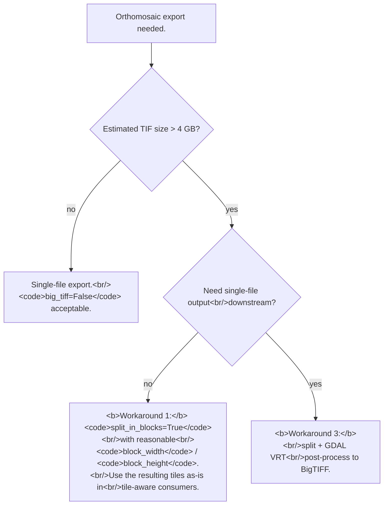

# Orthomosaic export — the 4GB / BigTIFF limit and shift-during-export
> **Confidence:** *medium.* The 4GB / BigTIFF / split-in-blocks
> workflow is well-documented in the source thread and the
> Agisoft user manual. The shift-during-export issue (reported
> by multiple users 2019–2025) does not have a clean
> resolution; the article frames the
> diagnostic checklist as community wisdom rather than
> authoritative.

Two related orthomosaic-export pitfalls that recur in
production aerial surveys:

- **Hitting the 4 GB TIF file-size limit** on large orthomosaics.
- **Random shifts** between the in-Metashape orthomosaic preview
  and the exported TIF.

The first has clear documented workarounds. The second is a
known-but-undocumented issue; this article gives a checklist
for triage rather than a fix.

## The 4 GB TIF limit

Standard TIF uses 32-bit byte offsets in the file format, capping
the total file size at 4 GB. Production aerial orthomosaics
routinely exceed this:

- A 50 ha survey at 5 cm GSD = 10 000 × 10 000 pixels at 8-bit
  RGB = 300 MB uncompressed (well below).
- A 500 ha survey at 5 cm GSD = 100 000 × 100 000 pixels at 8-bit
  RGB = 30 GB uncompressed.

The canonical statement:

> "TIF files exported by PhotoScan really have 4 GB limit, so
> for large areas it is recommended to use split in blocks
> option." — Alexey Pasumansky, 2015-01-28, PhotoScan 1.1
> ([permalink](https://www.agisoft.com/forum/index.php?topic=3351.msg17511#msg17511))

Three workarounds, in order of complexity:

### Workaround 1 — Split in blocks

The simplest fix: instruct Metashape to split the export into
multiple TIF files, each below 4 GB.

#### GUI

*File → Export → Orthomosaic* → check *Split in blocks* → set
*Width* and *Height* in pixels.

#### Python

```python
chunk.exportRaster(
    path="output_dir/ortho.tif",
    image_format=Metashape.ImageFormatTIFF,
    split_in_blocks=True,
    block_width=10000,
    block_height=10000,
    # other defaults are appropriate
)
```

The output is a set of files named `ortho_X_Y.tif` where X / Y
are block indices. Each file stays under 4 GB at typical
compression levels.

### Workaround 2 — BigTIFF

BigTIFF uses 64-bit byte offsets and supports up to ~18
exabytes per file. PhotoScan 1.2 added BigTIFF support;
subsequent versions have the option exposed:

#### GUI

*File → Export → Orthomosaic* → check *BigTIFF*.

#### Python

```python
chunk.exportRaster(
    path="output_dir/ortho.tif",
    image_format=Metashape.ImageFormatTIFF,
    big_tiff=True,
)
```

**Caveat:** PhotoScan 1.31 had a reported case of BigTIFF
corruption above 2 GB. The current 2.x state is the empirical
question; verify on your specific version with a test export
before relying on BigTIFF for production.

### Workaround 3 — Split + GDAL VRT post-processing

Most flexible. Export with `split_in_blocks=True`, then build a
GDAL Virtual Raster Table (VRT) and translate to a single
file with custom compression / tiling / projection.

```bash
# Build VRT from the split blocks.
gdalbuildvrt -srcnodata 0 -vrtnodata 0 mosaic.vrt blocks_*.tif

# Translate to a single BigTIFF with JPEG compression.
gdal_translate -of GTiff \
    -co COMPRESS=JPEG -co JPEG_QUALITY=90 \
    -co TILED=YES -co BLOCKXSIZE=256 -co BLOCKYSIZE=256 \
    -co PHOTOMETRIC=YCBCR \
    -co BIGTIFF=YES \
    -co TFW=YES \
    mosaic.vrt mosaic-final.tif

# Or to PNG for gigapan / web tile generators.
gdal_translate -of PNG -co ZLEVEL=9 mosaic.vrt mosaic.png
```

The recipe is community-validated and has remained the most
production-grade orthomosaic-export workflow
when the survey area exceeds Metashape's per-block comfort.

> "I get good results by using split in blocks option, then
> building a VRT with GDAL and using the VRT to generate a
> continuous geotiff (and GDAL supports BIGTIFF for TIFFs over
> 4GB if you want to go that way)." — andyroo, 2015-01-28
> ([permalink](https://www.agisoft.com/forum/index.php?topic=3351.msg17530#msg17530))

## Shift during export — diagnostic checklist

Multiple users (forum reports from 2019 to 2025) report
orthomosaic exports shifting position by
0.5–11 m relative to the in-Metashape *Ortho view* preview.
The forum thread (topic=10816) ends without a clean resolution;
Agisoft requested project files for diagnosis but no public
fix was documented.

If you observe this symptom, the community-suggested checklist:

### 1. Verify export CRS matches the build CRS

The most common cause of apparent "shifts":
*File → Export → Orthomosaic* defaults to the chunk's CRS,
but the user can override the export CRS in the dialog.
Different CRS = different projection = positions shift in the
exported file even though the underlying georeference is
correct.

```python
print(f"Chunk CRS  : {chunk.crs}")
# Make sure the export uses the same CRS:
chunk.exportRaster(path=…, projection=chunk.crs, …)
```

Checking the export CRS first eliminates the most frequent
false alarm.

### 2. Verify GCP residuals are reasonable before export

A bundle that hasn't fully absorbed the GCP references through
`optimizeCameras` can produce an in-preview orthomosaic that
looks correct (built from the bundle's tie points) but exports
at a different position (built using a different ortho-build
state). Run *Optimize Cameras* and rebuild the orthomosaic
before export:

```python
chunk.optimizeCameras(...)
chunk.buildOrthomosaic(...)
chunk.exportRaster(path=…)
```

### 3. Compare GCP overlay positions before and after export

The GCP markers should appear at the same world-frame positions
on (a) the *Ortho view* preview and (b) the exported TIF
overlaid in an external GIS. If they differ, the shift is
verifiable; if they match, the shift was a false alarm
(probably a CRS mismatch in the comparison tool).

### 4. Use sufficient GCPs with high accuracy

Scanned imagery with 62 GCPs at ±2 m XY accuracy has been
reported as still showing shifts. The issue may be amplified
by GCP-error propagation through the bundle. More GCPs of
higher accuracy
help; if the shift persists, the underlying issue is not
GCP-quantity-related.

### 5. Escalate to support@agisoft.com

The final reply in topic=10816 was a request for the project
file. If the checklist doesn't resolve the issue,
escalation with the project file is the documented path.

## Caveats

- **`split_in_blocks=True` and `big_tiff=True` are not mutually
  exclusive.** Setting both produces split BigTIFF files —
  generally redundant. Pick one.
- **GDAL must be installed separately.** Metashape doesn't bundle
  GDAL; install via package manager (`brew install gdal`,
  `apt install gdal-bin`, or `conda install -c conda-forge gdal`).
- **The `srcnodata=0` / `vrtnodata=0` arguments matter.** Without
  them, edge pixels of split blocks (which are typically
  black/transparent in Metashape's output) are interpreted as
  valid data, producing visible block boundaries in the
  combined VRT.
- **The shift-during-export issue is unresolved in the source.**
  The article's checklist is community wisdom + diagnostic
  steps; if your dataset hits the issue, escalation to
  support@agisoft.com with the PSZ is the documented path
  forward.

## Decision picker



## Runnable demonstration on the Aerial-with-GCPs sample dataset

The script below exports the orthomosaic with `split_in_blocks=True`
and counts the resulting block files.

> **Demo verified:** ✗ — pending Tier 3 reproduction on Metashape
> Pro 2.2 / 2.3 with the *Aerial-with-GCPs* sample dataset.
> Aerial-with-GCPs is small enough to fit in a single file; the
> demonstration is structurally correct but the block count will
> be 1.

```python
"""Export orthomosaic with split-in-blocks and verify output."""
from pathlib import Path
import Metashape

chunk = Metashape.app.document.chunk
out_dir = Path("/tmp/aerial-ortho")
out_dir.mkdir(exist_ok=True)

# Pre-condition: chunk has an orthomosaic built; if not:
# chunk.buildOrthomosaic(surface_data=Metashape.DataSource.PointCloudData)

chunk.exportRaster(
    path=str(out_dir / "ortho.tif"),
    image_format=Metashape.ImageFormatTIFF,
    split_in_blocks=True,
    block_width=5000,
    block_height=5000,
    save_alpha=False,
    projection=chunk.crs,    # explicit — avoids the CRS-mismatch false alarm
)

# Inventory.
blocks = sorted(out_dir.glob("ortho_*.tif"))
print(f"Exported {len(blocks)} block file(s):")
for b in blocks:
    size_mb = b.stat().st_size / (1024 * 1024)
    print(f"  {b.name}  {size_mb:.1f} MB")
```

**Expected output:** 1–4 block files (Aerial-with-GCPs is
small); each under 4 GB. For larger production datasets the
block count grows accordingly.

## References

- [Forum thread, *4GB Max file size when exporting orthophoto*, 2015](https://www.agisoft.com/forum/index.php?topic=3351.0)
  — primary source for the 4 GB / BigTIFF / split-in-blocks
  workflow (msgs 14971 and 15009; the GDAL
  recipe msg 14994).
- [Forum thread, *Shift in ortho image during export*, 2019](https://www.agisoft.com/forum/index.php?topic=10816.0)
  — the unresolved shift issue (multiple community reports
  spanning 2019, 2020, and 2025).
- [Forum thread, *Generate Ortho - Big Tiff Error*, 2020](https://www.agisoft.com/forum/index.php?topic=12060.0)
  — companion thread on BigTIFF-export errors.
- [Forum thread, *Shift of ortho image upon exporting*, 2020](https://www.agisoft.com/forum/index.php?topic=12021.0)
  — companion to topic=10816.
- [Forum thread, *Orthomosaic shift*, 2024](https://www.agisoft.com/forum/index.php?topic=16052.0)
  — third companion on the shift issue.
- *Metashape Python Reference* (2.3.1), `Chunk.exportRaster`,
  `Chunk.buildOrthomosaic`.
- [*Orthomosaic export fails* (Agisoft KB)](https://agisoft.freshdesk.com/support/solutions/articles/31000135270)
  — the TIFF 4 GB and JPEG 65535-px export limits and the
  reduce-resolution / Split-in-blocks / BigTIFF workarounds.
- GDAL documentation: [`gdalbuildvrt`](https://gdal.org/programs/gdalbuildvrt.html),
  [`gdal_translate`](https://gdal.org/programs/gdal_translate.html).
