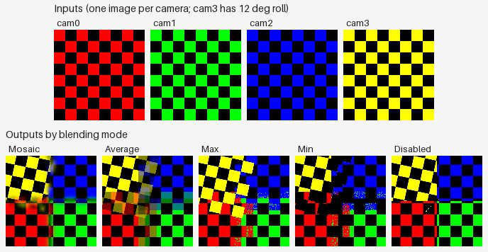

# Texture blending modes — what each one actually does

> **Confidence:** *medium overall.* The mode-by-mode behaviour
> documented below is high-confidence — each finding is
> directly observable in the included figure, with a derivation
> linking the input properties (camera colours, intensities,
> cam3's roll) to the predicted output. The medium rating
> reflects two limits: (a) the Natural mode (2.3+) could not
> be exercised on the synthetic test bed because it requires
> depth maps from a real alignment plus a Vulkan-capable GPU;
> (b) `Chunk.buildOrthomosaic` accepts the same `BlendingMode`
> enum but the user manual documents only three of the modes
> for ortho — what the others do for ortho is a separate
> Tier 3 question.

## Problem

`Chunk.buildTexture` accepts six different `BlendingMode`
values. The user manual gives a one-paragraph description of
each, but several of those descriptions are easily misread:

- *Max Intensity* — does it mean per-channel max, or per-pixel
  selection of the source camera with the brightest pixel, or
  per-region selection of the brightest source image?
- *Disabled* — the manual says "the image to take the color
  value for the pixel from is chosen like the one for the high
  frequency component in mosaic mode." What does that mean
  visually?
- *Mosaic* (default before 2.3) and *Average* — both blend
  contributions, but with different weighting strategies. When
  do they produce visibly different output?

This article answers those questions with a controlled
experiment: a flat textured plane viewed by four cameras (one
of which carries a small camera roll, modelling imperfectly
recovered alignment), each photographing a checkerboard with
a different colour. The output texture's centre region is
where all four cameras overlap and is where each blending
mode's behaviour shows.

## Context

The `BlendingMode` enum has five values on Metashape 2.2 and
six on 2.3 (which added `NaturalBlending` and made it the new
default for `buildTexture`):

| Mode (label / enum) | 2.2.3 | 2.3.1 | Documented for `buildTexture` | Documented for `buildOrthomosaic` |
|---------------------|:-----:|:-----:|:-----------------------------:|:---------------------------------:|
| `MosaicBlending` | ✓ | ✓ | ✓ | ✓ (default) |
| `AverageBlending` | ✓ | ✓ | ✓ | ✓ |
| `MaxBlending` | ✓ | ✓ | ✓ | — |
| `MinBlending` | ✓ | ✓ | ✓ | — |
| `DisabledBlending` | ✓ | ✓ | ✓ | ✓ |
| `NaturalBlending` | — | ✓ (default) | ✓ | — |

The Python API exposes the same enum to both `buildTexture`
and `buildOrthomosaic`, and both functions accept any of the
six values without raising. The user manual documents Mosaic /
Average / Disabled for `buildOrthomosaic` — what the other
three modes do for ortho output is *not* documented. This
article focuses on `buildTexture`; the ortho question is left
as a Tier 3 follow-up (see Caveats).

The cluster of five modes Metashape exposes is not unique to
its renderer. The same primitive operations (per-pixel
weighted-average, per-pixel max/min, per-region winner) appear
in every multi-image compositor; the value of having them
named in the API is choosing the *right* primitive for the
photometric and geometric properties of the input images.

## What each mode actually does

The experiment uses a single deliberately-engineered scene:

- A **flat 1m textured quad** as the model.
- Four cameras placed near the corners of the quad, at
  altitude 1m, looking nadir, with sensor-width-equal focal
  length (53° FOV). The placement gives **asymmetric
  coverage**: each *corner* of the texture is seen by exactly
  one camera, the *centre* is the only region seen by all
  four, and edges are seen by 2 or 3 cameras.
- **Each camera photographs a checkerboard whose "on" squares
  are a different colour**: cam0 = red, cam1 = green, cam2 =
  blue, cam3 = yellow. The checkerboard *geometry* is identical
  across all four — every camera's image places its squares at
  the same world surface positions.
- **Cam3 carries a 12° roll** around its optical axis. This
  models a real-world failure mode where a camera's roll
  component is imperfectly recovered during alignment. The
  rolled cam3 samples the surface at a tilted in-plane
  orientation; in the central overlap region this disagrees
  with the un-rolled cam0/1/2 sampling.
- The texture atlas is 256×256 px.

This single test discriminates all five blending modes
simultaneously. Three properties are made visible:

1. **Single-camera regions are deterministic.** All five
   modes produce identical output at the four corners — the
   only camera that contributes there is the unique camera
   whose footprint covers that corner.
2. **Per-channel arithmetic vs whole-image winner.** Yellow
   has the highest pixel intensity (`(255+255+0)/3 = 170`);
   red, green, and blue all tie at intensity 85. The Max and
   Min modes' choices in the central overlap region reveal
   whether the mode operates per-channel or per-image.
3. **Geometric misregistration.** The rolled cam3 contribution
   overlaps with the un-rolled cam0/1/2 contributions in the
   central region; each mode handles this disagreement
   differently.



| Mode | Behaviour visible in the figure |
|------|---------------------------------|
| Mosaic | Each region (corner + edge band) takes its colour from one camera's checkerboard; the seams between regions show smooth low-frequency colour gradients. The central overlap shows softened transitions between cameras' contributions rather than a single winning colour. |
| Average | Per-channel mean of the four input checkerboards. The single-camera corners keep their bright original colours; the central overlap region averages to a darker olive-green tone because averaging four saturated colours plus their black squares pulls toward low saturation. |
| **Max** | The whole-image-wins behaviour produces a *yellow-dominated* central region — yellow has the highest pixel intensity (170 vs 85 for red/green/blue). The yellow region is **tilted 12°** because it comes from rolled cam3; the rotation is the most visually striking signature of the rolled camera in any mode. |
| **Min** | Every pixel where at least one camera shows black goes to black. The central region is dominated by black plus a chaotic noise pattern of red, green, and blue pixels — these are pixels where one camera shows its colour and the rest show black. Red, green, and blue all tie at the lowest non-zero intensity (85), so the choice between them is non-deterministic; the noise *visualises the tie-breaking*. |
| Disabled | The per-region winner heuristic produces a sharp four-quadrant output: cam0 (red) at bottom-left, cam1 (green) at bottom-right, cam2 (blue) at top-right, cam3 (yellow + tilted) at top-left. The boundary at cam3's quadrant is *tilted* 12° because the rolled camera's projection edge is tilted. No blending at all between regions. |

Three findings stand out from the figure:

**Finding 1 — Max and Min do *not* compute per-channel max /
min.** If they did, Max in the central region would yield
`(255, 255, 255)` (white) — the per-channel max of the four
inputs — and Min would yield `(0, 0, 0)` (black) at every
*colour* pixel. Instead, Max picks *one image* per pixel —
typically yellow, because yellow has the highest pixel
intensity in the inputs — while Min picks *one image* by
lowest intensity, and the R/G/B tie produces a noise pattern.
The user manual's wording "the image which has maximum
intensity of the corresponding pixel is selected" is
technically accurate but easy to read as "per-channel max" by
a reader skimming.

**Finding 2 — The four corners are deterministic across all
modes.** Yellow at top-left, blue at top-right, red at
bottom-left, green at bottom-right — this is identical in
every output. Where only one camera contributes, no blending
mode can produce anything other than that camera's content.
This is a useful diagnostic property: any *difference* in the
four corners between two runs would indicate a non-blending
issue (e.g., a camera contributing to a region the geometry
implied it should not reach).

**Finding 3 — The rolled cam3's contribution is *tilted*.** In
the Disabled output, cam3's quadrant boundary is tilted 12°
relative to the others. In the Max output, the yellow-
dominated central region is *also tilted* — it follows
cam3's rolled orientation rather than the world axes. This is
the key visual signature of a camera with imperfectly-
recovered roll: not "one camera projects a rotated image into
the texture" but "the projection footprint of that camera is
itself rotated in the texture."

## Implications — when to use which mode

The choice of blending mode is a tradeoff between three
properties: photometric fidelity, sharpness, and tolerance of
imperfect registration.

| Mode | Best for | Avoid when |
|------|----------|-----------|
| **Mosaic** | The default for non-Natural workflows. Produces sharp output (high-frequency winner) with smooth seams (low-frequency blend). Photorealistic texture on aerial / mapping projects. | Severe photometric inconsistency between cameras (Average is more forgiving) or strong moving-object artefacts (Natural in 2.3+ has explicit ghost suppression). |
| **Average** | Diagnostic check — Average ghosts misregistered contributions across the central overlap region, making registration quality visible at a glance. Also useful when sharpness is unimportant but uniform global colour is. | Production texture on photogrammetric data — produces visibly soft / ghosted results when registration is imperfect. |
| **Max** | Specialised use cases such as shadow removal on plane-of-symmetry datasets where per-region brightest-image-wins approximates "no shadow on this pixel." | General texturing — the per-region winner-takes-all loses local detail and exposure consistency. |
| **Min** | Specialised use cases such as highlight removal under specular lighting where the dimmest-image-wins approximates a diffuse-lit response. | General texturing — same as Max. |
| **Disabled** | Useful when the alignment is good but the photometric variation is bad — produces a sharp, single-source-per-region texture without any blending artefacts. Also the only mode that does not require all cameras' contributions to be processed jointly, so it is the fastest. | Mosaic is sufficient for nearly all production cases; Disabled trades visible seams for processing speed. |
| **Natural** (2.3+) | The 2.3 default. According to the user manual, Natural combines per-region best-image selection (like Disabled) with frequency-domain blending (like Mosaic), and can suppress moving-object artefacts. The surrounding 2.3 API changes are documented in [Texture in Metashape 2.3](texture-in-2-3-changes.md). *This article does not test Natural empirically — see Caveats.* | When you need byte-for-byte reproducibility against pre-2.3 textures (use Mosaic). When the GPU does not support Vulkan (Natural is GPU-bound on 2.3). |

## Test methodology and reproducibility

The reproducer is `scripts/verify_blending_modes.py` in this
repository. It is a single Python file with no external state.

Steps:

1. **Synthetic dataset.** Construct a 1m flat quad as an OBJ
   with explicit UVs, four cameras at altitude 1m placed near
   the four corners of the plane (at `(±0.4, ±0.4, 1.0)`), and
   four 256×256 synthetic colored-checkerboard images (one per
   camera). **Cam3 has a 12° roll** baked into its
   camera-to-world transform — a deliberate misregistration
   modelling imperfectly-recovered roll.
2. **Drive Metashape via the API.** Add the photos, attach
   each camera to a shared 256-px focal-length sensor, set the
   camera transform manually (no alignment step), import the
   quad. The cameras are set to `fixed_calibration = True`.
3. **For each blending mode**, call
   `chunk.buildTexture(blending_mode=<mode>, texture_size=256)`
   on a fresh chunk and save the resulting texture as PNG.
4. **Measure**, per mode, the centre pixel, the four corner
   pixels, the texture-wide mean, and the unique-colour count.
   Save all measurements to `summary.json`.
5. **Generate the article figure** — one composite JPEG
   showing the four input images on top and the five per-mode
   output textures below. Quality 82, JFIF-only metadata (no
   EXIF). Re-running the script does not overwrite the
   existing figure unless `--regenerate-figures` is passed.

The script does **not** require an active Pro license:
`buildTexture` and `Texture.image().save()` both work with the
"No nodelocked license found" warning on 2.2.3 and 2.3.1.

Run:

```bash
~/.pyenv/versions/Metashape-2.2/bin/python \
    scripts/verify_blending_modes.py
```

> **Demo verified:** ✓ on 2.2.3 (5 modes), ✓ on 2.3.1 (5 modes;
> Natural skipped — see Caveats).

## Caveats

- **Asymmetric coverage is a design choice.** The test bed
  places each camera near one corner of the model so that:
  - each corner of the texture is seen by exactly one camera;
  - only the central region is seen by all four cameras.
  This is more representative of real photogrammetric overlap
  (where most surface points are visible from a subset of
  cameras, not all) than a perfectly symmetric grid above the
  plane. The cost is that the central region is small (about
  10% of the texture by area), so the modes' "personality" is
  concentrated in a small portion of each output.
- **Cam3's 12° roll is a deliberate single-axis
  misregistration.** Real-world photogrammetric failures have
  three rotational degrees of freedom (roll, pitch, yaw) plus
  three translational ones. A roll-only misregistration is
  the simplest non-trivial case and the easiest to interpret
  visually; the modes' qualitative behaviour likely
  generalises to the other rotational axes, though this
  article does not test the other axes empirically.
- **Natural blending could not be exercised on the synthetic
  test bed.** Two preconditions block it:
  1. **Depth maps required** — Natural's per-triangle
     best-image selection uses sharpness, ghost detection, and
     occlusion checks that depend on depth maps, which require
     a tie-point cloud from `matchPhotos` + `alignCameras`.
     Synthetic checkerboard images cannot be aligned this way
     without features the alignment can match across cameras.
  2. **Vulkan GPU required** — calling
     `buildTexture(blending_mode=NaturalBlending,
     source_data=DepthMapsData)` errors with `Failed to load
     vulkan library!` on Apple-silicon Macs without a Vulkan
     driver. The Python API does not gate on this; the failure
     surfaces at execution.
  Reproducing Natural blending side-by-side with the other
  five modes is therefore a Tier 3 follow-up on a real dataset
  with an aligned chunk and a Vulkan-capable GPU.
- **`buildOrthomosaic` accepts the same enum but the manual
  documents only three modes for ortho.** What
  `buildOrthomosaic(blending_mode=MaxBlending)` *actually does*
  for ortho output is undocumented and a separate empirical
  question. The Python API does not raise; whether the
  resulting orthomosaic differs from `MosaicBlending` is left
  for a future Tier 3 article.
- **Tie-breaking in Disabled / Max / Min is non-deterministic
  across runs.** The qualitative behaviour (per-region
  winner, brightest-image-wins, dimmest-image-wins) is stable,
  but the exact per-pixel choice in the central region varies
  between runs of the same script with identical inputs. The
  reproducer's figure-generation step skips overwriting the
  existing JPEG by default to avoid spurious diffs; pass
  `--regenerate-figures` to refresh.

## See also

- [Texture in Metashape 2.3 — what changed and why your
  scripts may need updating](texture-in-2-3-changes.md) — the
  surrounding API changes that landed alongside Natural in
  2.3.

### References

- Agisoft Metashape Pro User Manual 2.3 (English), section
  *Build Texture* > *Blending mode* (paragraph descriptions
  for the six modes).
- Agisoft Metashape Python API Reference 2.3.1, chapter 1
  *General concepts* > `Metashape.Chunk.buildTexture` (kwarg
  documentation).
- [*How to analyse Model UV Statistics?* (Agisoft KB)](https://agisoft.freshdesk.com/support/solutions/articles/31000162210)
  — assessing the resulting texture atlas (Fill ratio, Overlap,
  Resolution) after choosing a blending mode.
